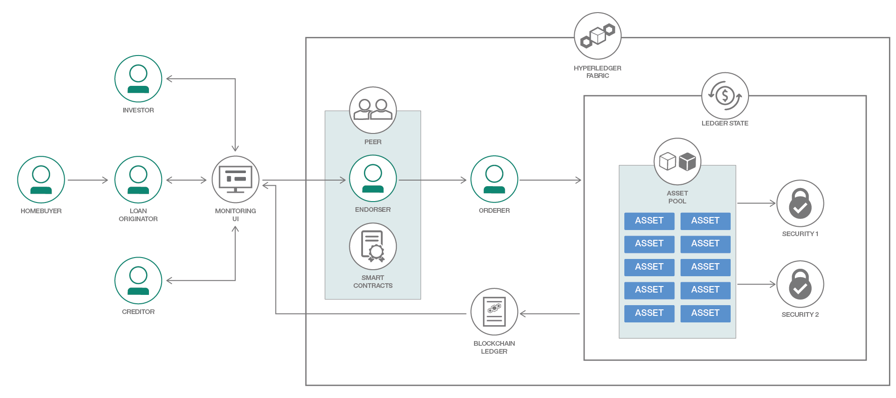

# ブロックチェーン・レジャー上に資産の証券化を実装する

### Hyperledger Fabric を使用して一連の非流動資産を取引可能な証券に統合する

English version: https://developer.ibm.com/patterns/implement-asset-securitization-on-a-blockchain-ledger
  ソースコード: https://github.com/IBM/securitization_blockchain

###### 最新の英語版コンテンツは上記URLを参照してください。
last_updated: 2018-06-26

 
## 概要

証券化とは、一連の非流動資産を取引可能な証券に統合するために使用できる金融プロセスのことです。非流動資産の一般的な例としては、簡単には売り買いできない住宅ローンが挙げられます。一方、取引可能な資産の例としては株や公債が挙げられます。証券化は、資産の流動性を高めて資本を解放することを目指す金融機関に役立ちます。このコード・パターンで紹介するアプリでは、IBM Blockchain Platform Starter Plan を使用して、ユーザーが資産、資産プール、投資家、証券の間の関係を作ったり確認したりするために使用できるダッシュボードを提供します。

## 説明

あまりにも多くの長期非流動資産を所有する金融機関が、新しい投資に資本を解放しようとする場合、証券化のメリットを利用することができます。証券化は、簡単には売り買いできない資産に流動性を与える手段となります。資産をプールして証券に分割することで、容易に取引できるようになります。また、投資家にとっては、株などのリスクの高い投資に代わる手段になります。証券は公債に比較的似ていますが、証券の保有者は支払いを一括払いではなく、毎月受け取ります。

証券化がまだ広く実装されていないのはなぜなのかという理由の一部に、これが複雑なプロセスであることが挙げられます。さらに、通常は多数の関係者 (債権者、公債などの引受人、融資担当者など) の情報が必要になることも理由となっています。けれどもブロックチェーンを使用すれば、より透明性が高くなり、証券化のプロセスの多くを標準化して自動化することができます。例えばスマート・コントラクトを使用して、証券の資産プールの投資リスクを評価し、住宅ローンが滞納状態になっている場合は投資家/債権者に通知したり、証券の価値をリアルタイムで判断したりできます。

このコード・パターンでは証券化の例を紹介し、ブロックチェーン・レジャーを使用して証券化プロセスを追跡する方法を説明します。ここで紹介するアプリケーションは、React.js、Express.js、そして Hyperledger Fabric SDK を使用します。この 3 つを統合することで、ユーザーは証券化プロセスをシミュレートして、ブロックチェーン上で各種のトランザクションが処理される仕組みを理解できます。

このコード・パターンを完了すると、以下の方法がわかるようになります。

* Hyperledger ブロックチェーン・ネットワークを IBM Cloud 上にデプロイする
* Hyperledger Node SDK を使用して管理クライアントを作成し、登録する
* スマート・コントラクトをデプロイして初期化し、資産、資産プール、証券、投資家を登録する

## フロー

1. 住宅購入者が原資産所有者のサービスを利用して、住宅ローンの融資を証券化します。
2. 原資産所有者がアプリケーションをロードして、ブロックチェーン・レジャーを新しい資産で更新するためのリクエストを送信します。
3. リクエストが Node.js Express バックエンドで処理されて、CRUD リクエストが JSON-RPC オブジェクトにフォーマット化された上で、トランザクション案として Hyperledger のピアに送信されます。リクエストにより、価値 540,000 米ドル、利率 3.3 パーセント、信用スコア 720 の住宅ローンが登録されます。信用スコアを使用して、潜在的投資者にとってのリスクを計算します。
4. ピアは承認サービスを利用して、関連するスマート・コントラクトに対してトランザクション案をシミュレートします。この承認サービスにより、レジャーの現在の状態を前提としてトランザクションを実行可能であることが確認されます。無効なトランザクション案の例としては、既存の資産を作成するトランザクションや、存在しない資産の状態をクエリーするトランザクションが挙げられます。
5. シミュレーションが成功すると、トランザクション案にピアのエンドーサーが署名します。
6. 署名されたトランザクションは順序付けサービスに転送され、このサービスによってトランザクションが実行されます。この例の場合、新しく作成された資産が資産プールに追加されます。
7. 更新後の状態が、ブロックチェーン・レジャーにコミットされます。
8. 証券化 UI により、更新後のレジャーの状態がクエリーされて、更新された情報を使用してテーブルがレンダリングされます。
9. 資産プールが証券に分割された場合、投資家はそれらの証券を売り買いできます。証券の価格は、レジャーの状態が変更されるたびに更新されます。
10. 債権者がレジャーの状態を確認し、支払いの遅延または住宅ローンの不履行のリスクを判断します。大幅な変化が検出された場合、債権者によって証券の信用格付けが再計算され、レジャー内で信用格付けが更新されます。

## 手順

1. リポジトリーを複製します。
2. リポジトリーのコードベースをローカルにセットアップするか、IBM Cloud にデプロイします。
3. IBM Cloud で Watson サービスを作成します。
4. チェーン・コードをアップロードして初期化します。
5. アプリケーションを起動します。
6. サービス資格情報を取得します。
7. アプリケーションを構成して実行します。
