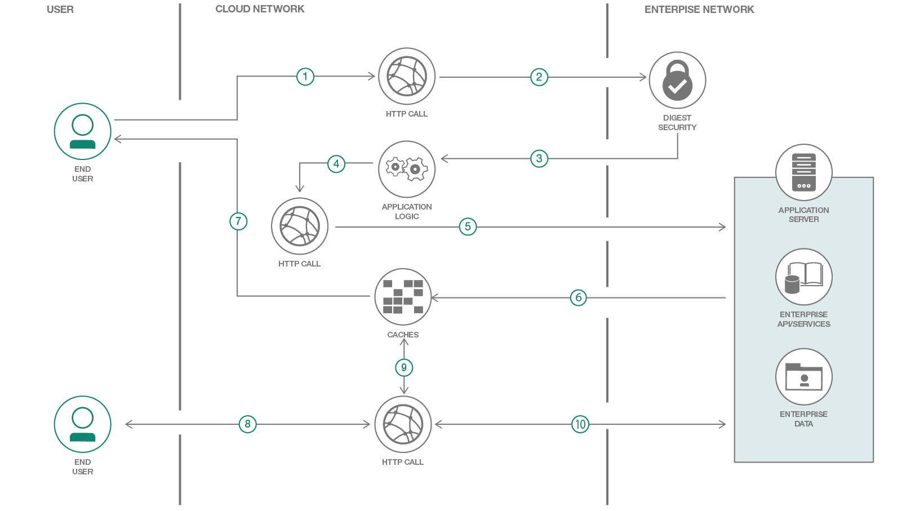

# Digest 認証に対応していないツール内で Digest 認証を実装する
### IBM Integration Bus と IBM App Connect を使用した Digest 認証

English version: 削除されました

ソースコード: https://github.com/IBM/IIB-ACE-DigestAuthentication

###### アーカイブとして残しています。英語版のパターンは削除されていますので、ご注意ください。
last_updated:	'2018-11-16'

retired_date: "2020-08-24"
## 概要

Digest 認証は、Web サーバーがユーザーを Web ブラウザーに対して認証するための一般的な認証方式です。このコード・パターンでは、Digest 認証がネイティブに組み込まれていない開発ツール内でこの認証を実装する方法を紹介します。このようなツールの 1 つとして、ここでは IBM Integration Bus を例に用います。このパターンの手順を完了すると、同様のロジックを、Digest 認証が組み込まれていないあらゆるツールに適用できるようになるはずです。

<sidebar>
 IBM App Connect Enterprise 製品の一部となっている IBM Integration Bus は、複数のハードウェアおよびソフトウェア・プラットフォーム全体にわたり、多種多様なアプリケーション間でビジネス情報を受け渡せるようにする統合ブローカーです。
</sidebar>

このコード・パターンで、IBM Integration Bus 内でサービスを作成し、そのサービスをプロキシーとして公開して Diget 認証を実装する方法を学んでください。ここでは、Digest 認証メカニズムがバックグラウンドで機能する方法と、Digest 認証を独自にサポートしていないプラットフォーム用に構成しなければならないロジックを説明します。また、IBM Cloud Kubernetes クラスター上で IBM Integration Bus サービスを公開し、サンプル・クライアントを介してそのサービスを使用する方法についても説明します。サンプルのアプリケーションとクライアント・アプリケーションは IBM Integration Bus 上で作成し、Docker イメージを使用して Kubernetes ノード上にデプロイします。

このコード・パターンを完了すると、以下の方法がわかるようになります。

* Digest 認証に応じたメッセージ・フローを作成し、Digest 認証のロジックを構成する
* アプリケーションをローカルにデプロイしてテストする
* IBM Integration Bus Digest 認証サービスを Kubernetes に公開する

## フロー

1. ユーザーがクラウド上の IBM Integration Bus アプリケーションにリクエストを送信します。
1. アプリケーションがユーザーから送信されたリクエストを、認証を要件とするサーバーに送信します。
1. サーバーがリクエストを拒否し、認証を求めます。サーバーが認証ロジックを作成するための詳細をレスポンスで返します。
1. アプリケーションが認証ロジックを構成します。
1. アプリケーションが認証を要件とするサーバーに別のリクエストを送信します。
1. リクエストが正常に認証されます。
1. 次の HTTP リクエストとレスポンスを成功させるために、アプリケーションが Authorization ヘッダーまたは Cookie をキャッシュに保存します。
1. ユーザーがクラウド上の IBM Integration Bus アプリケーションに次のリクエストを送信します。
1. アプリケーションがサーバーに認証を求める前に、リクエストとキャッシュを同期化します。
1. リクエストがサーバーに送信されると、サーバーがユーザーを認証し、「成功」レスポンスをユーザーに返します。

## 手順

このパターンに完了するには、[README](https://github.com/IBM/IIB-ACE-DigestAuthentication) で詳しく説明している手順に従ってください。以下に、実行手順を要約します。

1. Digest 認証サーバーを作成します。
1. サービスをローカルにデプロイしてテストします。
1. クラスターを作成して IBM Cloud 上にデプロイします。
1. IBM Cloud 上の IBM App Connect 上でサンプル API をテストします。
