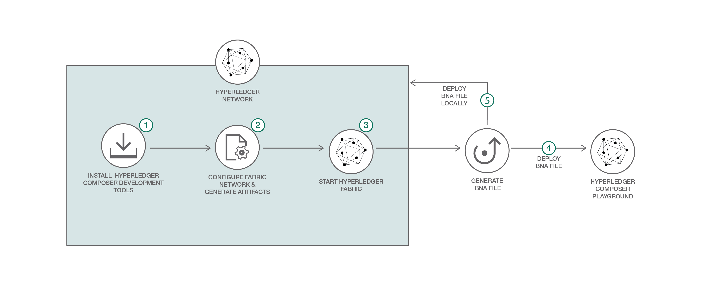

# FDA 外国供給業者検証プログラムの要件をモデル化する

### ビジネス・ネットワーク上にデプロイされたスマート・コントラクトを自動化する規制コンプライアンス・アプリケーションを構築する

English version: https://developer.ibm.com/patterns/./implement-fda-food-supplier-verification-program-on-hyperledger-composer
  ソースコード: https://github.com/IBM/BlockchainPublicRegulationFabric-Food

###### 最新の英語版コンテンツは上記URLを参照してください。
last_updated: 2017-10-10

 
_**Note:** This pattern focuses on older technology (e.g. Hyperledger Fabric APIs prior to Fabric 1.4). Therefore, there is no support for this pattern and it will be archived on May 1, 2019. You are welcome to use up to that date, but we recommend that you begin working with the updated release found at [https://github.com/IBM/japan-technology/blob/main/Code-Patterns/monitor-food-shipments-using-blockchain/](https://github.com/IBM/japan-technology/blob/main/Code-Patterns/monitor-food-shipments-using-blockchain/)._

## 概要

食品供給業者は、米国食品医薬品局 (FDA) 外国供給者検証プログラムの規制要件に準拠していなければ、製品を市場に送り出すことができません。この開発者向けコード・パターンでは、Hyperledger Composer を使用して、食品供給業者検証プログラムの規制要件を分散ビジネス・ネットワーク向けにモデル化する方法を説明します。

## 説明

*Hyperledger Fabric V1.1 および Hyperledger Composer V0.19 に対応するために更新*

現在、開発者たちの間では規制コンプライアンスの分野に注目が集まっていて、コンプライアンスを強化・施行するためのプロセスを自動化および標準化するアプリケーションの構築が試みられています。ブロックチェーンは、まさにそのようなアプリケーションの構築を可能にするテクノロジーです。Hyperledger Composer を使用すれば、簡単に規制コンプライアンス・アプリケーションを構築し、スマート・コントラクト内にロジックを作成してビジネス・ネットワークにデプロイすることができます。このパターンでは使用ケースとして、FDA コンプライアンスを取り上げます。創造力を発揮して、規制コンプライアンスを管理する独自の使用ケースにこのパターンを適用してください。

FDA コンプライアンスの使用ケースに注目したシナリオを考えてみましょう。供給業者が例えば食品を輸入業者に引き渡すと、輸入業者がその供給業者、国、食品のタイプのすべてが正しい識別子と一致することを検証します。通関手続き地では供給業者が再びチェックされ、(規制機関が管理する) データベース内に保管されている既知の供給業者のリストと照らし合わされます。供給業者が「免除」タイプに該当する場合、製品が小売業者に引き渡されます。供給業者が「非免除」タイプに該当する場合は、製品が (規制機関が管理する) データベース内に保管されている既知の食品リストに照合されます。その食品が「免除」製品であれば、小売業者に引き渡されます。食品が「非免除」製品の場合は、輸入業者が (単独で、またはサード・パーティーを利用して) 危険分析を実施する必要があります。危険分析レポートは、供給業者から規制機関に提出されます。規制機関はコンプライアンスを確認してから、製品を小売業者に引き渡します。このパターンでは、FDA 外国供給業者検証プログラムを対象とした規制コンプライアンス・ロジックをスマート・コントラクト内に取り込んで、ビジネス・ネットワークにデプロイします。

この Hyperledger Composer パターンは、食品供給業者検証プログラムの規制要件を分散ビジネス・ネットワーク向けにモデル化する方法を説明するものです。留意する点として、ビジネス・ネットワーク定義を構成するモデル (.cto)、スクリプト (.js)、および ACL (.acl) ファイルは、パッケージ化されてアーカイブ (.bna) ファイルとしてエクスポートされます。エクスポートされたアーカイブ・ファイルが、Hyperledger Fabric ネットワークにデプロイされます。

## フロー

1. Hyperledger Composer 開発ツールをインストールします。
1. Hyperledger Fabric ネットワークを構成して起動します。
1. ビジネス・ネットワーク・アーカイブを生成します。
1. BNA ファイルを Hyperledger Composer Playground にインポートします。

## 手順

Follow these steps to use Hyperledger Composer to model food supplier verification regulatory requirements for a distributed business network.

1. Install the Hyperledger Composer Development Tools.
2. Configure and start the Hyperledger Fabric network.
3. Generate the Business Network Archive (BNA).
4. Deploy the Business Network Archive using Composer Playground.
5. Deploy the Business Network Archive on Hyperledger Composer running locally.
