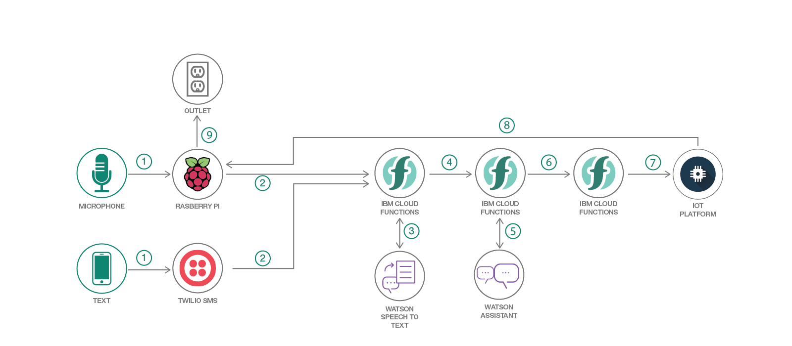

# サーバーレス・ホーム・オートメーション・ハブの音声制御を実装する

### 自然言語サービスと OpenWhisk を利用して、音声作動式のサーバーレス・ホーム・オートメーション・ハブを構築する

English version: https://developer.ibm.com/patterns/./implement-voice-controls-for-serverless-home-automation-hub
 ソースコード: https://github.com/IBM/serverless-home-automation

###### 最新の英語版コンテンツは上記URLを参照してください。
last_updated: 2017-07-18

 
## 概要

このわずか数年の間で、ホーム・オートメーションはサイエンス・フィクションではなく、現実のものになりました。この開発者コード・パターンで、自然言語サービスと OpenWhisk サーバーレス・テクノロジーを利用すると、いかに簡単にホーム・オートメーション・ハブを構築できるかを確かめてください。

## 説明

このわずか数年の間に、インテリジェントなパーソナル・アシスタントの数は急増しています。例えば、Apple Siri、Amazon Alexa、Google Assistant について考えてください。当初、これらのアプリは目新しいものにすぎないと受け止められていましたが、今や便利で有用なアプリへと進化し、手放せないアプリとして使用するユーザーの数が増え続けています。

このようなアプリは、ユーザーがサービス API や IoT に接続されたデバイスを操作するための簡単な自然言語インターフェースになります。現在、自然言語による対話が次の段階に進みつつある中、開発者たちは、音声対話型の完全に自動化された住居を実現することに強い意欲を示しています。

この開発者コード・パターンは、皆さんをインタラクティブなホーム・オートメーションの世界に案内します。住居に接続して音声コマンドで制御できるデバイスの数が増える中、住居は真の意味で「スマート」になってきています。これらの家庭用デバイスのハブとして、電源出力をオフ/オンにするスターター・ホーム・オートメーション・ハブを、Raspberry PI を使用してセットアップする方法を学んでください。回路とソフトウェア依存関係をインストールして適切に構成した後は、IBM Watson の自然言語サービスを利用して、音声またはテキストによるコマンドによって電源出力を制御できるようにします。

さらに、この開発者コード・パターンではサーバーレスの世界にも足を踏み入れます。OpenWhisk サーバーレス関数を使用して、時刻指定のスケジュール、天候の変化、モーション・センサーのアクティベーションやその他の入力に応じてこの同じ電源出力をトリガーする方法を説明します。この一連の手順から、Watson サービスを利用すれば、いかに簡単にユーザー入力を解釈できるのかがわかるはずです。また、IBM Cloud サービスが HTTP、SMS、MQTT などのプロトコルを使って、システムをよりアクセスしやすいものにする仕組みも理解できます。アナリティクスを処理して、特定のデバイスがオンの状態になっている時間を判断するように Watson IoT Platform を拡張し、スケジュールや、トリガーされたセンサーに応じてデバイスを制御するように OpenWhisk のシーケンスを調整することも可能です。

目新しさという要素は忘れて、最新の開発スキルを身に着け、需要のあるアプリを作り出せるようになってください。人々は、スマート・ホーム、接続されたデバイス、音声起動型のアプライアンスを求めています。この開発者コード・パターンで、人々の期待に応える方法を説明します。

## フロー

1. ユーザーがマイクに向かって声で命令するか、Twilio SMS の電話番号にテキストを送信します。
1. 入力がキャプチャーされて、OpenWhisk シーケンスをトリガーするための HTTP POST リクエストに、その入力が組み込まれます。
1. OpenWhisk アクション 1 が、音声を IBM Cloud Speech to Text サービスに転送して、レスポンスを待機します。
1. トランザクションが OpenWhisk アクション 2 に転送されます。
1. OpenWhisk アクション 2 が、ユーザーのテキスト入力を分析する Assistant サービスを呼び出して、レスポンスを待機します。
1. Assistant サービスの分析結果が最後の OpenWhisk アクションに転送されます。
1. Openwhisk アクションがエンティティー/インテントのペア (「fan/turnon」など) を IoT MQTT ブローカーにパブリッシュします。
1. MQTT ブローカーにサブスクライブされた Raspberry Pi が結果を受信します。
1. Raspberry Pi が RF 信号を送信して、電源出力のオン/オフを切り替えます。

## 手順

Ready to put this code pattern to use? Complete details on how to get started running and using this application are in the [README](https://github.com/IBM/serverless-home-automation/blob/master/README.md) file.
