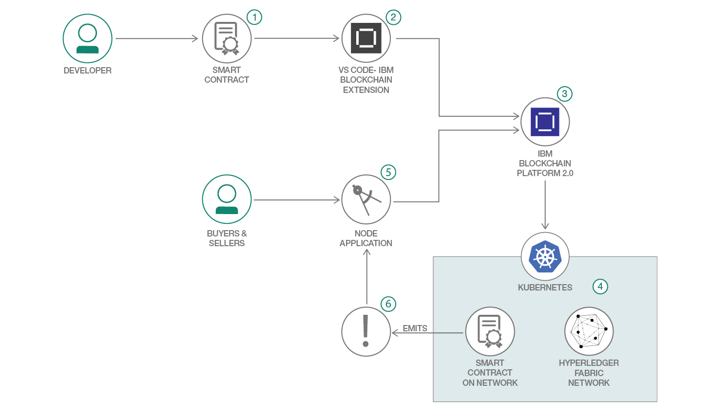

# Blockchain Platform からイベントを発行する

### Fabcar 使用ケースを拡張してイベントを処理するデモ・アプリケーション

English version: https://developer.ibm.com/patterns/./implementing-blockchain-events-using-ibp-vscode-extension
  ソースコード: https://github.com/IBM/auction-events

###### 最新の英語版コンテンツは上記URLを参照してください。
last_updated: 2019-03-08

 ## 概要

この開発者コード・パターンでは、外部アプリケーションがイベントにサブスクライブしてアクションを実行できるよう、ブロックチェーン・ネットワークからイベントを発行する方法を説明します。さらに重要な点として、IBM Blockchain Platform で IBM Kubernetes Service クラスターをベースに構築されたアプリケーションによって、このイベント通知を可能にします。これまでの回で説明したように、革新的なビジネス・ソリューションの基盤となるのは、ブロックチェーンによる信用の置ける不変の共有レジャーです。この共有レジャーに対するイベントが発生した場合、通常は、アプリケーションや外部システムがそれを把握しなければなりません。このパターンでは、トランザクションがブロックチェーン・ネットワークに書き込まれた時点で、これらのイベント通知をプログラムによってブロックチェーン・ネットワークから生成し、受信できるようにする方法を説明します。

## 説明

_**注:** この開発者向けパターンは、ブロックチェーン入門として意図されているパターン・シリーズの第 3 回です。シリーズの概要については、「[初めてのブロックチェーン・アプリケーションを構築する]( https://www.ibm.com/developerworks/jp/library/code-pattern-series-build-your-first-blockchain-application/)」を参照してください。_

IBM Blockchain Platform サービスを利用してネットワークとスマート・コントラクトを作成するスキルを身に付けたら、このコード・パターンに取り組んでください。このパターンは、今まで学んだ知識の延長線上にあります。今回のアプリケーションでは、Fabcar 使用ケースを拡張してイベントを処理する方法を説明します。イベントは、自動車販売リストが発行されたときに発生します。オークションで自動車を購入しようと考えているネットワーク参加者がイベント通知を申請すると、自動車販売リストが掲載された時点で通知を受け取れるようになるため、早いうちに入札のチャンスをつかむことができます。このパターンを拡張すれば、取引が完了した時点で自動車の所有者に通知を送信し、いつ頃入金が見込めるかを所有者が把握できるようにすることもできます。一般に、ネットワーク参加者はトランザクションが発生した時点で適切な対応を取りたいと考えるものです。したがって、イベント通知はブロックチェーン・テクノロジーで重要な役割を果たします。

このコード・パターンをひと通り完了すると、以下の方法がわかるようになります。

* IBM Blockchain Platform の VS Code 拡張機能を使用してブロックチェーン・スマート・コントラクトをパッケージ化する
* IBM Blockchain Platform 上に Hyperledger Fabric ネットワークをセットアップする
* IBM Blockchain Platform を使用してスマート・コントラクト・パッケージをインストールし、インスタンス化する
* コールバック関数を登録するコードを配布して、トランザクションがブロックにコミットされた時点で通知を受信できるようにする
* Hyperledger Fabric SDK を使用して、デプロイ済みのネットワークとやり取りしてトランザクションを送受信する Node.js アプリケーションを実行する

## フロー

1. 開発者が Node.js を使用してスマート・コントラクトを開発します。
1. IBM Blockchain Platform の VS Code 拡張機能を使用して、分散型エネルギー・スマート・コントラクトをパッケージ化します。
1. IBM Blockchain Platform サービスをセットアップして起動します。
1. IBM Blockchain Platform を使用して、IBM Kubernetes サービス上にネットワークを作成します。そのネットワーク上でオークション・スマート・コントラクトをインストールしてインスタンス化します。
1. Node.js アプリケーションでは Fabric SDK を使用して、特定のトランザクションにリスナーを追加します。それ以降は、IBM Blockchain Platform 上にデプロイされたネットワークとやり取りしてトランザクションを発行します。
1. トランザクションとして発行されるイベントがトリガーされ、ブロックがレジャーにコミットされます。その時点でイベントが Node.js アプリケーションに返されます。

## 手順

このコード・パターンを開始するには、[README](https://github.com/IBM/auction-events/blob/master/README.md) ファイルを参照してください。
