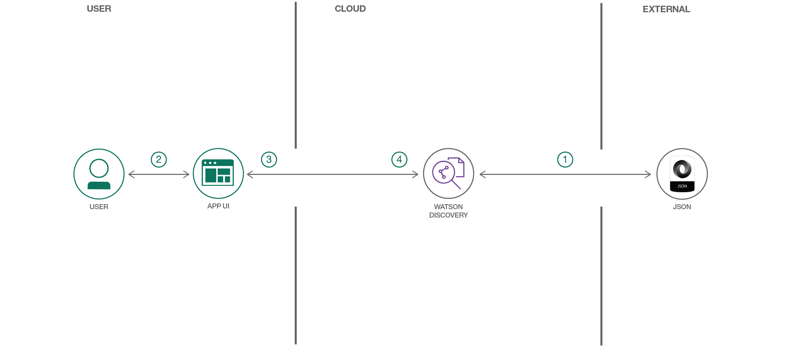

# データ漏洩インシデントをマイニングして洞察を見つける

### Watson Discovery を利用してデータをインポート、エンリッチ、探索するコグニティブ Node.js Web アプリを作成する

English version: https://developer.ibm.com/patterns/./import-enrich-and-gain-insight-from-data
  ソースコード: https://github.com/IBM/watson-discovery-analyze-data-breaches

###### 最新の英語版コンテンツは上記URLを参照してください。
last_updated: 2018-05-10

 ## 概要

あらゆる組織にとってデータが不可欠なものであることに変わりはありませんが、データから価値を引き出して洞察を得ることができなければ、データの価値は失われてしまします。このコード・パターンでは、Watson™ Node.js SDK を利用してデータをインポートし、インポートしたデータを Watson Discovery Service サービスによってエンリッチする方法を説明します。エンリッチされたデータを探索すれば、パターン、傾向、そして実用的な洞察を見つけることができます。

## 説明

組織のデータは、探索されてマイニングされるのを待っている情報の宝庫です。けれども、この情報がどこかにしまい込まれて、アクセスすることも、整理して使用することもできないという場合があまりにも多すぎます。

データの価値を解き放つ鍵は、開発者の手にあります。このコード・パターンを完了すると、データをインポートしてエンリッチし、ビジネスに真の洞察を提供するためのスキルを身に付け、そのために必要なツールを理解することができます。このコード・パターンでは、独自のデータを Watson Discovery Service にアップロードして、作成したデータ・コレクションをクエリーできるように Web アプリケーションを構成した後、以下の作業を行います。

* React で作成された HTML フロントエンドを備えた Node.js API サーバーを作成して、実行します。
* 専用のデータ・コレクションを作成してエンリッチするように Watson Discovery を構成します。
* Watson Discovery を利用してデータのクエリーと分析を行います。

このコード・パターンを完了した暁には、データを完全に探索するスキルを身に付けた貴重な開発者になることができているはずです。このコード・パターンでは例として、世界最大のデータ漏洩とハッキングのインシデントが含まれる、**一般公開されたデータ・セット**を使用します。

## フロー

1. 開発者がデータ・ファイルを Watson Discovery に追加します。
1. ユーザー入力が処理されて、バックエンド・サーバーにルーティングされます。バックエンド・サーバーは、ブラウザー上に表示するビューをレンダリングします。バックエンド・サーバーは Express を使用して作成されており、React で作成されたビューを、express-react-views エンジンを使用してレンダリングします。
1. ユーザーがアプリの UI を使用してバックエンド・サーバーとやり取りします。フロントエンドのアプリ UI は、React を使用して検索結果のレンダリングを行い、バックエンドで使用したすべてのビューをサーバー・サイドのレンダリングに再利用できます。フロントエンドは watson-react-components コンポーネントを使用していて、レスポンシブなものとなっています。
1. バックエンド・サーバーがユーザー・リクエストを Watson Discovery Service に送信します。バックエンド・サーバーはプロキシー・サーバーとして機能し、フロントエンドからのクエリーを、機密性の高い API キーをユーザーから隠した状態で Watson Discovery Service API に転送します。

## 手順

Ready to put this code pattern to use? Complete details on how to get started running and using this application are in the [README](https://github.com/IBM/watson-discovery-analyze-data-breaches/blob/master/README.md).
