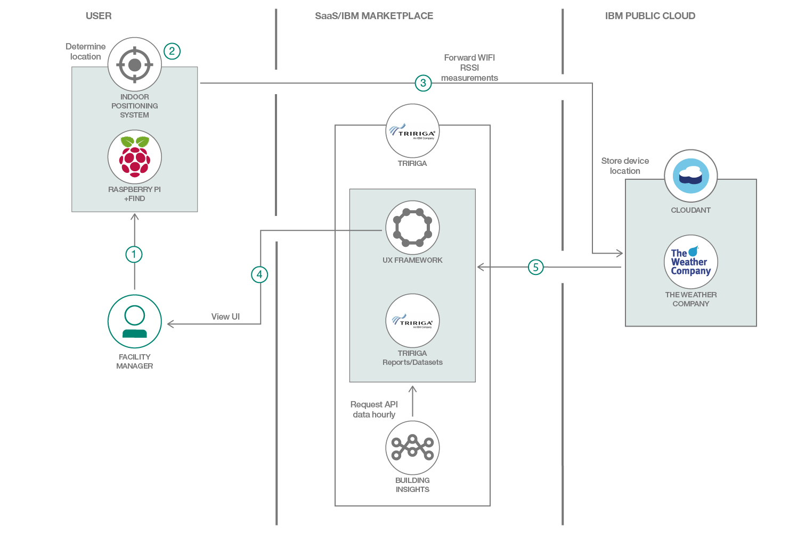

# TRIRIGA を使用して屋内測位システムを統合する

### TRIRIGA、Kubernetes、Weather Company API を使用してカスタム認知アプリケーションを構築し、デプロイする

English version: https://developer.ibm.com/patterns/indoor-positioning-mobile-app-iot-platform-tririga-building-insights
  
ソースコード: https://github.com/IBM/tririga-indoor-positioning

###### 最新の英語版コンテンツは上記URLを参照してください。
last_updated: 2019-03-22

 
_**注: このパターンは複合パターンの一部を構成するものです。** 複合パターンに含まれる 2 つのパターンは、それぞれスタンドアロン・アプリケーションとして使用できます。また、もう一方のコード・パターンの続きとして取り組むこともできます。複合パターンの構成要素は次のとおりです。_

* [TRIRIGA 認知アプリに Building Insights API を統合する](https://developer.ibm.com/jp/patterns/tririga-perceptive-app-w-building-insights/)
* TRIRIGA を使用して屋内測位システムを統合する (このパターン)

## 概要

このコード・パターンでは、TRIRIGA インスタンス内でカスタムの認知アプリケーションを作成してデプロイします。この認知アプリケーションを例に、TRIRIGA からインタラクティブなフロアー・プランをインポートしてレンダリング、更新する方法、そして Weather Company API からデータをプルする方法を説明します。さらに、屋内測位システムをデプロイして、フロアー・プラン上に各ユーザーの位置を示すマーカーをレンダリングする方法も説明します。この測位システムは、エリア内にあるすべての WiFi ルーターの信号強度を測定することによって機能します。

## 説明

このコード・パターンをひと通り完了すると、以下の方法がわかるようになります。

* カスタマイズした Polymer アプリケーションを設計し、TRIRIGA インスタンスに公開する
* Weather Company API を使用してデータをプルする
* TRIRIGA からビルディング・ブロアー・プランをインポートする
* "[FIND](https://github.com/schollz/find-lf) " indoor 屋内測位システムを Raspberry Pi のクラスター上にデプロイしてトレーニングする
* 認知アプリ内でユーザーの位置を視覚化する

## フロー

1. ユーザーのモバイル・デバイスが、そのエリア内にあるすべての Wi-Fi エンドポインの信号強度を定期的に測定し、測定値を屋内測位システム (Raspberry Pi) に転送します。
2. 屋内測位システムが測定値を処理し、モバイル・デバイスの位置を判断します。
3. モバイル・デバイスの位置が Cloudant 内に保管され、更新されます。
4. ユーザーが TRIRIGA 認知アプリをロードします。
5. 認知アプリが Weather Company API に対してクエリーを実行し、TRIRIGA からビルディング・フロアー・プラン、Cloudant から位置データを取得します。フロンエンドのフロアー・プラン上で、デバイスの位置がマークされます。

## 手順

このパターンの詳細な手順については、[README](https://github.com/IBM/tririga-indoor-positioning/blob/master/README.md) ファイルを参照してください。次の手順に沿って、クラウド上にデプロイする方法を説明します。

1. 前提条件をインストールします。
2. サービスをプロビジョニングします。
3. 認知アプリケーションを生成します。
4. Node.js アプリをデプロイします。
5. 認知アプリを TRIRIGA にプッシュします。
6. 測位システムをデプロイします。
