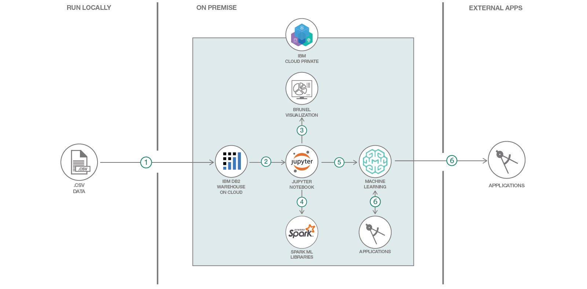

# AI をアプリケーションに注入する

### IBM Cloud Pak for Data、Spark MLlib、Jupyter Notebook を利用してカスタマー・チャーン予測モデルを作成、デプロイする

English version: https://developer.ibm.com/patterns/infuse-ai-into-your-application
  ソースコード: https://github.com/IBM/icp4d-customer-churn-classifier

###### 最新の英語版コンテンツは上記URLを参照してください。
last_updated: 2019-02-08

 
## 概要

このコード・パターンでは、IBM Cloud Pak for Data を使用して顧客の人口統計データと売買活動データを IBM Db2 Warehouse にロードし、Jupyter Notebook で Brunel 視覚化機能を使って IBM Db2 Warehouse 内のデータを分析します。データを分析した後、Spark 機械学習ライブラリーを使用して、カスタマー・チャーンのリスクを予測するモデルを作成します。このモデルは Web サービスとしてデプロイし、アプリケーション内での推測に使用できます。

## 説明

このコード・パターンでは、Jupyter Notebook を使用して Db2 Warehouse、Brunel 視覚化機能、Spark 機械学習ライブラリーを操作する例を紹介します。この例では、データベース・オブジェクトの作成から高度なアナリティクス、そして機械学習モデルの開発、デプロイに至るまで Jupyter Notebook を使用します。このコード・パターンは、オープンなクラウド・ネイティブの AI 対応情報アーキテクチャーである IBM Cloud Pak for Data をベースに作成されています。この完全に管理された統合型チーム・プラットフォームを使用すると、ソースとしてのデータを安全に保持しつつ、任意のデータ・マイクロサービスやアナリティクス・マイクロサービスを柔軟に追加できます。単純化された方法でデータを収集、整理、分析し、ビジネス全体に AI を注入することができます。

このコード・パターンで使用するサンプル・データは、あるオンライン株式取引会社の顧客の人口統計および売買活動に関するデータです。この使用ケースでは、オンライン株式取引会社がカスタマー・チャーンのリスクを予測し、ターゲットを絞ったインセンティブ・プログラムを顧客対応アプリケーションに統合したいと考えています。

このコード・パターンを完了すると、以下の方法がわかるようになります。

* IBM Cloud Pak for Data を利用する方法を判断する
* データを Db2 Warehouse にロードする
* IBM Cloud Pak for Data 内でアナリティクス・プロジェクトを作成する
* リモート・データセットをプロジェクトに追加する
* Jupyter Notebook を実行する
* Brunel のグラフを使用してデータを視覚化する
* Spark MLlib を使用して機械学習モデルを作成、テストする
* IBM Cloud Pak for Data を使用して、モデルを Web サービスとしてデプロイする
* 外部アプリケーションからモデルにアクセスしてリスクを推測する (チャーン・リスク予測)

## フロー

1. データを Db2 Warehouse にロードします。
1. Jupyter Notebook がデータにアクセスします。
1. Jupyter Notebook が Brunel を使用して情報を視覚化します。
1. Jupyter Notebook が Spark ML ライブラリーを使用してモデルを作成します。
1. Jupyter Notebook がモデルをリポジトリーに保存してデプロイできる状態にします。
1. アプリケーションが REST API を介してモデルにアクセスします。

## 手順

このパターンの詳細な手順については、[readme ファイル](https://github.com/IBM/icp4d-customer-churn-classifier/blob/master/README.md)を参照してください。手順の概要は以下のとおりです。

1. リポジトリーを複製します。
1. データを Db2 Warehouse にロードします。
1. アナリティクス・プロジェクトをセットアップします。
1. Jupyter Notebook を作成します。
1. Spark DataFrame を挿入します。
1. Jupyter Notebook を実行します。
1. 結果を分析します。
1. UI 内でモデルをテストします。
1. モデルをデプロイします。
1. アプリ内でモデルを使用します。
