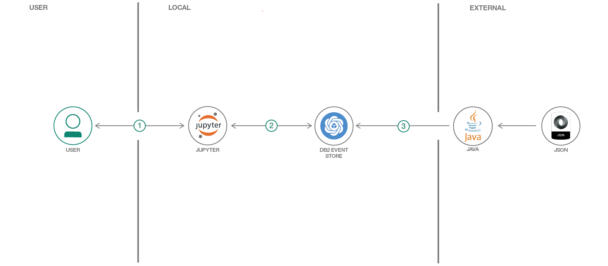

# イベント・データ・ストリームを取り込んで分析し、タイムリーな洞察を引き出す

### 外部プログラムからのイベント・データのストリーム配信と並行して、タクシー乗車に関する統計を視覚化する

English version: https://developer.ibm.com/patterns/ingest-and-analyze-event-data-streams-for-timely-insights
  
ソースコード: https://github.com/IBM/db2-event-store-taxi-trips

###### 最新の英語版コンテンツは上記URLを参照してください。
last_updated: 2018-04-22

 ## 概要

イベント・データのストリーム配信と並行してアナリティクスを実行したいと考えているとしたら、これはまさにうってつけのコード・パターンです。このコード・パターンでは、タクシー乗車イベントのストリーム配信と並行してタクシー乗車に関するタイムリーな統計を表示するために、Jupyter Notebook、Spark SQL、matplotlib を使用します。紹介する Java プログラムでデータ・ストリームの配信先として使用する IBM Db2 Event Store は、イベント駆動型のデータ処理とアナリティクスを対象に最適化されています。

## 説明

このコード・パターンでは、デーモンとして実行される Java プログラムが、IBM Db2 Event Store にイベントを送信します。Python でこのイベント・ストアとやり取りする方法は、Jupyter Notebook を使用して説明します。ストリーム配信されるイベントに応じて変化するデータを視覚化するために、アニメーション化した matplotlib グラフを使用します。イベント・ストリームとして使用するのは、タクシーの乗車データです。乗車開始ごとに平均乗車時間が常時更新されます。タクシー乗車データベースが増大していく様子を視覚化するために、グラフには乗車回数も示されます。

単純にするために、この例では CSV ファイル形式のタクシー・データを使用することにしました。この形式のデータであれば、別の外部データ・フィードに登録することなく、手軽にコード・パターンを実行できます。ただし明らかにしておくべき点として、このコード・パターンでは、膨大な量のデータに応じてスケーリングする、イベント駆動型のデータ処理とアナリティクスを実証することを意図しています。このコード・パターンは、皆さん独自のイベント・ストリームを処理できるよう、簡単に変更を加えられるようになっています。この例で使用するデータにはタイムスタンプが含まれているので、最新のイベントを含め、すべてのデータに基づく単純な統計を表示するのは簡単です。独自のイベントを使用する場合、ノートブックを使ってさまざまなグラフを試し、最新の統計でイベントの傾向を確認できます。

このコード・パターンをひと通り完了すると、以下の方法がわかるようになります。

* IBM Db2 Event Store Developer Edition をインストールする
* Python と Jupyter Notebook を使用して Db2 Event Store とやり取りする
* Java プログラムを使用して IBM Db2 Event Store にデータを取り込む
* データの取り込みと並行してデータベースのクエリーを実行する
* アニメーション化されたグラフにライブ更新を反映する

## フロー

1. Jupyter Notebook を実行します。
1. Jupyter Notebook を、ライブ・イベント・ストリームを分析する Db2 Event Store に接続します。
1. 外部 Java プログラムがライブ・イベントを送信します。

## 手順

このパターンの詳細な手順については、[README](https://github.com/IBM/db2-event-store-taxi-trips/blob/master/README.md) を参照してください。手順の概要は以下のとおりです。

1. IBM Db2 Event Store Developer Edition をインストールします。
1. リポジトリーを複製します。
1. Java イベント・ローダーを作成して実行します。
1. Jupyter Notebook を作成します。
1. Jupyter Notebook を実行します。
