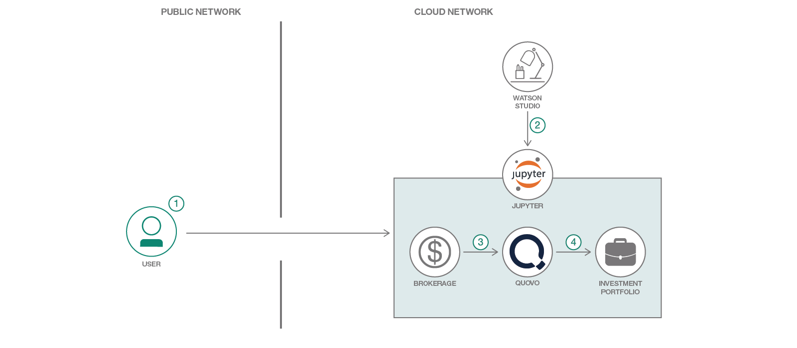

# 金融投資ポートフォリオを統合する

### Quovo Aggregation API、IBM Watson Studio、IBM Cloud Investment Portfolio サービスを利用して、安定株を集約して表示する

English version: https://developer.ibm.com/patterns/integrate-a-financial-investment-portfolio
  
ソースコード: https://github.com/IBM/Integrate-Investment-Portfolio

###### 最新の英語版コンテンツは上記URLを参照してください。
last_updated: 2018-04-27

 ## 概要

近頃は、投資ポートフォリオにアナリティクス・サービスを適用しようと試みる開発者が増えてきています。このコード・パターンでは、Quovo Aggregation API を使用して金融機関からポートフォリオとホールディングス情報を取得し、そのデータを IBM Cloud® Investment Portfolio サービスにロードする方法を説明します。この一連の手順がリストアップされている Jupyter Notebook は、IBM Watson Studio を使用して開くことができます。

## 説明

このコード・パターンでは、Quovo Aggregation API を使用して、証券取引口座に金融機関 (例えば、E*TRADE、Charles Schwab、Fidelity Investments など) からの複数のホールティング情報を統合してから、IBM Cloud Investment Portfolio サービスにロードする方法を説明します。

IBM Cloud Investment Portfolio サービスを利用すると、投資ポートフォリオおよび関連するホールディングス情報を、API 呼び出しによって保管、更新、クエリーすることができます。このサービスはホールディングス・レコードを一定期間保持し、柔軟なオブジェクト定義によって他の情報も保管できるようにしています。Investment Portfolio サービスにポートフォリオ・データをロードすれば、金融関連のテクノロジー・サービスを活用して、ポートフォリオで最先端のアナリティクスを実行できます。

このコード・パターンでは、ワークフローを一連の手順として Jupyter Notebook 内に設定しているので、各セルを実行する前に説明を確認できます。Jupyter Notebook を使用する各ユーザーは、Quovo アカウントを取得して、IBM Cloud 上に Investment Portfolio サービス・インスタンスを作成する必要があります。この両方が揃っていれば、IBM Watson Studio 内でノートブックを開いて手順の各ステップを実行できます。API 呼び出しには、Python スクリプトが使用されます。このスクリプトは最初に Quovo Aggregation API を使用して証券取引口座からポートフォリオ情報を取得し、次にそのデータを Investment Portfolio サービスにロードします。このコード・パターンにはさらに、ポートフォリオとホールディングス情報を統合してユーザーの投資ポートフォリオ内にそれらの情報を表示する Web インターフェースも用意されています。

## フロー

1. ユーザーが IBM Data Science Experience にログインします。
2. ユーザーがプロジェクトを作成して、ノートブックを開きます。
3. 初期手順で、Quovo Aggregation API を使用して証券取引口座情報を取得するまでの各ステップを実行します。
4. 以降の手順で、ポートフォリオおよび関連するホールディングス情報を IBM Cloud Investment Portfolio サービスにロードするまでの各ステップを説明します。

## 手順

Find the detailed steps for this pattern in the [README](https://github.com/IBM/Integrate-Investment-Portfolio).
