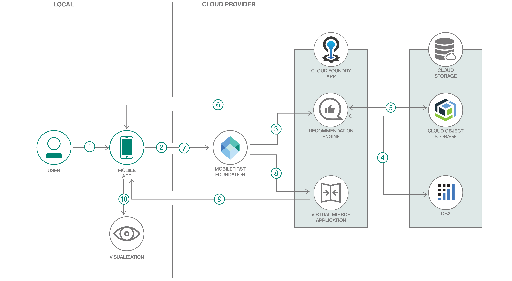

# e-コマース製品にバーチャル・ミラーを統合する

### Mobile First Foundation を使用して、レコメンデーション・システムを統合したハイブリッド・モバイル・アプリケーションを開発する

English version: https://developer.ibm.com/patterns/integrate-a-virtual-mirror-with-e-commerce-products
  
ソースコード: https://github.com/IBM/virtual-mirror-for-ecommerce

###### 最新の英語版コンテンツは上記URLを参照してください。
last_updated: 2019-08-01

 ## 概要

バーチャル・トライオン・アプリは、e-コマース界隈で次の大ヒットになる可能性があります。バーチャル・トライオン・アプリを使用すれば、店舗に出向いてさまざまな商品を物理的に試着する負担を大幅に軽減できます。こうしたアプリは、コスト効率に優れた、しかも商品を試着する便利な代替手段として消費者の時間とブランドの予算を節約するだけでなく、最も重要な点として、消費者がバーチャル・ミラーを見るだけで気に入った商品をあれこれ選ぶことを可能にします。

## 説明

この開発者コード・パターンでは、IBM MobileFirst&reg; Platform Foundation を利用して、レコメンデーション・システムを統合したハイブリッド・モバイル・アプリケーションを開発します。このアプリケーションは年齢と性別を入力として取り、そのデータに基づいてパーソナライズされた宝飾品のレコメンデーションを返します。ユーザーは勧められた宝飾品を、バーチャル・ミラー機能を使って試着できます。

このコード・パターンを完了すると、以下の方法がわかるようになります。

* モバイル・アプリケーションを使用して IBM MobileFirst Platform Foundation に接続する
* モバイル・アプリからの入力を取得して、IBM Cloud 上で処理する
* Cloud Foundry アプリをデプロイして使用する
* モバイル・アプリを使用して Cloud Object Storage に保管されている画像にアクセスする
* IBM Cloud 上の Db2&reg; を接続してアクセスする
* レコメンデーション・エンジンをセットアップしてモバイル・アプリに統合する

## フロー

1. ユーザーがモバイル・アプリを通じて年齢と性別を入力します。
1. IBM MobileFirst Platform Foundation にユーザーの入力が渡されます。
1. IBM MobileFirst Platform Foundation がユーザーの入力をレコメンデーション・エンジンに渡します。
1. レコメンデーション・エンジンが IBM Db2 とやり取りして、推奨する商品に関する必要な詳細情報を取得します。
1. 推奨する商品の画像が Cloud Object Storage から取得されます。
1. レコメンデーション・エンジンが推奨する商品の画像と詳細をユーザーのモバイル・アプリに返します。
1. ユーザーがバーチャル・ミラー・ボタンをクリックしてバーチャル・ミラーにアクセスします。
1. IBM MobileFirst Platform Foundation がユーザーの入力をバーチャル・ミラー・アプリケーションに渡します。
1. バーチャル・ミラー・アプリケーションがユーザーにバーチャル・ミラーへのアクセスを提供します。
1. ユーザーがバーチャル・ミラーを表示します。

## 手順

このコード・パターンに取り組む準備はできましたか？詳細な手順については、[README](https://github.com/IBM/virtual-mirror-for-ecommerce/blob/master/README.md) ファイルを参照してください。手順の概要は以下のとおりです。

1. リポジトリーのクローンを作成します。
1. レコメンデーション・エンジンをセットアップします。
1. バーチャル・ミラーをセットアップします。
1. モバイル・アプリをセットアップします。
