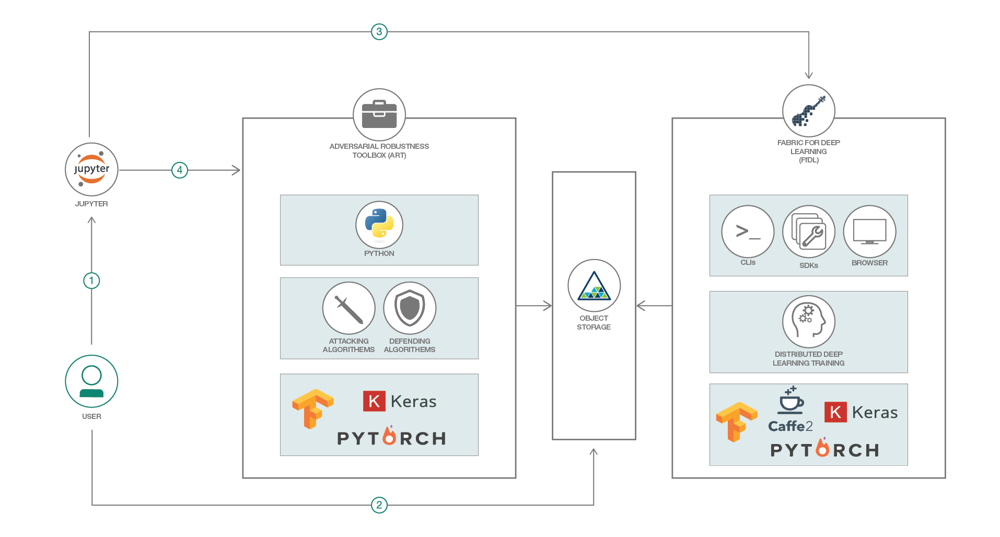

# モデルのトレーニング・パイプラインに敵対者からの攻撃を統合する

### モデルの脆弱性を見つけるために、Jupyter Notebook を使用してニューラル・ネットワーク・モデルのトレーニング・パイプラインに Adversarial Robustness Toolbox を統合する

English version: https://developer.ibm.com/patterns/./integrate-adversarial-attacks-model-training-pipeline
ソースコード: https://github.com/IBM/FfDL/tree/master/demos/fashion-mnist-adversarial

###### 最新の英語版コンテンツは上記URLを参照してください。
last_updated: 2018-06-25

 
## 概要

セキュリティーが非常に重要となるアプリケーションでは、敵対者からの攻撃によって AI システムを実際の脅威にさらします。こうした攻撃は、攻撃者と防御者にとって非対称的な課題を突きつけます。攻撃者の見返りは、疑いを抱かせることなく攻撃が成功することです。一方、防御者は既知となっているすべての攻撃を防ぐことが可能な戦略を開発しなければなりません。さらに理想的には、考えられる限りの情報を入手する必要があります。このコード・パターンでは、Fabric for Deep Learning (FfDL) を使用したモデルのトレーニング・パイプラインに、Adversarial Robustness Toolbox (ART) に含まれる Fast Gradient Method (FGM) を統合する方法を説明します。FGM によって生成された敵対的サンプルを使用して、トレーニングされたモデルのロバスト性を評価します。

## 説明

最近では、敵対者からの攻撃に対する機械学習モデルのロバスト性を評価することが、機械学習パイプラインに不可欠のステップとなってきています。こうした敵対的機械学習のためにあるライブラリーが、Adversarial Robustness Toolbox (ART) です。ART の目的は、分類子を攻撃および防御する多数の最先端のメソッドを実装して、機械学習モデルに応じた攻撃方法と防御方法を迅速に作成し、分析できるようにすることです。

Fabric for Deep Learning (FfDL。「フィドル」と発音します) は、分散型深層学習トレーニング環境をセットアップする際の複雑さの多くを隠し、Kubernetes 上のサービスとしての TensorFlow、PyTorch、Caffe、Keras といった深層学習フレームワークを一貫した方法で実行できるようにしています。機械学習モデルのトレーニングは非常に繰り返しの多いプロセスですが、このことが特に当てはまるのは、敵対的サンプルをトレーニング・データ・セットに取り込んで、攻撃に対してモデルを評価して強化する手法を組み込む場合です。Web アプリケーション内でインタラクティブにプログラミングを行うことができるJupyter Notebook は、データ・サイエンティストの間で非常によく使われているツールです。

このコード・パターンでは、Jupyter Notebook で Python と Bash シェルのマジックを使って FfDL 上でトレーニング・ジョブを起動し、Adversarial Robustness Toolbox を使用してモデルの脆弱性を検出します。このプロセスの中で、トレーニング・ジョブを構成して起動する方法、そして実行中のトレーニング・ジョブを追跡する方法を説明します。ここでは深層学習フレームワークとして Keras と TensorFlow を使用します。また、トレーニング・データとトレーニング済みモデルを保管するために必要な S3 クラウド・オブジェクト・ストレージ・インタンスとのやり取りには、Boto3 Python SDK を使用します。Adversarial Robustness Toolbox から Fast Gradient Method (FGM) を実行し、敵対的サンプルを作成して、トレーニング済みモデルのロバスト性に関する指標を生成します。

## フロー

1. FfDL クラスターをデプロイした後、必要となる Python ライブラリーを仮想環境内にインストールし、ローカル Jupyter Notebook サーバーを起動します。
2. Jupyter Notebook 内で Fashion-MNIST データ・セットをダウンロードし、それをクラウド・オブジェクト・ストレージにアップロードします。次に、畳み込みニューラル・ネットワーク (CNN) をトレーニングするための Keras スクリプトと、FfDL モデル・マニフェスト・ファイルを作成します。このマニフェスト・ファイルに含まれるさまざまなフィールドに、FfDL 内のモデル、オブジェクト・ストア情報、リソース要件の他、モデルのトレーニングとテストの実行中に必要な一連の引数 (ハイパーパラメーターを含む) を記述します。
3. Jupyter Notebook 内から FfDL CLI を使用して FfDL とやり取りし、FfDL モデル・マニフェスト・ファイルとモデル定義ファイルをデプロイした後、トレーニング・ジョブを起動して、ジョブの進捗状況をモニタリングします。
4. トレーニング・ジョブが完了したら、クラウド・オブジェクト・ストレージ・インスタンスからトレーニング済みモデルをダウンロードし、ART を使用して Fast Gradient Method により敵対的サンプルを生成します。生成された敵対的サンプルを使用して、トレーニング済みモデルのロバスト性をテストし、ロバスト性の指標を表示します。一部の敵対的サンプルを視覚化し、元のモデルを使用して敵対的サンプルに対する予測を行います。

## 手順

このコード・パターンに取り組む準備はできましたか？アプリケーションを起動して使用する方法について詳しくは、[README](https://github.com/IBM/FfDL/blob/master/demos/fashion-mnist-adversarial/README.md) を参照してください。
