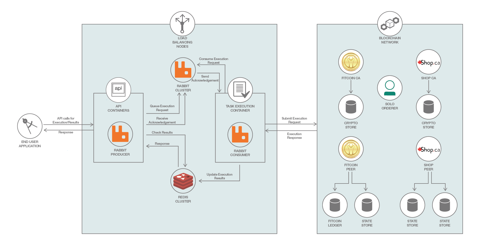

# ブロックチェーン・ネットワークに RabbitMQ と Redis Cluster を統合する

### 膨大な数のリクエストを処理できるようにアプリケーションを最適化してスケーリングする

English version: https://developer.ibm.com/patterns/integrate-rabbitmq-and-redis-cluster-with-a-blockchain-network
  ソースコード: https://github.com/IBM/Leveraging-cache-and-MessagingQueue-to-scale-BlockchainNetwork

###### 最新の英語版コンテンツは上記URLを参照してください。
last_updated: 2018-04-18

 
## 概要

Hyperledger Fabric Node SDK を使用したブロックチェーン・アプリケーションの作成方法を紹介する IBM Code パターン・シリーズの第 4 回へようこそ。これまでの回でネットワークを作成してネットワークの操作を定義する方法を理解したところで、今回は、RabbitMQ と Redis Cluster を統合してブロックチェーン・アプリケーションをスケーリングできるようにする方法を説明します。大量のリクエストを処理できるよう、ブロックチェーン・アプリケーションを最適化しましょう！

## 説明

優れた開発者であれば誰でも知っているように、アプリケーション開発プロセスでは、スケーリングが極めて重要な意味を持ちます。スケーラビリティーとは、特定の負荷の増加に応じてどれだけ効率的にスケーリングできるかを測る指標です。スケーラビリティーは設計および開発プロセスを開始する時点から考慮しなければならない要素であり、結果論であってはなりません。スケーラビリティーを考慮しなかったために、アプリケーションに制限を課すようなことはしたくないはずです。さらに、複数のソースにわたって、データを並行処理してからその結果を統合することが可能であるかどうかも考慮する必要があります。この開発者向けパターンでは、IoS アプリケーションのフロントエンド・アプリケーションとブロックチェーン・バックエンドとの間で行われるデータ処理をスケーリングして調整するように Redis と Rabbit を構成します。REST API 呼び出しを直接使う方法では、読み取り/書き込みが競合する可能性があるため、ブロックチェーン・ネットワークに送信されるリクエストの数を制御することはできません。ここでは、ブロックチェーン・ネットワークに送信されるリクエストのフローを制御してアプリケーションをスケーリングするために、以下の 2 つの方法をとります。

1. ミラーリングされたキューからなるノードで RabbitMQ クラスター使用し、ユーザー・リクエストを順序付ける
1. 6 つのノード (3 つのマスターと 3 つのスレーブ) で Redis Cluster クラスターを構成し、ここで一時的に結果を保管する

アーキテクチャー図に示されているように、RabbitMQ プロデューサーを API コンテナーに含めて、これらのコンテナー内で RabbitMQ クラスターへのリクエストをキューに入れます。タスク実行コンテナー内の Hyperledger Fabric Node SDK のインスタンスで、ユーザーからのリクエストを取り込み、実行対象としてブロックチェーン・ネットワークに送信するように RabbitMQ コンシューマーを構成します。

## フロー

1. ブロックチェーン・ネットワークを作成して起動します。
1. ブロックチェーン・ネットワーク上でトランザクションを実行します。
1. ブロックチェーン・ネットワーク内で生成された結果とトランザクション・ブロックを表示します。

## 手順

Ready to put this code pattern to use? Complete details on how to get started running and using this application are in the [README](https://github.com/IBM/Leveraging-cache-and-MessagingQueue-to-scale-BlockchainNetwork/blob/master/README.md).
