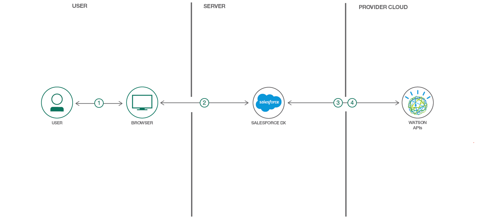

# Watson AI を Salesforce アプリに統合する

### Watson Visual Recognition、Watson Discovery、Watson Tone Analyzer の API を呼び出す

English version: https://developer.ibm.com/patterns/integrate-watson-ai-into-salesforce-apps
  ソースコード: https://github.com/IBM/watson-and-salesforce

###### 最新の英語版コンテンツは上記URLを参照してください。
last_updated: 2018-02-20

 ## 概要

この開発者向けコード・パターンでは、Salesforce アプリケーション内の Watson AI サービスに簡単にアクセスできるよう、IBM Watson® SDK for Salesforce を使用する方法を紹介します。この新しい Watson Salesforce SDK を使用することで、Conversation、Language Translator、Discovery をはじめとする Watson サービスにアクセスする Apex アプリケーションを作成できます。

## 説明

Apex コードベースを使って Watson を統合しようとしたことがあればわかるはずですが、そのためのコードは何百行にも及ぶことになります。けれども恐れないでください。このプロセスに必要な時間を短縮するのに役立つ SDK があります。

2017 年 11 月に、IBM は新たな Watson Salesforce SDK のリリースを発表しました。この SDK は、IBM と Salesforce のパートナーシップによって生まれた数多くの画期的な成果の 1 つに過ぎませんが、SDK は開発者のツールボックスになくてはならない重要なツールです。Watson Salesforce SDK を使用することで、Salesforce 開発者がこれまでになく簡単に、Watson AI を Salesforce アプリケーションに統合できるようになります。簡単に言えば、Watson Salesforce SDK は、開発者が Watson API に適切にアクセスするためにすぐに使用できるコードをパッケージ化したものです。SDK を使用すると、計り知れないほどの時間と労力が節約されます。Apex コードベースを使用して Waton を統合するには、一般に何百行ものコードを作成しなければなりませんが、SDK を使用することによって、わずか 5 行のコードで同じ結果を達成できます。

この開発者向けコード・パターンでは、この新しい Watson Salesforce SDK の使い方を説明するために、Salesforce 固有のプログラミング言語 Apex でさまざまな Watson API を操作します。現在、Watson Salesforce SDK では次の Watson サービスをサポートしています。

* Watson Conversation V1
* Watson Discovery V1
* Watson Language Translator V2
* Watson Natural Language Classifier V1
* Watson Natural Language Understanding V1
* Watson Personality Insights V3
* Watson Speech to Text V1
* Watson Text to Speech V1
* Watson Tone Analyzer V3
* Watson Visual Recognition V3

このコード・パターンをひと通り完了することで、以下の作業をどのようにして行うのかを把握できます。

* Salesforce アカウントを作成する
* Watson Salesforce SDK をインストールする
* Watson Salesforce SDK を使用して Watson Visual Recognition、Watson Discovery、Watson Tone Analyzer の API を呼び出す
* Lightning UI デバッガーを使用して API 呼び出しの結果を確認する

## フロー

1. Salesforce プラットフォームにログインして、Developer Console を表示します。
1. Watson Salesforce SDK を使用して、Developer Console に Apex コードを書き込みます。
1. Watson API を呼び出す Apex コードを実行します。
1. Watson API 呼び出しの結果が Salesforce Developer Console デバッガーに返されます。

## 手順

Ready to put this code pattern to use? Complete details on how to get started running and using this application are in the [README](https://github.com/IBM/watson-and-salesforce/blob/master/README.md).
