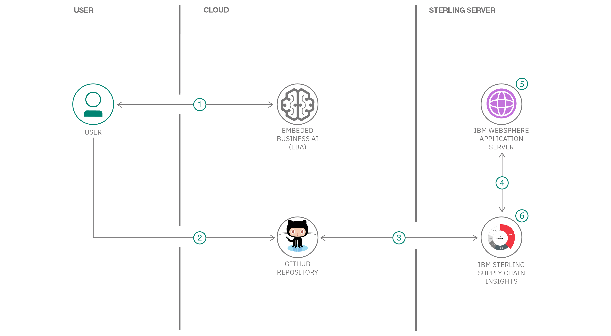

# カスタマー・サービス担当者が顧客と注文の情報を迅速に入手できるようにする

### Embedded Business Assistant を IBM Sterling Call Center for Commerce に統合する

English version: https://developer.ibm.com/patterns/./integration-of-scba-to-call-center-oms
  ソースコード: https://github.com/IBM/Call-center-EBA

###### 最新の英語版コンテンツは上記URLを参照してください。
last_updated: 2020-03-09

 ## 概要

IBM Sterling Call Center for Commerce は、カスタマー・サービス担当者 (CSR) がコール・センターの UI 内で受注処理システムのありとあらゆる重要な機能にアクセスできるようにするためのソリューションです。このソリューションを使用することで、注文入力、商品と在庫の検索、返品と交換の処理、注文に関するアラートと例外の管理、顧客の苦情処理、再発送と注文の変更、プライス・マッチなどの重要な機能にアクセスできるようになります。この開発者コード・パターンでは、拡張機能を使用して Sterling Call Center for Commerce をさらに強化する方法を概説します。

## 説明

IBM Sterling Call Center for Commerce は、アプリケーションに既に備わっている機能を拡張機能によって拡張することで強化できます。こうした拡張機能の 1 つとして使用できるのが、Embedded Business Assistant (Embedded Business AI) フレームワークです。Embedded Business AI は、複数のオープン・ハイブリッド・クラウドにデプロイ可能な、オムニチャネルに対応したエンタープライズ・クラスのフレームワークであり、開発者はこのフレームワークを利用することで、ビジネス・ユーザー向けの高度なドメイン固有のプロセスを自動化することができます。ルール・ベースの推論と述語論理を使用する他の対話管理システムとは異なり、Embedded Business AI では、シンプルで整合性のある包括的かつ簡単な方法で、マシンに対してビジネス・ドメインを記述することができます。IBM はこの Embedded Business AI を使用して、ビジネスのあらゆる場面で人工知能をサポートする、デジタル・ツインを作成しています。

Embedded Business Assistant を IBM Sterling Call Center for Commerce に統合すると、カスタマー・サービス担当者が迅速、簡単に、対応相手の顧客に関する情報と、その顧客の注文とトランザクションに関する情報を入手できるようになります。これにより、照会されている問題の解決時間が短縮されるとともに、顧客と担当員との間の対話が強化され、改善されます。このコード・パターンでは、Embedded Business Assistant を IBM Sterling Call Center for Commerce に統合する方法を説明します。

## フロー

1. ユーザーが IBM ID を使用して Embedded Business AI フレームワークにログインし、プログラムでアクセスするために使用する公開鍵と秘密鍵を生成します。
1. ユーザーが、生成された秘密鍵と GitHub リポジトリーから入手できる GetAccessKey.js スクリプトを使用してアクセス・キーを生成し、同じく GitHub リポジトリーに用意されている customer_overrides.properties ファイル内のアクセス・キーを更新します。
1. ユーザーがリポジトリー内に置かれている更新後の customer_overrides.properties ファイルと extensions フォルダーを、IBM Sterling Call Center for Commerce がデプロイされているサーバーに移動します。
1. 新しい .ear ファイルが作成されて IBM WebSphere&reg; Application Server にデプロイされます。
1. IBM WebSphere Application Server が再起動されて、デプロイされた .ear ファイルに従って変更が反映されます。
1. これで、ユーザーは Embedded Business Assistant が IBM Sterling Call Center for Commerce に統合されたことを確認できます。

## 手順

このコード・パターンに取り組む準備はできましたか？詳しい手順については、[README](https://github.com/IBM/Call-center-EBA/blob/master/README.md) ファイルを参照してください。手順の概要は以下のとおりです。

1. GitHub リポジトリーのクローンを作成します。
1. アクセス・キーを生成します。
1. properties ファイルと extensions フォルダーを Github から Sterling サーバーにコピーします。
1. .ear ファイルを作成してアプリを WebSphere にデプロイします。
1. WebSphere Application Server を再起動します。
1. WebSphere Application Server 上にデプロイしたアプリケーションを起動します。
1. IBM Sterling Call Center for Commerce 上で変更を確認します。
