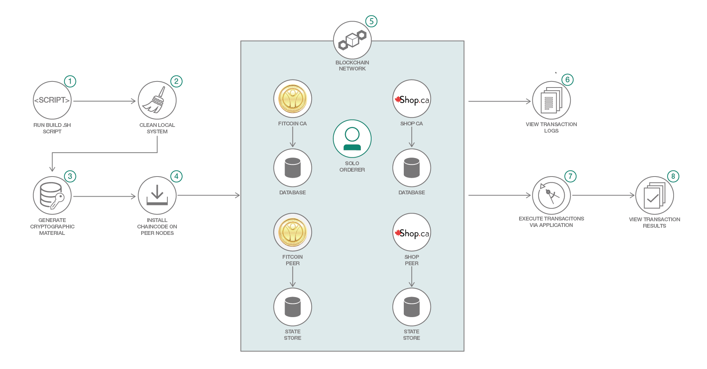

# ブロックチェーン・ネットワークとやり取りする

### ブロックチェーン・ネットワークとそのルールをテストするアプリを作成して、ネットワークに対してトランザクションとリクエストを実行する

English version: https://developer.ibm.com/patterns/interacting-with-a-blockchain-network
  
ソースコード: https://github.com/IBM/InteractingWithABlockchainNetwork

###### 最新の英語版コンテンツは上記URLを参照してください。
last_updated: 2018-06-14

 
## 概要

完全なブロックチェーン・アプリケーションを構築する全 5 回からなるパターン・シリーズの 2 回目へようこそ。ブロックチェーン・アプリを開発するには、ネットワークを立ち上げ、サポートするトランザクションのタイプを定義するチェーンコードを作成し、最後にアプリケーションを使用してネットワークとそのルールをテストするといったように、複数のステップが伴います。最後のステップは、REST API を使用してトランザクションを公開するという手法でも、単純なアプリケーションを作成するという手法でも対処できます。この開発者パターンでは、後者の手法でブロックチェーン・ネットワークに対してトランザクションとリクエストを実行する方法を説明します。

## 説明

ブロックチェーンは、あらゆる開発者が理解しなければならない話題のテクノロジーです。ブロックチェーン・テクノロジーは、ネットワーク内のすべての参加者によるトランザクションの信ぴょう性を保証します。ネットワークのセットアップに伴って確立されたコントラクト以外には、仲介者も規制もありません。

ネットワークを立ちあげて、参加者とトランザクションを定義した後は、次のステップとして、ネットワークが正しくセットアップされていて期待通りに動作することをテストするアプリケーションを作成します。このテストを、コードの機能を繰り返し演習する単体テストと呼ぶ人もいるでしょう。コードのロジックを確認するには例外なく、テスト・ケースを作成しなければなりません。この場合、各参加者が実行できるトランザクションがその参加者に対して定義されているトランザクションだけであることを確認する必要があります。さらに、すべてのトランザクションが期待通りに機能することを検証する必要もあります。この取り組みが、開発ライフサイクル・プロセスの基礎となります。

この開発者コード・パターンでは、この複合パターンの最初のステップで構築したネットワークを使用して、トランザクションをテストします。ステップ 1 で構築したネットワークをまだデプロイしていない場合は、このリンク先のコード・パターン「[API 一式を通して Hyperledger Fabric を探索する](https://developer.ibm.com/jp/patterns/explore-hyperledger-fabric-through-a-complete-set-of-apis/)」に従って今すぐネットワークをセットアップしてください。その後は、このパターンに従ってアプリケーションを作成してデプロイし、トランザクションを発行できます。

## フロー

1. ビルド・スクリプトを実行します。これにより、3 つのステップでネットワークが起動されます。
1. クリーンなシステムからネットワークを構築できるよう、古い Docker イメージをすべて削除します。
1. 暗号化マテリアルを生成します。暗号化構成ファイル (crypto-config.yaml) は、誰が誰であるかの身元を定義するものです。このファイルは、ピアと発注者に対し、それぞれが属する組織とドメインを指示した上で、最初のチェーン・ブロックとして機能する Orderer Genesis Block によってブロックチェーン・ネットワークまたはチャネルとサービスを初期化します。チャネルの各ピアには、メンバーシップ・サービスがインストールされます。
1. ピア上にチェーンコードをインストールし、発注者、ピア、チャネル、ネットワークそれぞれの Docker イメージをビルドします。
1. ネットワークを起動します。
1. トランザクションのログを確認します。
1. Web アプリケーションを使用してトランザクションを行います。
1. Web アプリケーション内でトランザクションの結果を表示します。

## 手順

このコード・パターンを利用するには、[README](https://github.com/IBM/InteractingWithABlockchainNetwork) に記載されている開始方法の詳細を参照してください。
