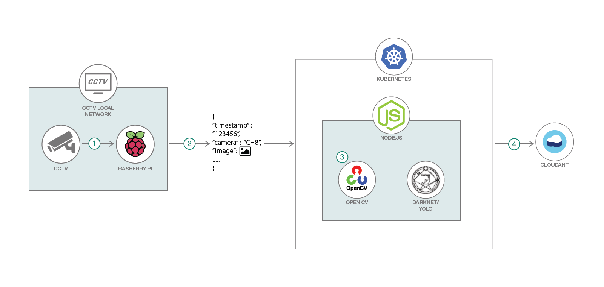

# 畳み込みニューラル・ネットワークを使用して、リアルタイムの CCTV 画像を分析する

### 深層学習アルゴリズムを使用して動きを検出し、動画フィード内のオブジェクトを特定する

English version: https://developer.ibm.com/patterns/iot-devicesensor-damage-detection-with-edge-analytics
  ソースコード: https://github.com/IBM/dnn-object-detection

###### 最新の英語版コンテンツは上記URLを参照してください。
last_updated: 2018-12-14

 ## 概要

この開発者コード・パターンでは、OpenCV と Darknet を使用し、ニューラル・ネットワーク・モデルを適用して RTSP (Real-Time Streaming Protocol) 形式の動画ストリームを分析するアプリケーションをデプロイします。

## 説明

数多くの監視カメラが設置されているとは言え、こうした監視カメラを一日中厳重にモニタリングすることはできません。イベントというものは、オペレーターがいないときに発生しがちです。そのため、重要なイベントが記録されているとしても見落とされることはよくあります。ユーザーが何時間も映像を見続けるだろうと期待することはできません。ユーザーが何に注意すれば良いのかわかならいとしたら、それは尚更のことです。

このプロジェクトの目的は、上述の問題を軽減するために、深層学習アルゴリズムを使用して動きを検出し、映像の中のオブジェクトを特定することです。深層学習アルゴリズムは、ライブ・ストリームにも記録済みの動画にも適用できます。各動画フレームを分析した後、ラベルを付けたスクリーンショットをそれに対応するメタデータと併せて Cloudant® データベースにアップロードします。これにより、オペレーターは複雑なクエリーを呼び出して、収集されたデータに対して分析を実行できるようになります。サンプル・クエリーとして、前の月曜日にカメラ 3 で人が検出されたすべてのスクリーンショットを選択するクエリー、前の日曜日に検出された自動車の合計数を取得するクエリーが用意されています。

このコード・パターンを完了すると、以下の方法がわかるようになります。

* Python と OpenCV を使用して RTSP 動画ストリームに接続する
* OpenCV と NumPy を使用して、動画フレームを処理し、顕著な動きがあるかどうかを判断する
* 事前に作成された深層学習モデルを使用して、写真または動画の中のオブジェクトを識別する

## フロー

1. 動き検出スクリプトをRTSP ストリームまたは動画ファイルに接続します。
1. 動きが検出された場合、スクリーンショットをキャプチャーして、そのスクリーンショットをローカルでホストされている Node.js サーバーまたは IBM Cloud コンテナー・サービス内の Node.js サーバーに転送します。
1. Darknet/YOLO オブジェクト検出アルゴリズムを使用してスクリーンショットを分析します。
1. ラベルを付けたスクリーンショットを、関連するメタデータ (時刻、カメラ・チャネル) と併せて Cloudant データベースにアップロードします。

## 手順

詳細な手順については、[README](https://github.com/IBM/dnn-object-detection/blob/master/README.md) を参照してください。
