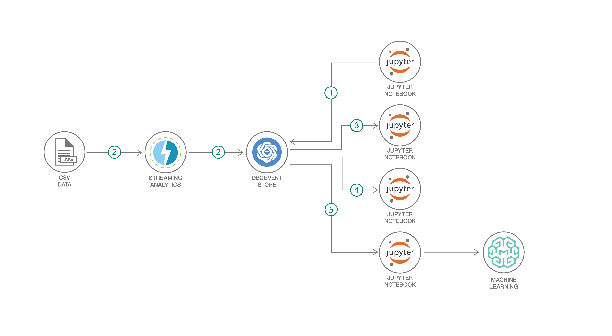

# 機械学習と高度なアナリティクスを使用して IoT センサー・データを分析する

### Spark MLlib、IBM Db2 Event Store、Jupyter ノートブックを使用して、温度予測モデルを作成する

English version: https://developer.ibm.com/patterns/iot-sensor-temperature-analysis-with-ibm-db2-event-store
  ソースコード: 'https://github.com/IBM/db2-event-store-iot-analytics'

###### 最新の英語版コンテンツは上記URLを参照してください。
last_updated: '2019-01-30'

 
## 概要

このコード・パターンでは、Jupyter ノートブックを使用して IoT センサー・データを IBM Db2 Event Store にロードします。次に、Jupyter ノートブックで Spark SQL および Matplotlib を使用して、IBM Db2 Event Store 内のデータをクエリーし、分析します。最後に Spark 機械学習ライブラリーを使用して、入力された電力消費量と周囲温度を基に温度を予測するモデルを作成します。

## 説明

このコード・パターンでは、Jupyter ノートブックを使用して IBM Db2 Event Store とやり取りする例を紹介します。この例では、データベース・オブジェクトの作成から高度なアナリティクス、そして機械学習モデルの開発とデプロイに至るまで、Jupyter ノートブックを使用します。

このコード・パターンで使用するサンプル・データは、実際の産業用 IoT センサーによって収集されるデータをシミュレーションしたものです。この IoT サンプル・データには、センサー温度、周囲温度、電力消費量に加え、固有のセンサー ID とデバイス ID で識別されたセンサーからなるグループのタイムスタンプが含まれています。

Db2 Event Store は、膨大な量の構造化データとリアルタイムのアナリティクスに対応するよう、Apache Spark と Apache Parquet データ形式に基づいて設計されたインメモリー・データベースです。このソリューションは、イベント駆動型のデータ処理と分析用に最適化されており、IoT ソリューション、決済、ロジスティクス、Web コマースといったイベント駆動型の新しいアプリケーションをサポートすることができます。さらに、柔軟性とスケーラビリティーを兼ね備えていることから、時とともに変化するビジネス・ニーズにも迅速に適応できます。

このコード・パターンを完了すると、以下の方法がわかるようになります。

* Python と Jupyter ノートブックを使用して Db2 Event Store とやり取りする
* Matplotlib グラフを使用してデータを視覚化する
* 機械学習モデルを作成してテストする
* Watson Machine Learning を利用してモデルをデプロイし、使用する

## フロー

1. サンプル IoT データセットをプロジェクト・アセットとして追加します。
1. Db2 Event Store データベースおよびテーブルを作成します。
1. Spark SQL を使用してテーブルのクエリーを実行します。
1. Matplotlib グラフを使用してデータを分析します。
1. 機械学習モデルを作成してデプロイします。

## 手順

このパターンの詳細な手順については、[README ファイル](https://github.com/IBM/db2-event-store-iot-analytics/blob/master/README.md)を参照してください。手順の概要は以下のとおりです。

1. リポジトリーを複製します。
1. IBM Db2 Event Store をインストールします。
1. サンプル IoT データ・アセットを追加します。
1. IBM Db2 Event Store データベースおよびテーブルを作成します。
1. テーブルのクエリーを実行します。
1. データを分析します。
1. 機械学習モデルを作成してデプロイします。
