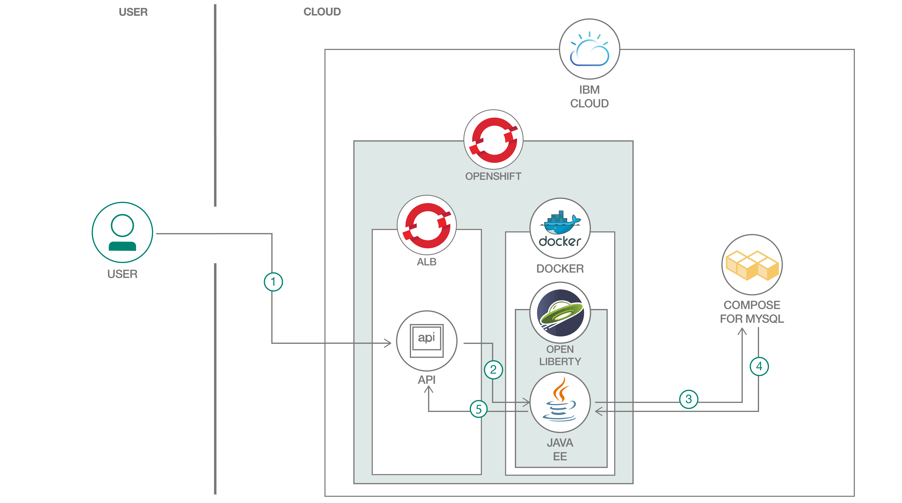

# OpenShift による Java EE アプリケーションのモダナイズ

### Java EE と Open Liberty を使用した架空の医療アプリ内に Kubernetes ベースのマイクロサービスをデプロイする

English version: https://developer.ibm.com/patterns/jee-app-modernization-with-openshift

ソースコード: https://github.com/IBM/example-health-jee-openshift

###### 最新の英語版コンテンツは上記URLを参照してください。
last_updated: 2019-08-01

 ## 概要

このコード・パターンでは、Open Liberty 上で稼働する Java EE アプリケーションを Kubernetes ベースのマイクロサービスに変換してモダナイズする方法を紹介しています。例として、概念上の健康記録システムで使用する RESTful なアプリケーションのコンテナー・イメージを作成する方法を具体的に説明します。このアプリは、MySQL データベースに接続されて、エンタープライズ Kubernetes 環境内にデプロイされます。

このサンプル・コードは、架空の医療会社を例に IBM Cloud&trade; 上で Red Hat OpenShift のエンタープライズ Kubernetes 環境を使用してアプリをモダナイズする方法を説明するコード・パターン・シリーズの一部となっています。このシリーズでは、REST API を使用して MySQL データベースに大量のデータを取り込み、Java EE アプリケーションからそのデータにアクセスする方法を学ぶことができます。さらに、OpenShift の Source-to-Image ツールキットも使用します。そのために、いずれも Java EE アプリケーションから API への RESTful な呼び出しによって MySQL データベース内のデータを表示する、Node.js と PHP の 2 つの Web アプリケーションをデプロイします。

## 説明

「Example Health」は概念上の医療/保険会社です。この会社は長年にわたって蓄積された何十万件もの患者記録を保有しています。これらの健康記録は、ほとんどの保険会社が保有している健康記録と非常によく似たものです。

当初、Example Health はモノリシックなアプリケーション構造で健康記録アプリケーションを作成しました。つまり、フルスタックの Java アプリケーションを WebSphere Application Server 上で実行し、System z 上の DB2 データベースに接続するという構造です。

最近になって、Example Health はこのモノリシックな健康記録アプリケーションをモダナイズして、マイクロサービスに分割することを決めました。これを受けて開発チームが決定したのは、SQL データベースに移行して、[Java EE アプリケーション](https://github.com/IBM/example-health-jee-openshift)と [Node.js アプリケーション](https://developer.ibm.com/jp/patterns/app-modernization-s2i-openshift/)に接続することです。前者 (このコード・パターンで説明するアプリケーション) は Open Liberty 上で稼働して、ビジネス・ロジックを実行します。後者は患者記録アプリケーションのユーザー・インターフェースとして使用します。さらに、Example Health はこの 2 つのアプリケーションを IBM Cloud 上の Red Hat OpenShift にデプロイすることにしました。

OpenShift に移行した後、Example Health はシステムを拡大して新しいマイクロサービスを追加しました。追加されたマイクロサービスには、健康記録管理者用の [PHP アプリケーション](https://developer.ibm.com/jp/patterns/app-modernization-php-s2i-openshift/)と [Node.js アナリティクス・アプリケーション](https://developer.ibm.com/patterns/creating-a-health-data-analytics-app-with-legacy-mainframe-code-and-cloud/)が含まれます。

このコード・パターンに従って、従来型の Java アプリケーションをマイクロサービスに変換してクラウド上にデプロイする方法を理解してください。

## フロー

1. ユーザーが、Java EE アプリケーションのいずれかの API を呼び出します。このアプリケーションは OpenShift アプリケーション・ロード・バランサーの背後に配置されています。
1. ロード・バランサーはユーザーからの呼び出しを、Kubernetes ポッド内で稼働する Open Liberty コンテナーにルーティングします。
1. Java EE アプリケーションが必要なデータを取得するために、クラウド内で稼働する MySQL データベースに対してクエリーを実行します。
1. MySQL データベースから該当するデータが Java EE アプリケーションに送信されて、必要に応じて処理されます。
1. データは JavaScript Object Notation (JSON) 形式に変換されてから、API とユーザーに渡されます。

## 手順

手順に取り組む準備はできましたか？このコード・パターンの詳細な手順については、GitHub リポジトリー内に置かれている [README.md](https://github.com/IBM/example-health-jee-openshift/blob/master/README.md) ファイルを参照してください。手順の概要は以下のとおりです。

1. IBM Cloud 上に Red Hat OpenShift クラスターを作成します。
1. Compose for MySQL データベースをプロビジョニングします。
1. Java EE アプリケーションの Docker コンテナー・イメージを作成します。
1. コンテナー・イメージを Docker Hub リポジトリーにプッシュします。
1. `kubernetes-openshift.yaml` ファイル内のイメージ・キーを変更します。
1. シークレットの値を MySQL クラウド・デプロイメントに合わせて編集します。
1. Open Liberty サーバーのデータベース・アクセス・パラメーターを設定します。
1. IBM Cloud 上の Red Hat OpenShift クラスターにアプリケーションをデプロイします。
1. アプリケーションをインターネットに公開します。
1. 合成された患者健康記録を MySQL データベースに取り込みます。
