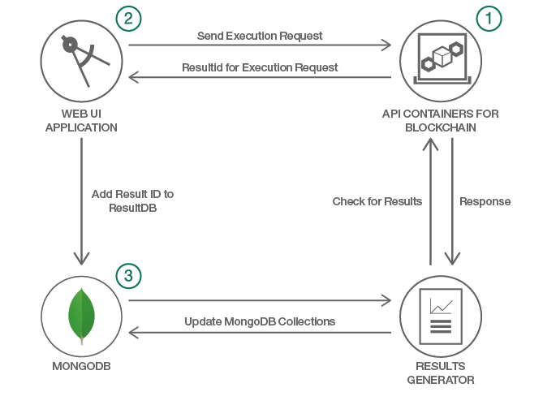

# ブロックチェーン・ネットワークの負荷テストを実施する  

### Java プログラムを使用してネットワークの負荷テストを行って、MongoDB に格納されたテスト結果を確認する

English version: https://developer.ibm.com/patterns/./load-test-your-blockchain-network
  ソースコード: https://github.com/IBM/loadtesting-the-Blockchain-Network

###### 最新の英語版コンテンツは上記URLを参照してください。
last_updated: 2018-04-23

 
## 概要

皆さんがこのページにアクセスしているのは、おそらくブロックチェーン・アプリケーションを完成させたからでしょう。おめでとうございます！その一方で、アプリケーションが効率的に動作するかどうか、あるいはどのようにパフォーマンスをテストすればよいのかわからないという不安を抱えているとしたら、今回の開発者向けパターンを読んでください。Hyperledger Fabric Node SDK を使用したブロックチェーン・アプリケーションの作成方法を紹介するこのシリーズではこれまで、ネットワークを作成する方法、ネットワークをスケーリングする方法を説明してきました。今回は、ブロックチェーン・ネットワークの負荷テストを行う方法を説明します。具体的には、大量の登録、起動、クエリーのリクエストを送信し、MongoDB 内に保管されたリクエストの結果を確認します。

## 説明

ブロックチェーン・ネットワークを構築する開発者の数は増加の一途を辿っています。それは、多くの企業がプロセスを操作可能にする方法を革新し、ブロックチェーンの統合を進めていることを意味します。将来、自動車の販売とリースの管理や、配車サービスの手配にもブロックチェーンが使用されるようになるかもしれません。こうしたアプリケーションに必要なネットワークでは、かなりの数の参加者と資産を管理することになります。おそらく皆さんは、ネットワーク全体をダウンさせることなく、必要に応じてネットワークをスケーリングしてボリュームの増加に対応させるには、どうしたらよいのか考えていることでしょう。

本番アプリケーションのパフォーマンスとスケーラビリティーは、あらゆる開発者が第一に念頭に置かなければならない事項です。そこで、「ブロックチェーン・ネットワークに RabbitMQ と Redis Cluster を統合する」パターンの続編として、今回のパターンでは Java™ プログラムを実行してブロックチェーン・ネットワークの負荷テストを行います。つまり、リクエストをブロックチェーン・ネットワークに送信して、その結果を確認するということです。これらの負荷テストの統計を追跡するために、MongoDB を使用します。

## フロー

1. ブロックチェーン・ネットワークを作成して起動します。
2. ExecutionApp を起動します。
3. MongoDB 内に保管された負荷テストの結果を確認します。

## 手順

Ready to put this code pattern to use? Complete details on how to get started running and using this application are in the README.
