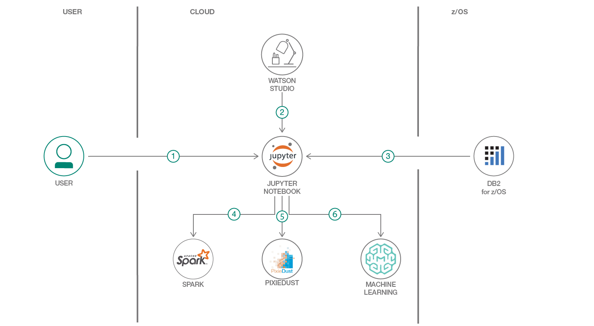

# 合成された診療記録を使用した機械学習

### 実在する患者の診療記録に関するプライバシーの問題を懸念せずにデータ・モデルを作成する

English version: https://developer.ibm.com/patterns/./machine-learning-using-synthesized-patient-health-records
  ソースコード: https://github.com/IBM/summit-health-machine-learning

###### 最新の英語版コンテンツは上記URLを参照してください。
last_updated: 2019-04-11

 
## 概要

このコード・パターンでは、合成された診療記録を使用して、2 型糖尿病を予測する機械学習モデルをトレーニングする方法を説明します。合成された診療記録を使用することで、実在する患者の診療記録を使用する場合に伴うプライバシーの問題を懸念せずに、モデルの作成方法を学ぶことができます。

## 説明

このプロジェクトは、z/OS サーバー上のデータベース内に電子診療記録を保管している Summit Health という架空のヘルスケア会社に焦点を当てた[コード・パターン・シリーズ](https://developer.ibm.com/series/systems-example-health-series/)の一部です。ノートブックを実行する前に、合成された診療記録を作成して、このデータベースにロードする必要があります。そのための手順は、コード・パターン [ビッグデータの CSV ファイルを変換してデータベースにロードする](https://github.com/IBM/japan-technology/blob/main/Code-Patterns/transform-load-big-data-csv-files-db2-zos-database/)
 で説明しています。その手順に従って、Synthea ツールを使用して診療記録を作成し、変換してからデータベースにロードしてください。

このコード・パターンでは、ヘルスケア分野で考えられる機械学習の使用ケースをデモするために、IBM Watson Studio 上で Jupyter Notebook を使用して予測モデルを作成します。Jupyter Notebooks は、多くのデータ・サイエンティストがデータのクレンジング、変換、視覚化や、機械学習モデルの作成とテストに使用しているツールです。このコード・パターンはデモを目的としたものですが、合成されたヘルスケア・メトリックから構成されたデータ・セットに対して Watson Machine Learning を適用し、糖尿病のリスクを予測するモデルを作成する方法を説明します。このモデルを作成した後は、入力したデータにスコアを付けて、個々のケースに対して糖尿病のリスクを予測することができます (注意する点として、このサンプル・アプリケーションはデモと説明だけを目的としているため、法規制関連のレビューは行われていません)。

このコード・パターンをひと通り完了すると、以下の方法がわかるようになります。

* Apache Spark を使用してデータを準備する
* PixieDust を使用してデータ間の関係を視覚化する
* 機械学習モデルをトレーニングして Watson Machine Learning リポジトリー内で公開する
* モデルを Web サービスとしてデプロイし、予測を行うために使用する

## フロー

1. IBM Watson Studio にログインします。
1. 用意されているノートブックを Watson Studio にロードします。
1. データをノートブックにロードします。
1. Apache Spark を使用してデータを変換します。
1. PixieDust を使用してグラフを作成します。
1. Watson Machine Learning を使用してモデルを公開し、デプロイします。

## 手順

詳細な手順については、[README](https://github.com/IBM/summit-health-machine-learning/blob/master/README.md) を参照してください。手順の概要は以下のとおりです。

1. IBM Watson Studio にサインアップします。
1. プロジェクトを作成します。
1. Watson Machine Learning インスタンスを作成します。
1. ノートブックをプロジェクトに追加します。
1. ノートブックを実行します。
