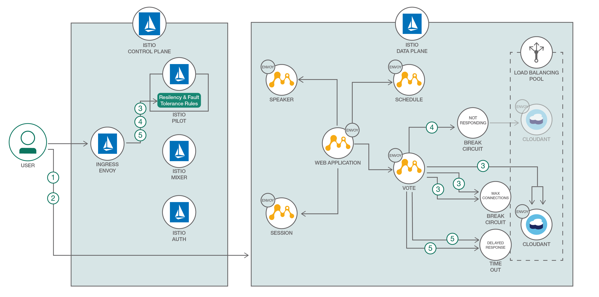

# Istio を使用して Java マイクロサービスをレジリエンシーなサービスにする

### Istio を利用して、高度なレジリエンシーとフォールト・トレランス機能を備えた Java マイクロサービスを実現する

English version: https://developer.ibm.com/patterns/make-java-microservices-resilient-with-istio
  
ソースコード: https://github.com/IBM/resilient-java-microservices-with-istio

###### 最新の英語版コンテンツは上記URLを参照してください。
last_updated: 2017-08-21

 
## 概要

Twelve-Factor App (アプリ開発に必要な 12 要素) では、障害を前提としてマイクロサービスを設計し、実装することを強く主張しています。これが何を意味するかというと、マイクロサービスが急増するなか、障害の発生は不可避であるため、アプリケーションにはフォールト・トレランス機能が必要だということです。サービス・メッシュとしての Istio を利用すれば、アプリケーション・コードを変更することなく、マイクロサービスのレジリエンシーを確保できます。

## 説明

マイクロサービスを作成してパッケージ化するのは、プロセス全体の一部でしかありません。高度にスケーラブルで分散されたマイクロサービスのデプロイメントにおいて、さまざまなレイヤーで障害が発生した場合のことを考えてみてください。どのようにして、粒度の細かいアクセス制御とレート制限といったポリシー決定を適用しますか？タイムアウト/再試行、ヘルス・チェックなどを有効にするにはどうしますか？いくつかの言語固有のフレームワークでこれらの課題に対処するとしても、通常、その実装はフレームワークまたは言語に固有なものです。マイクロサービス間で基礎となるフレームワークまたは言語が異なる場合、回復機能を再実装または移植しなければなりません。場合によっては、アプリケーションで、レジリエンシーとフォールト・トレランス機能に必要なコードおよび構成を実装しなければならないこともあります。サービス・メッシュ・アーキテクチャーでは、このような問題を解決するために、マイクロサービス・フレームワークに必要となる共通の回復機能をアプリケーションとフレームワークから切り離し、プラットフォーム自体に組み込むという手法を取っています。このようなサービス・メッシュを簡単に作成する手段となるのが、Istio です。このコード・パターンではまず、Istio サービス・メッシュを使用して、Java&trade; MicroProfile マイクロサービスを作成、デプロイ、接続する方法を説明します。続いて、アプリケーション・コードを変更することなくマイクロサービスに回復性をもたらすために、Istio に備わっている高度な回復機能 (サーキット・ブレーカー、タイムアウト/再試行、レート制限など) を構成して使用する方法を説明します。

## フロー

1. Kubernetes クラスター内で稼動するように構成された Java アプリケーションをデプロイします。
1. アプリケーション上で Istio Envoy を注入します。
1. MicroProfile 用に高度な Istio 機能を構成し、Cloudant データベース用のサーキット・ブレーカーを作成します。
1. Cloudant の 2 つのインスタンスを使用してロード・バランシング用プールを作成した後、サーキット・ブレーカーを使用して正常性を失ったインスタンスを検出し、そのインスタンスをロード・バランシング用プールから除外します。
1. Cloudant への Vote マイクロサービス接続のタイムアウトと再試行ルールを作成します。

## 手順

1.  アプリケーション・コードを入手してビルドします。
1.  アプリケーションのマイクロサービスと Istio Envoy をデプロイします。
1.  Istio のレジリエンシー機能であるサーキット・ブレーカーとフォールト・インジェクションを調べます。
