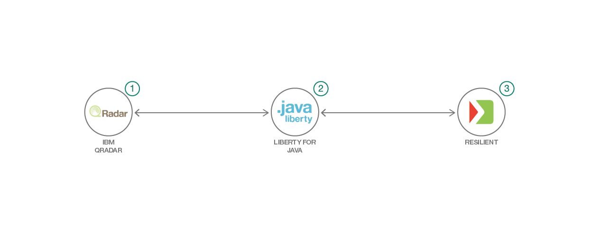

# セキュリティーの分析情報とインシデントの対応を効率的に管理する

### REST API を使用して IBM Resilient Incident Response Platform に IBM QRadar によるセキュリティー情報・イベント管理を統合する

English version: https://developer.ibm.com/patterns/./manage-security-insights-and-incidence-response-effectively
  ソースコード: https://github.com/IBM/managing-security-incidents

###### 最新の英語版コンテンツは上記URLを参照してください。
last_updated: 2019-01-18

 
_**注: 本コード・パターンは、複合パターンの一部となっているものです。** この複合パターンを構成するコード・パターンは、スタンドアロン・アプリケーションにすることも、別のコード・パターンの続きとして使用することもできます。この複合パターンは、次のコード・パターンからなります。_

* [QRadar を使用してデバイス・イベントをモニタリングする](https://github.com/IBM/japan-technology/blob/main/Code-Patterns/detect-security-offenses-for-iot-devices-using-qradar)
* セキュリティーの分析情報とインシデントの対応を効率的に管理する (本パターン)

## 概要

最近のセキュリティー情報・イベント管理 (SIEM) システムは広範な知識ベースにアクセスし、これまで以上に効果的にデータの検出とロギングを行うようになっていますています。SIEM にインシデント対応プラットフォームを組み合わせれば、セキュリティー・チームがインシデントのエスカレーションと管理のプロセスを単純化および簡素化するために使用できる、強力なプラットフォームになります。この開発者コード・パターンでは、REST API を使用して IBM Resilient Incident Response Platform&reg; に IBM QRadar&reg; によるセキュリティー情報・イベント管理を統合する方法を説明します。

## 説明

このコード・パターンでは、IBM QRadar 上で速度と場所に関連するオフェンスを作成し、それらのオフェンスを、QRadar Resilient Integration アプリケーションを使用して IBM Resilient Incident Response Platform 上のプレースホルダ―組織に送信する手順を説明します。

このコード・パターンを完了すると、以下の方法がわかるようになります。

* REST API を使用して、QRadar からオフェンスにアクセスする
* REST API を使用して、IBM Resilient Incident Response Platform 上にインシデントを作成する
* QRadar から、IBM Resilient Incident Response Platform 上の該当する組織にオフェンスを送信する

## フロー

1. QRadar からすべてのオフェンスを取得します。
1. 取得したオフェンスを IBM Resilient Incident Response Platform のインシデント形式に変換します。
1. 変換後のインシデントを該当する組織に送信します。

## 手順

このコード・パターンに取り組む準備はできましたか？詳しい手順については、[README](https://github.com/IBM/managing-security-incidents/blob/master/README.md) を参照してください。
