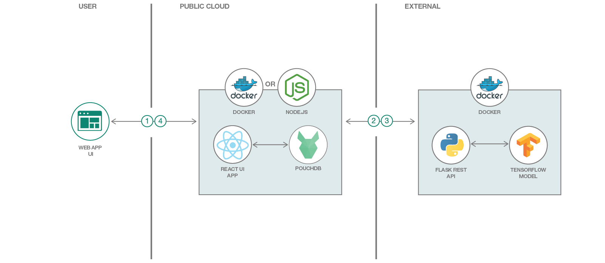

# 深層学習を採用した「マジック・トリミング・ツール」をデプロイする

### 事前にトレーニングされたオープンソースのモデルを使用して、深層学習駆動型の「マジック・トリミング・ツール」をデプロイする

English version: https://developer.ibm.com/patterns/max-image-segmenter-magic-cropping-tool-web-app
  
ソースコード: https://github.com/IBM/MAX-Image-Segmenter-Web-App

###### 最新の英語版コンテンツは上記URLを参照してください。
last_updated: 2019-03-28

 ## 概要

このコード・パターンでは、オープンソースの画像セグメント化深層学習モデルを使用して、送信された画像の中から各種のオブジェクトを検出します。それらのオブジェクトを、ドラッグ・アンド・ドロップ操作対応の Web アプリケーション・インターフェースから操作して、オブジェクトを結合したり、新しい画像を作成したりします。

## 説明

オンラインで共有されている画像のほとんどには 1 つまたは多数のオブジェクトが描写されていて、これらのオブジェクトは、一般に何らかの環境に含まれているか、ある種の背景の前にあります。他の場所でさらに処理するためであっても、新しい構成で使用するためであっても、画像を編集する際は、こうした個々のオブジェクトをトリミングして抜き出すのにかなりの時間がかかることがあります。このコード・パターンで紹介するアプリケーションは、Model Asset eXchange (MAX) の深層学習モデルを使用してこのプロセスを自動化することによって創造性を刺激します。

ユーザーが送信した画像内のオブジェクトをピクセル単位で識別するために、このアプリケーションでは [MAX Image Segmenter](https://developer.ibm.com/jp/exchanges/models/all/max-image-segmenter/) モデルを使用しています。このモデルによって分類されたピクセルを使用して、個々のタイプによる色分けでオブジェクトが強調表示されたバージョンの画像 (カラーマップ) を生成します。さらに、各セグメントを独立した画像ファイルに分割し、ダウンロードして別の場所で使用できるようにします。追加の画像がアップロードされると、それらの画像が画面の下部にあるカルーセルに追加され、PouchDB を使ってブラウザー内に保存されます。このカルーセルから、画像をレビュー、削除したり、「Studio」にロードしたりできます。

アプリの「Studio」セクションでは、2 つの画像をインターフェースにロードし、それらの画像に含まれる任意の 2 つのオブジェクトをドラッグ・アンド・ドロップ操作で結合することができます。ここで作成した新しい画像もダウンロードできます。

このコード・パターンを完了すると、以下の方法がわかるようになります。

* Image Segmenter MAX Model の Docker イメージをビルドする
* REST エンドポイントを使用して深層学習モデルをデプロイする
* MAX Model の REST API を使用して、画像内のオブジェクト・セグメントを認識する
* MAX Model の REST API を使用する Web アプリケーションを実行する
* 処理後のオブジェクト・セグメントを操作して新しい画像を作成する

## フロー

1. ユーザーが Web アプリケーション・インターフェースを使用して画像を送信します。
1. MAX Deep Learning マイクロサービスにより、画像内のオブジェクト・セグメントが識別されて JSON レスポンスとして返されます。
1. Web アプリケーション・サーバーが JSON レスポンスを使用して画像からオブジェクトを切り取り、それらのオブジェクトをユーザーに表示します。
1. ユーザーが Web アプリケーション・インターフェースを使用して、アップロードされた画像に含まれるオブジェクト・セグメントを操作します。

## 手順

このパターンの詳細な手順については、[README](https://github.com/IBM/MAX-Image-Segmenter-Web-App/blob/master/README.md) ファイルを参照してください。手順で説明する方法は以下のとおりです。

1. MAX モデル API を起動します。
1. 「マジック・トリミング・ルーツ」Web アプリを起動します。
