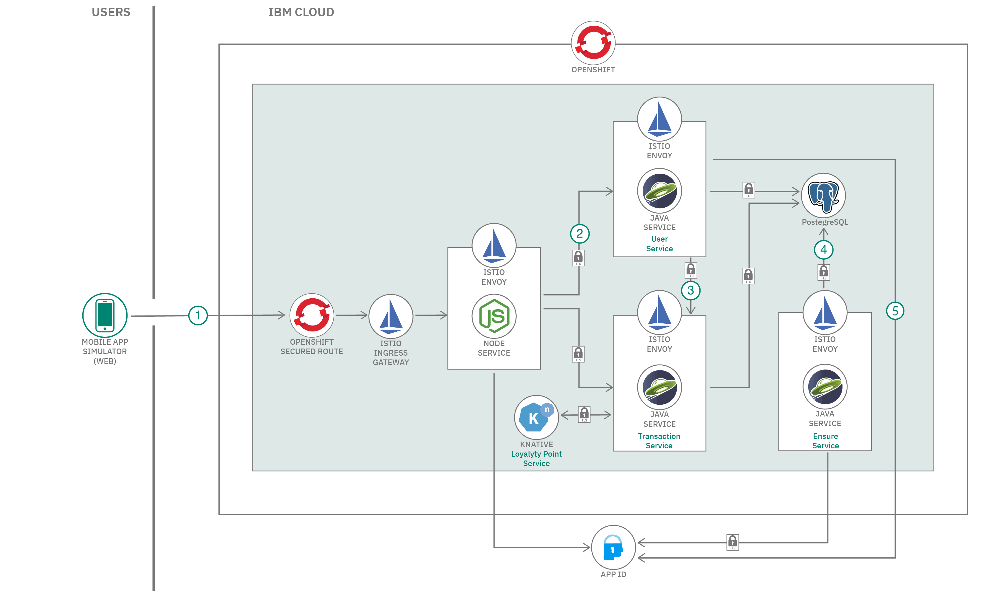

# OpenShift Service Mesh を使用したマイクロサービス

### TLS と Istio ベースのサービス・メッシュを使用して、マイクロサービス間の相互作用をセキュリティーで保護する

English version: https://developer.ibm.com/patterns/microservices-with-the-openshift-service-mesh
  
ソースコード: https://github.com/IBM/example-bank/blob/service-mesh/mesh-pattern.md

###### 最新の英語版コンテンツは上記URLを参照してください。
last_updated: 2020-09-17

 
## 概要

このコード・パターンでは、Red Hat&reg; OpenShift&reg; Service Mesh を利用して、[シミュレートされたインタラクティブなモバイル・アプリケーション](https://developer.ibm.com/blogs/build-secure-applications-with-openshift-4-public-cloud/)用のサービス・メッシュをデプロイする方法を説明します。説明では、Red Hat OpenShift on IBM Cloud&trade; 内でのサンプルを使用します。

## 説明

顧客データを収集する企業にとって極めて重要なのは、クラウド環境にデプロイされてもデータ・プライバシーとセキュリティーを確保するセキュアなアプリケーションを構築することです。金融、小売、銀行などの規制対象の業界ともなれば、この重要性はなおさら高くなります。マイクロサービス・アーキテクチャーとコンテナー化への移行が進む中、データ・プライバシー・サービスのコンテキストでは、サービス・メッシュのようなテクノロジーが役立つ可能性があります。

OpenShift Service Mesh は、[Maistra Istio Operator](https://github.com/Maistra/istio-operator) をベースに、Istio の上位層として構築されます。このコード・パターンでは、マイクロサービス・ベースのモバイル・バンキング・アプリが Istio サービス・メッシュと連動できるように、デプロイメント・スクリプト、Dockerfile、ネットワーク・ポリシーを変更する方法を説明します。主な目標は、サービス間の mTLS と Istio Ingress Gateway によってセキュリティーを確保することですが、Istio を構成した後は、Istio のトラフィック管理とセキュリティー・ポリシーの柔軟性を利用できるようになります。この例では、OpenShift Service Mesh をインストールして、サービス間で共通の TLS を使用するように Example Bank プロジェクトを構成します。Istio メッシュ内では、Istio のトラフィック管理、テレメトリー、可観測性の機能を利用することもできます。

## フロー

以下の図は、Example Bank モバイル・アプリケーションでのサービス・メッシュのアーキテクチャー・フローを示しています。図中には、[ユーザー認証](https://developer.ibm.com/jp/patterns/privacy-backend-loyalty-app-openshift-4/)とトランザクションを処理する複数のマイクロサービスが示されています。

1. ユーザーが HTTPS を介して OpenShift ルーターに接続します。このルーターにより、リクエストは Istio Ingress Gateway という Envoy インスタンスにルーティングされます。
1. Envoy がゲートウェイと仮想サービス・ルールを使用して、リクエストを Node.js サービスに転送します。この Node.js サービスでは、アプリ ID を基準にユーザー・アカウントを検証します。
1. サービス・メッシュ内のトラフィック・ルールは、サービス間のすべてのトラフィックを Istio プロキシーで傍受してセキュリティーを適用するようにセットアップされています。Node.js サービス、Java Transaction Service、Java ユーザー管理サービスの間でのトラフィックは、Envoy がプロキシーの役割を果たす mTLS 接続を経由します。
1. ユーザー・サービス、トランザクション・サービス、クリーンアップ・サービスはすべて、クラスター内の PostgreSQL データベースと通信します。PostgreSQL データベース自体も Pod 内のプロキシー・コンテナーで実行されているため、データベース・アクセスにセキュリティーおよびフィルター・ルールを適用できます。
1. Java 消去サービスは 24 時間間隔で実行されて、アプリ ID からユーザーを削除します。Istio 環境内では、このようなジョブに遅延を設定し、Envoy プロキシーが起動してトラフィックを受信するようになるまで待機させる必要があります。[この仕組みの詳細を確認してください。](https://github.com/IBM/example-bank/blob/main/README.md#erasure-service)

## 手順

このコード・パターンを試すには、GitHub リポジトリー内に用意されている[詳細な手順](https://github.com/IBM/example-bank/blob/service-mesh/mesh-pattern.md)を参照してください。手順の概要は以下のとおりです。

1. Example Bank コード・パターンを使用してサービスをデプロイします。
1. OpenShift Service Mesh Operator をインストールします。
1. コントロール・プレーン・インスタンスとメンバー・ロール・インスタンスを作成します。
1. サービス・メッシュ対応の service-mesh ブランチをチェックアウトします。
1. 変更を確認して適用します。

## 次のステップ

私たちが OpenShift 4.3 を使用して Example Bank アプリケーションを構築したときに従った手順を理解するには、以下のコンテンツに含まれているオープンソース・コードと手順を使用してください。

* **ブログ記事**: [Build secure microservices applications with OpenShift 4.3 on public cloud](https://developer.ibm.com/blogs/build-secure-applications-with-openshift-4-public-cloud/)
* **記事**: [An introduction to OpenShift 4](https://developer.ibm.com/articles/intro-to-openshift-4/)
* **記事**: [Threat modeling in the context of microservice architectures](https://developer.ibm.com/articles/threat-modeling-microservices-openshift-4/)
* **チュートリアル**: [OperatorHub を楽しむ](https://developer.ibm.com/jp/tutorials/operator-hub-openshift-4-operators-ibm-cloud/)
* **コード・パターン**: [データ・プライバシーを重視した、顧客ロイヤルティー向けモバイル・アプリのバックエンド](https://developer.ibm.com/jp/patterns/privacy-backend-loyalty-app-openshift-4/)
* **チュートリアル**: [Build serverless Node.js applications with the OpenShift Serverless Operator](https://developer.ibm.com/tutorials/build-serverless-nodejs-applications-with-the-openshift-serverless-operator/)
* **チュートリアル**: [モバイル・アプリのバックエンドを OpenShift 4 にデプロイする Tekton パイプラインを構築する](https://developer.ibm.com/jp/tutorials/tekton-pipeline-deploy-a-mobile-app-backend-openshift-4/)
