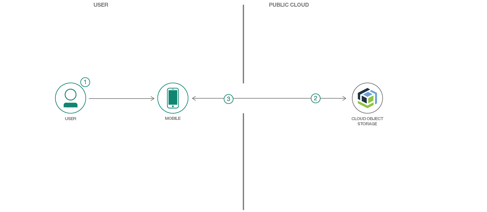

# クラウド内にオブジェクトとして保管されている画像をダウンロードするモバイル・アプリを設計する

### 画像をダウンロードするサンプル Swift アプリ内で Cloud Object Storage を利用する

English version: https://developer.ibm.com/patterns/mobile-applications-cloud-object-storage

ソースコード: https://github.com/IBM/swift-cloud-object-storage-example

###### 最新の英語版コンテンツは上記URLを参照してください。
last_updated: 2019-01-15

 
## 概要

クラウド内にオブジェクトとして保管されているデータとやり取りできるモバイル・アプリケーションであれば、アーカイブ、保管、バックアップなどのタスクだけでなく、アナリティクス用のスケーラブルな永続ストレージにも対応できます。このコード・パターンでは、従来型のサーバーからダウンロードした画像を、クラウド上でオブジェクトとして保管されている画像を比較するサンプル Swift アプリを紹介します。

## 説明

このコード・パターンで紹介するのは、iPhone 上で従来型のサーバー (この例では [Wikipedia](https://en.wikipedia.org/wiki/Atlantic_hurricane_season)) と [IBM Cloud Object Storage](https://www.ibm.com/cloud/object-storage) のそれぞれからダウンロードした、大西洋のハリケーン・シーズンの画像を比較するサンプル「Image Downloader」アプリです。Cloud Object Storage からダウンロードする画像には、1 つのバケット内にオブジェクトとして保管されているものと、別のバケット内に圧縮ファイル・アーカイブとして保管されているものがあります。

このコード・パターンでは、以下のタスクに対処する方法を説明します。

* iOS Swift アプリケーションを作成する
* Cloud Object Storage を Swift アプリケーションに統合する

## フロー

1. ユーザーがアプリを操作して、Cloud Object Storage からのオブジェクト (画像) のダウンロードを開始します。
2. アプリは Cloud Object Storage に対し、アクセス・トークンとバケット・オブジェクトのリストを取得するため、そしてオブジェクト (画像) をダウンロードするために必要な一連の呼び出しを行います。
3. ダウンロードされた画像が、アプリ上でユーザーに表示されます。

## 手順

このコード・パターンの詳細な手順については、GitHub リポジトリー内に置かれている [README.md](https://github.com/IBM/swift-cloud-object-storage-example/blob/master/README.md) ファイルを参照してください。

1. リポジトリーを複製します。
2. 開発者用ツールをインストールします。
3. 依存関係をインストールします。
4. Cloud Object Storage バケットを作成します。
5. Xcode 内でアプリを実行します。
