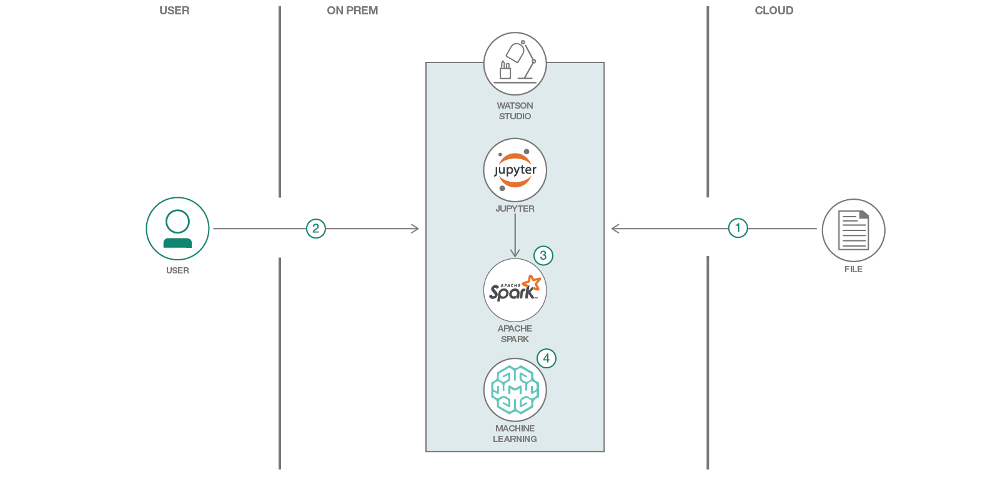

# フィーチャー・エンジニアリングとモデルの採点を行う

### IBM Watson Studio Local を利用して、ワインを分類する機械学習モデルの作成とトレーニングを自動化する

English version: https://developer.ibm.com/patterns/model-mgmt-on-watson-studio-local
  
ソースコード: https://github.com/IBM/model-mgmt-on-watson-studio-local

###### 最新の英語版コンテンツは上記URLを参照してください。
last_updated: 2018-11-05

 
## 概要

このコード・パターンでは、IBM Watson Studio Local を利用して、ワインを分類する機械学習モデルの作成とトレーニングを自動化する方法を説明します。ここではフィーチャーを抽出するために、ワイン関連のデータセットに主成分分析 (PCA) アルゴリズムを適用します。抽出した成分に基づいて、ワインのカテゴリーを予測する分類モデルを作成します。

## 説明

このコード・パターンでは IBM Watson Studio Local ツール・スイートを利用する例として、ワインをその化学的プロパティーに基づいて 3 つのカテゴリーに分類するためのデータ・サイエンス・ワークフローを紹介します。

ワインを分類するために必要なプロパティーの数は、フィーチャー・エンジニアリングを使用して制限します。主成分分析 (PCA) アルゴリズムを使用してワイン関連のデータセットから 2 つの主成分を抽出し、分類モデルを作成します。

この分類モデルでは、抽出された成分にロジスティック回帰を適用してワインのカテゴリーを予測します。

このコード・パターンを完了すると、以下の方法がわかるようになります。

* Watson Studio Local を使用して、PCA やその他の手法によってフィーチャーを抽出する
* Watson Studio Local を使用して、抽出されたフィーチャーを基にモデルを作成、トレーニング、保存する
* Watson Machine Learning の機能を使用してモデルをデプロイし、バッチおよび API モードでモデルにアクセスする
* サービスとしてデプロイされたスクリプトを使用して、バッチおよび API モードでフィーチャー抽出とモデル採点を自動化する

## フロー

1. Spark DataFrame の処理によってデータセットをクリーンアップし、Spark MLlib を使用して PCA 分類モデルをトレーニングします。
1. トレーニングしたモデルを IBM Watson Studio Local に保存します。
1. ユーザーは Watson Studio Local 内で提供されているノートブックを実行できます。
1. IBM Watson Machine Learning の機能を使用してモデルをデプロイし、モデルを使用してワインを分類します。

## 手順

詳細な手順については、[README](https://github.com/IBM/model-mgmt-on-watson-studio-local/blob/master/README.md) ファイルを参照してください。手順の概要は以下のとおりです。

1. github リポジトリーをローカル・システムに複製します。
1. Watson Studio Local 内でプロジェクトを作成します。
1. 必要なすべてのプロジェクト・アセットをアップロードおよび作成します。
1. Jupyter Notebook を実行して分類モデルを作成します。
1. Watson Studio Local マスター・リポジトリーに変更をコミットします。
1. Watson Machine Learning 内でデプロイ可能なリリース・プロジェクトを作成します。
1. モデルを Web サービスとしてデプロイします。
1. ヘルパー・スクリプトをジョブとしてデプロイします。
1. すべてのデプロイメントをオンライン状態にします。
1. API エンドポイントを収集して、スクリプトから呼び出せるようにします。
1. デプロイされたエンドポイントを呼び出すようにスクリプトを変更します。
1. スクリプトをローカルで実行してテストします。
1. Watson Machine Learning を使用してモデルを管理します。
