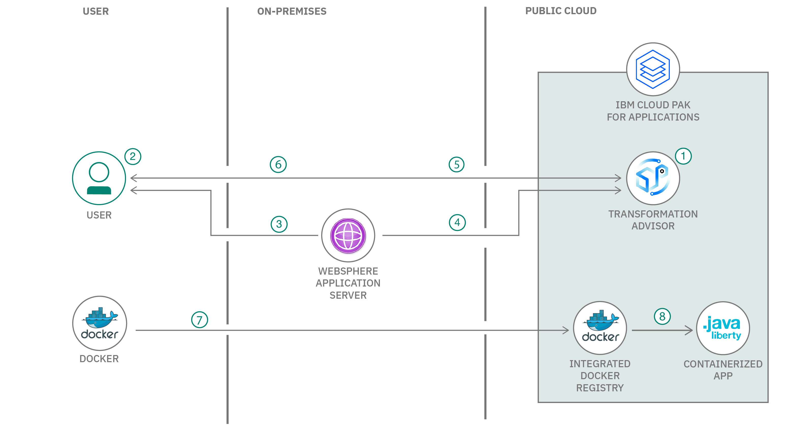

# 従来型のオンプレミス・アプリを変換し、コンテナー化されたアプリとしてパブリック・クラウド上にデプロイする

### IBM Transformation Advisor を使用したアプリのモダナイゼーション

English version: https://developer.ibm.com/patterns/modernize-apps-with-ibm-transformation-advisor
  
ソースコード: https://github.com/IBM/migrate-app-to-openshift-using-cp4a

###### 最新の英語版コンテンツは上記URLを参照してください。
last_updated: 2020-08-25

 
## 概要

この開発者コード・パターンでは、IBM Cloud Pak&trade; for Applications 上の Transformation Advisor を使用して、従来型のオンプレミス WebSphere&reg; アプリケーションを評価します。Transformation Advisor によって生成された移行バンドルをダウンロードし、Transformation Advisor の推奨に従って、IBM Cloud Pak for Applications 上で稼働する WebSphere Liberty コンテナー内にデプロイし、IBM が管理する OpenShift 上で実行します。

## 説明

オンプレミスから IBM Cloud への移行を説明する、サンプル Web アプリが用意されています。

このコード・パターンを完了すると、以下の方法がわかるようになります。

* IBM が管理する OpenShift クラスター (ICP4A) 上で、IBM Cloud Pak for Applications にアクセスする
* Transformation Advisor を使用してカスタム・データ・コレクターを作成する
* カスタム・データ・コレクターを実行して従来型の WebSphere アプリを評価する
* Transformation Advisor からのレポートをレビューして、移行の複雑さ、コスト、推奨を確認する
* アプリをコンテナー化するための成果物を生成する
* 生成された移行バンドルを使用して、モダナイズされたアプリを IBM が管理する OpenShift クラスター上の IBM Cloud Pak for Applications に移行する

## フロー

1. IBM が管理する OpenShift クラスター上で、IBM Cloud Pak for Applications に用意されている IBM Transformation Advisor にアクセスします。
1. IBM Transformation Advisor からカスタム・データ・コレクターをダウンロードします。
1. 移行するアプリケーションが実行されている従来型の WebSphere Application Server ホスト上でデータ・コレクターを実行します。
1. データ・コレクターによる分析結果が自動的にアップロードされます。または、手作業で分析結果をアップロードします。
1. Transformation Advisor 内で推奨をレビューし、移行バンドルを生成します。
1. 移行バンドルをダウンロードします。
1. Docker を使用してイメージをビルドし、OpenShift Docker レジストリーにアップロードします。
1. プッシュされたイメージを使用してアプリを作成し、コンテナー化されたアプリを実行します。

## 手順

このコード・パターンに取り組む準備はできましたか？詳しい手順については、[README](https://github.com/IBM/migrate-app-to-openshift-using-cp4a/blob/master/README.md) を参照してください。手順の概要は以下のとおりです。

1. IBM Cloud Pak for Applications をインストールします。
1. Transformation Advisor を導入します。
1. データ・コレクターをダウンロードして実行します。
1. 必要に応じて、結果をアップロードします。
1. 推奨とコストの見積もりを確認します。
1. 移行バンドルを生成します。
1. ICP4A 上にアプリケーションをデプロイします。
