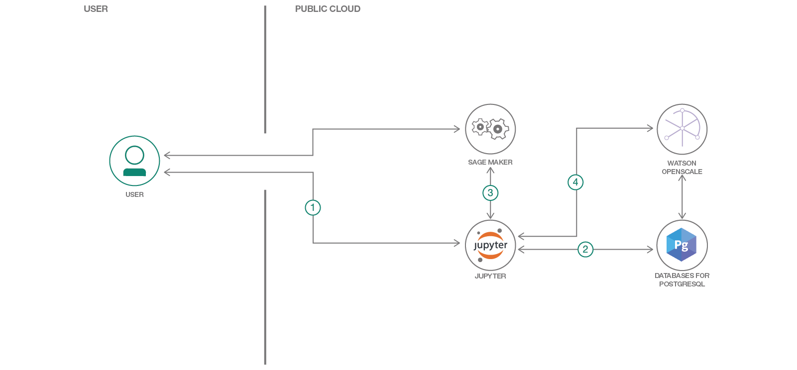

# Watson OpenScale を利用して SageMaker での機械学習をモニタリングする

### AWS SageMaker で機械学習モデルを作成し、Watson OpenScale を利用してペイロードのロギングとモデルの公正さをモニタリングする

English version: https://developer.ibm.com/patterns/./monitor-amazon-sagemaker-machine-learning-models-with-ai-openscale
  ソースコード: 'https://github.com/IBM/monitor-sagemaker-ml-with-watson-openscale'

###### 最新の英語版コンテンツは上記URLを参照してください。
last_updated: '2019-01-29'

 ## 概要

このコード・パターンでは、Watson OpenScale と SageMaker 機械学習モデルを利用して洞察を引き出す方法を説明します。具体的には、Amazon SageMaker で [UC Irvine 機械学習データベース](https://archive.ics.uci.edu/ml/machine-learning-databases/breast-cancer-wisconsin/)内のデータを使用してロジスティック回帰モデルを作成し、AWS クラウド上にデプロイします。この AWS クラウド上の機械学習モデルを、Watson OpenScale を利用してバインドし、サブスクリプションを作成してペイロードとフィードバックをログに記録します。

## 説明

Watson OpenScale を利用すると、モデルがどこにホストされているかにかかわらず、モデルの品質をモニタリングしてペイロードをログに記録できます。このコード・パターンでは例として、Amazon Web Service (AWS) の SageMaker モデルを使用して Watson OpenScale の非依存性と開放性を実証します。IBM Watson OpenScale は、組織が AI を自動化して運用可能にするために使用できるオープンな環境です。OpenScale は IBM Cloud 上に限らず、あらゆる場所にデプロイされている AI モデルや機械学習モデルを管理できる強力なプラットフォームとして、以下のメリットを提供します。

オープン・デザイン: Watson OpenScale では、モデルがどのフレームワークまたは IDE を使用して作成されているかにも、どのモデル・ホスティング・エンジン上にデプロイされているかにも関係なく、機械学習モデルと深層学習モデルをモニタリングして管理することができます。

結果の公正さを推進: Watson OpenScale はモデルのバイアスを検出できるだけでなく、公正さの問題を強調してバイアスを軽減できるよう支援します。具体的には、モデルのバイアスによって影響を受けたデータ範囲をプレーン・テキストで説明するとともに視覚化し、データ・サイエンティストやビジネス・ユーザーがビジネスの成果にもたらすその影響を理解できるようにします。バイアスが検出されると、Watson OpenScale はバイアスを排除したバージョンを自動的に作成し、そのモデルをデプロイ済みモデルと併せて実行します。したがって、ユーザーは元のモデルを置き換えることなく、期待される、より公正な結果のプレビューを確認できます。

トランザクションの説明を提供: 企業が AI を注入したアプリケーションの透明性と監査可能性を確保できるよう、Watson OpenScale では、スコア対象の個々のトランザクションについて説明が生成されるようになっています。生成される説明には、予測を行うために使用された属性と各属性の重み付けに使用された属性も含まれます。

AI の作成を自動化: 現在ベータ版として利用可能な Neural Network Synthesis (NeuNetS) は、基本的に特定のデータ・セットに応じたカスタム・デザインを設計することによってニューラル・ネットワークを合成する機能です。ベータ版の NeuNetS では、画像とテキストの分類モデルがサポートされています。NeuNetS により、カスタム・ニューラル・ネットワークの設計とトレーニングにかかかる時間が短縮され、必要なスキル・レベルも低くなるため、技術的な主題専門家でなくてもニューラル・ネットワークが利用可能となると同時に、データ・サイエンティストの生産性を高めることができます。

このコード・パターンをひと通り完了すると、以下の方法がわかるようになります。

* AWS SageMaker を使用して、データを準備し、モデルをトレーニングしてデプロイする
* スコアリング用のサンプル・レコードとスコアリング・エンドポイントを使用してモデルにスコアを付ける
* Watson OpenScale データ・マートをセットアップする
* SageMaker モデルを Watson OpenScale データ・マートにバインドする
* サブスクリプションをデータ・マートに追加する
* サブスクライブした両方のアセットに対して、ペイロードのロギングとパフォーマンス・モニタリングを有効化する
* サブスクリプションを介し、データ・マートを使用してテーブルのデータにアクセスする

## フロー

1. 開発者が [UCI 機械学習データベース](https://archive.ics.uci.edu/ml/machine-learning-databases/breast-cancer-wisconsin/wdbc.data)内に保管されているデータを使用して Jupyter Notebook を作成します。
1. Watson OpenScale データを保管する PostgreSQL データベースに Jupyter Notebook を接続します。
1. AWS SageMaker を使用して機械学習モデルを作成し、AWS クラウドにデプロイします。
1. Jupyter Notebook で Watson OpenScale を使用して、ペイロードをログに記録し、パフォーマンスをモニタリングします。

## 手順

このパターンの詳細な手順については、[readme ファイル](https://github.com/IBM/monitor-sagemaker-ml-with-watson-openscale/blob/master/README.md)を参照してください。手順の概要は以下のとおりです。

1. リポジトリーを複製します。
1. Compose for PostgreSQL データベースを作成します。
1. Watson OpenScale サービス・インスタンスを作成します。
1. ノートブックを実行します。
