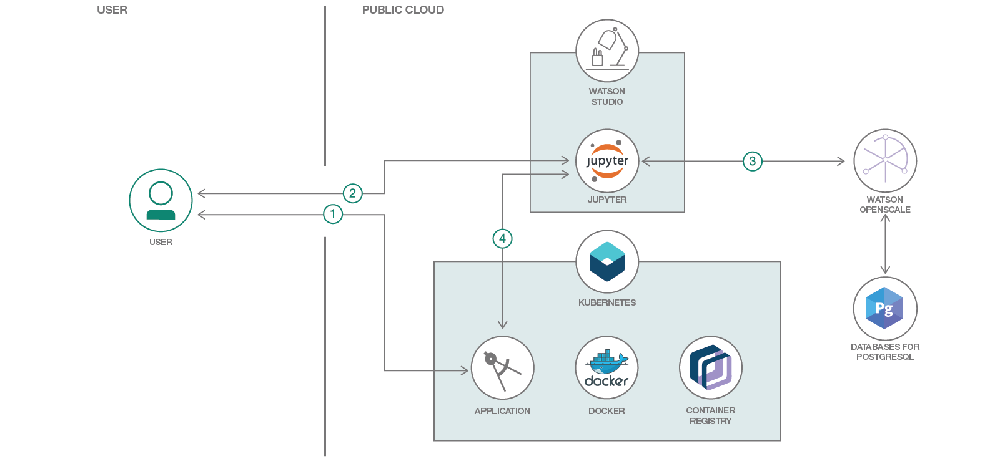

# Watson OpenScale を利用してカスタム機械学習エンジンをモニタリングする

### Docker と Kubernetes を使用してカスタム機械学習エンジンをデプロイし、Watson OpenScale を利用してペイロードのロギングとモデルの公正さをモニタリングする

English version: https://developer.ibm.com/patterns/./monitor-custom-machine-learning-engine-with-ai-openscale
  ソースコード: https://github.com/IBM/monitor-custom-ml-engine-with-watson-openscale

###### 最新の英語版コンテンツは上記URLを参照してください。
last_updated: 2019-01-24

 ## 概要

この開発者コード・パターンでは、Watson OpenScale Python SDK を使用して、カスタム機械学習モデル対応エンジン上にデプロイされたモデルのペイロードをログに記録します。Keras を使用して深層学習 REST API を作成し、Watson OpenScale でモニタリングします。

## 説明

このコード・パターンでは、Watson OpenScale とカスタム機械学習モデル対応エンジンを組み合わせて使用する例を紹介します。Watson OpenScale を利用すると、モデルがどこにホストされているかにかかわらず、モデルの品質をモニタリングしてペイロードをログに記録できます。このコード・パターンでは例として、カスタム・モデル対応アプリケーションを使用して Watson OpenScale の非依存性と開放性を実証します。

IBM Watson OpenScale は、組織が AI を自動化して運用可能にするために使用できるオープンな環境です。OpenScale は IBM Cloud 上に限らず、あらゆる場所にデプロイされている AI モデルや機械学習を管理できる強力なプラットフォームとして、以下のメリットを提供します。

* オープン・デザイン: Watson OpenScale では、モデルがどのフレームワークまたは IDE を使用して作成されているかにも、どのモデル・ホスティング・エンジン上にデプロイされているかにも関係なく、機械学習モデルと深層学習モデルをモニタリングして管理することができます。
* 結果の公正さを推進: Watson OpenScale はモデルのバイアスを検出できるだけでなく、公正さの問題を強調してバイアスを軽減できるよう支援します。具体的には、モデルのバイアスによって影響を受けたデータ範囲をプレーン・テキストで説明するとともに視覚化し、データ・サイエンティストやビジネス・ユーザーがビジネスの成果にもたらすその影響を理解できるようにします。バイアスが検出されると、Watson OpenScale はバイアスを排除したバージョンを自動的に作成し、そのモデルをデプロイ済みモデルと併せて実行します。したがって、ユーザーは元のモデルを置き換えることなく、期待されるより公正な結果のプレビューを確認できます。
* トランザクションの説明を提供: 企業が AI を注入したアプリケーションの透明性と監査可能性を確保できるよう、Watson OpenScale では、スコア対象の個々のトランザクションについて説明が生成されるようになっています。生成される説明には、予測を行うために使用された属性と各属性の重み付けに使用された属性も含まれます。
* AI の作成を自動化: この更新でベータ版として利用可能になる Neural Network Synthesis (NeuNetS) は、基本的に特定のデータ・セットに応じたカスタム・デザインを設計することによってニューラル・ネットワークを合成する機能です。ベータ版の NeuNetS では、画像とテキストの分類モデルがサポートされます。NeuNetS により、カスタム・ニューラル・ネットワークの設計とトレーニングにかかる時間が短縮され、必要なスキル・レベルも低くなるため、技術的な主題専門家でなくてもニューラル・ネットワークが利用可能となると同時に、データ・サイエンティストの生産性を高めることができます。

このコード・パターンを完了すると、以下の方法がわかるようになります。

* Keras を使用してカスタム・モデル対応エンジンを構築する
* REST API を使用してカスタム・モデルにアクセスする
* Watson OpenScale を利用してモデルのペイロードをログに記録する

## フロー

1. ユーザーが Kubernetes と Docker を使用して、アプリケーション・サーバーを IBM Cloud 上にデプロイします。
1. ユーザーが Watson&trade; Studio 上で Jupyter Notebook を作成し、Watson OpenScale と Compose PostgreSQL を構成します。
1. Watson OpenScale を使用して、機械学習モデルのペイロードのロギングと品質をモニタリングします。
1. アプリケーション・サーバーを使用して、デプロイ済みモデルにスコアを付けます。

## 手順

このパターンの詳細な手順については、[README](https://github.com/IBM/monitor-custom-ml-engine-with-watson-openscale/blob/master/README.md) を参照してください。手順の概要は以下のとおりです。

1. リポジトリーを複製します。
1. IBM Cloud で Watson サービス・インスタンスを作成します。
1. IBM Watson Studio 内で公開アドレスを指定したサーバーで使用するためのノートブックを作成するか、ローカル・テストのみを目的にローカルでノートブックを実行します。
1. Watson Studio で使用する 4.1 またはローカル・テスト専用の 4.2 を実行します。  
    1. ubernetes クラスター内でアプリケーション・サーバーを実行します。  
    1. アプリケーション・サーバーをローカルで実行します。
1. IBM Watson Studio 内でノートブックを実行します。
