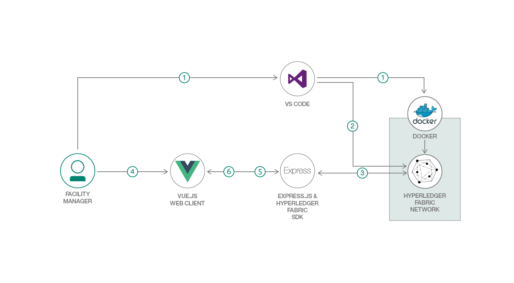

# サプライチェーン全体にわたって食品供給業者を規制するブロックチェーン・ネットワークをデプロイする

### Hyperledger Fabric ネットワークを使用して、食品供給業者に対する規制要件を分散ビジネス・ネットワーク向けにモデル化する

English version: https://developer.ibm.com/patterns/monitor-food-shipments-using-blockchain
  ソースコード: https://github.com/IBM/PublicRegulationFabric-Food-IBPV20

###### 最新の英語版コンテンツは上記URLを参照してください。
last_updated: 2019-04-02

 
## 概要

米国の食品供給業者は、米国食品医薬品局 (FDA) 外国供給者検証プログラムの規制要件に準拠していなければ、製品を市場に送り出すことができません。この開発者向けコード・パターンでは、Hyperledger Fabric ネットワークを使用して、食品供給業者検証プログラムの規制要件を分散ビジネス・ネットワーク向けにモデル化する方法を説明します。

## 説明

現在、開発者たちの間では規制コンプライアンスの分野に注目が集まっていて、コンプライアンスを強化・施行するためのプロセスを自動化および標準化するアプリケーションの構築が試みられています。ブロックチェーンは、まさにそのようなアプリケーションの構築を可能にするテクノロジーです。Hyperledger Fabric SDK と Vue.js を併せて使用することで、簡単に規制コンプライアンス・アプリケーションを構築し、スマート・コントラクト内にロジックを作成してビジネス・ネットワークにデプロイすることができます。このパターンでは使用ケースとして、FDA コンプライアンスを取り上げます。創造力を発揮して、規制コンプライアンスを管理する独自の使用ケースにこのパターンを適用してください。

この使用ケースでは、食品供給業者が製品を引き渡すと、輸入業者がその供給業者、国、食品のタイプのすべてが正しい識別子と一致することを検証します。通関手続き地では供給業者が再びチェックされ、(規制機関が管理する) データベース内に保管されている既知の供給業者のリストと照らし合わされます。供給業者が「免除」タイプに該当する場合、製品が小売業者に引き渡されます。供給業者が「非免除」タイプに該当する場合は、製品が (規制機関が管理する) データベース内に保管されている既知の食品リストに照合されます。その食品が「免除」製品であれば、小売業者に引き渡されます。食品が「非免除」製品の場合は、輸入業者が (単独で、またはサード・パーティーを使用して) 危険分析を実施する必要があります。供給業者は危険分析レポートを規制機関に提出しなければなりません。規制機関はコンプライアンスを確認してから、製品を小売業者に引き渡します。このパターンでは、FDA 外国供給業者検証プログラムを対象とした規制コンプライアンス・ロジックをスマート・コントラクト内に取り込んで、ビジネス・ネットワークにデプロイします。

## フロー

1. Hyperledger ネットワークを Docker コンテナーのグループとして (ホストする場合は Kubernetes に) デプロイします。
2. デプロイした Hyperledger コンテナー上にスマート・コントラクトをインストールします。
3. Express バックエンドが Fabric SDK を使用してブロックチェーン・ユーザーを作成し、登録します。
4. ユーザーが Vue UI を使用してトランザクションを送信します。
5. Vue UI がリクエストを Express バックエンドに転送し、Express バックエンドが Fabric SDK を使用して Hyperledger に対するリクエストを実行します。
6. Hyperledger の状態が SDK によって取得され、Vue UI 内に表示されます。

## 手順

詳細な手順については、[README ファイル](https://github.com/IBM/PublicRegulationFabric-Food-IBPV20/blob/master/README.md)を参照してください。手順の概要は以下のとおりです。

1. git リポジトリーを複製します。
1. スマート・コントラクトをパッケージ化します。
1. ローカル・ブロックチェーンをデプロイします。
1. Node サーバーを起動します。
1. Hyperledger にデータを取り込んでトランザクションをシミュレーションします。
