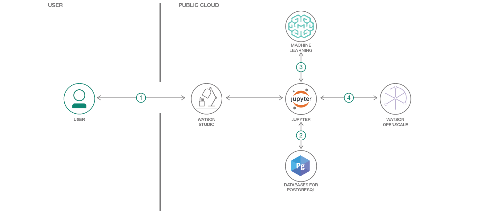

# Watson OpenScale を利用して Watson Machine Learning サービスの機械学習モデルをモニタリングする

### Watson Machine Learning デプロイメント用のデータマートを作成する

English version: https://developer.ibm.com/patterns/monitor-performance-fairness-and-quality-of-a-wml-model-with-ai-openscale-apis
  ソースコード: https://github.com/IBM/monitor-wml-model-with-watson-openscale

###### 最新の英語版コンテンツは上記URLを参照してください。
last_updated: 2019-03-15

 ## 概要

このコード・パターンでは、[Watson Machine Learning](https://cloud.ibm.com/catalog/services/machine-learning?cm_sp=ibmdev-_-developer-patterns-_-cloudreg) を利用して、ドイツのクレジット・データで機械学習モデルをトレーニングして作成し、デプロイする方法を説明します。また、[Watson OpenScale] を使用して、このモデルのデータマートを作成し、モデルのデプロイメントをモニタリングするように OpenScale を構成してから、7 日分の履歴レコードと測定値を注入し、OpenScale Insights ダッシュボードで確認します。

## 説明

このコード・パターンを完了すると、以下の方法がわかるようになります。

* Watson Machine Learning サービスを利用して機械学習モデルを作成してデプロイする
* Watson OpenScale データマートをセットアップする
* Watson Machine Learning を Watson OpenScale データマートにバインドする
* サブスクリプションをデータマートに追加する
* サブスクライブした資産のペイロード・ロギングとパフォーマンス・モニターを有効にする
* 品質 (精度) モニタリングを有効にする
* 公平性モニタリングを有効にする
* Watson Machine Learning を利用してドイツのクレジット・モデルを採点する
* 履歴ペイロード、公平性指標、品質指標をデータマートに挿入する
* サブスクリプションを介し、データマートを使用してテーブル・データにアクセスする

## フロー

1. 開発者が Watson Studio 上で Jupyter Notebook を作成します。
1. Jupyter Notebook を PostgreSQL データベースに接続します。このデータベースは、Watson OpenScale データを保管するために使用されるものです。
1. Notebook を Watson Machine Learning に接続し、モデルをトレーニングしてデプロイします。
1. Notebook では Watson OpenScale を使用してペイロードをログに記録し、パフォーマンス、品質、公平性をモニタリングします。

## 手順

詳しい手順については、[README](https://github.com/IBM/monitor-wml-model-with-watson-openscale/blob/master/README.md) を参照してください。
