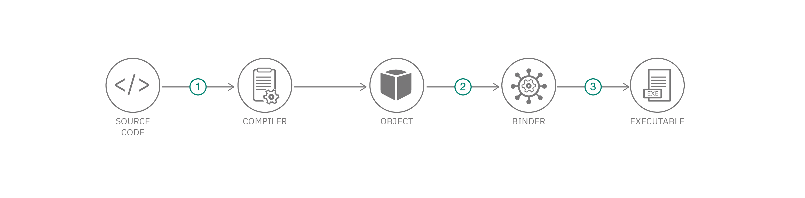

# 初めての COBOL アプリケーションを作成する

### シンプルな COBOL アプリで 3 つのテキスト・ファイルを読み取り、内容をマージして 1 つのソートされたリストを含む出力を書き込む

English version: https://developer.ibm.com/patterns/my-first-cobol-application
  
ソースコード: https://github.com/IBM/cobol-is-fun/tree/master/my-first-program

###### 最新の英語版コンテンツは上記URLを参照してください。
last_updated: 2020-06-09

 
## 概要

このコード・パターンでは、3 つのテキスト・ファイルから入力を読み取って内容をマージし、ソートされた 1 つのリストを含む出力を書き込む、シンプルな COBOL アプリケーションを紹介します。ただし、このアプリケーションで使用する JCL ジョブのうちの 1 つ、そして COBOL ソースの内容については、時間をかけて説明します。このコード・パターンの目標は JCL と COBOL の基礎を十分に理解してもらうことですが、読者を数分で専門家にしようとは思っていません。

## 説明

このアプリケーションは 2 つの部分で構成されています。1 つは COBOL ソース・コード自体です。もう 1 つの部分は 3 つの JCL ジョブからなります。アプリケーションをコンパイルおよびビルドして z/OS 実行可能ファイルにするには、これらのジョブを実行する必要があります。それぞれの構成部分を順に紹介します。

`fxsort.cbl` という名前のファイルに格納されたこの COBOL アプリケーションが行うメインの処理は、2 つあります。

1. 3 つのファイルから入力を読み取り、それぞれの内容を 1 つのリストにマージします。
1. インメモリー・リストをソートして、その結果を出力ファイルに書き込みます。

コード・パターンに付属の JCL を使用して、この COBOL アプリケーションをコンパイル、ビルド、実行できます。

## フロー

1. プログラムをコンパイルします。
1. オブジェクトをリンク・エディットします。
1. プログラムを実行します。

## 手順

このパターンの詳しい手順については、[README ファイル](https://github.com/IBM/cobol-is-fun/blob/master/my-first-program/README.md)を参照してください。
