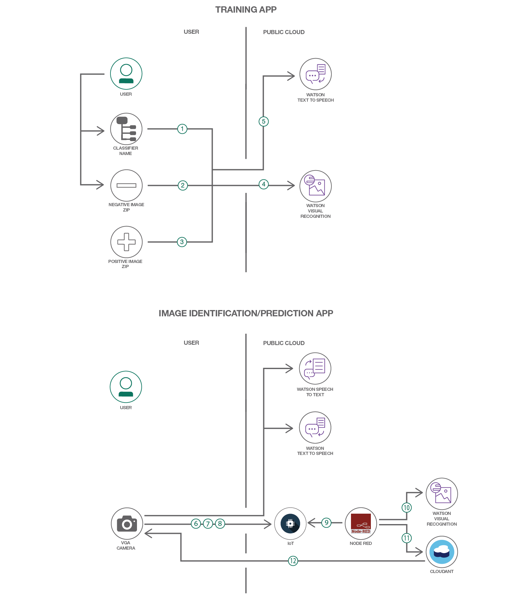

# 視覚認識による分類を最適化する

### Java、Watson IoT Platform、Node-RED、Watson Visual Recognition サービスを利用して、トレーニング・アプリと予測アプリを作成する

English version: https://developer.ibm.com/patterns/optimize-visual-recognition-classification
  
ソースコード: https://github.com/IBM/IoTWatsonTrainingandPredictionApp

###### 最新の英語版コンテンツは上記URLを参照してください。
last_updated: 2018-04-17

 
## 概要

視覚認識による分類プロセスで使用するデータ・セットのサイズはかなり大きいため、開発者は画像を分類する作業に追われて、AI テクノロジーや機械学習テクノロジーに取り組むまでの段階になかなか辿り着けないことがよくあります。Watson IoT Platform に Watson Visual Recognition サービスを統合すれば、Visual Recognition のトレーニング済みモデルを使用して、オブジェクトを識別する際の処理時間を短縮することができます。このコード・パターンではまず、Java ベースのトレーニング・アプリを作成する方法を説明します。このアプリは IoT 対応デバイスから画像をキャプチャーした後、カスタム分類子を作成します。そしてJava API を呼び出して画像のセットを渡し、そのカスタム分類子をトレーニングします。続いて、Watson IoT Platform、Node-RED、Watson Visual Recognition サービスを利用して、トレーニング済みモデルに基づいて新しい画像セットを分類する予測アプリを作成する方法を説明します。

## 説明

インテリジェントな画像認識には、以下の 2 つのプロセスが必要になります。

1. トレーニング・モデルを作成する
1. 画像を分類し、トレーニング・モデルに基づいてオブジェクトを識別する

このパターンは、トレーニング・アプリと予測アプリの 2 つのアプリで構成されています。予測アプリは、分類プロセスを最適化する革新的ソリューションになるはずです。このアプリでは、画像がキャプチャーされて Watson IoT Platform にパブリッシュされると、Node-RED 内の IoT サブスクライバー・ノードがこのパブリッシュされたペイロードを取り、Watson Visual Recognition サービスを呼び出してそのペイロードを渡します。画像の分類結果は Cloudant DB 内に保管されます。

このパターンを使用すれば、Visual Recognition サービス・インスタンスを利用してカスタム分類子を作成し、トレーニングすることができます。Visual Recognition サービスは画像内にあるオブジェクトを識別するために、事前にトレーニングされた分類子を使用します。したがって、Visual Recognition サービスを利用して特定の画像に含まれている特定のオブジェクトを検出するには、独自のカスタム分類子を作成する必要があります。

識別結果を表示するには、予測アプリを実行する必要があります。IBM Watson IoT Platform には柔軟性があり、開発者がアナリティクス、ストレージなどの他のサービスやタスクを統合して実行することができます。このパターンでは予測アプリ内で Watson IoT Platform を使用して、Visual Recognition サービスを呼び出し、画像内のオブジェクトを検出します。この実装には、オブジェクト検出の全体的な実行時間を短縮できるという利点があります。

## フロー

1. ユーザーがトレーニング・アプリ内で、分類子の名前を入力します。
1. ユーザーがトレーニング・アプリ内で、ネガティブ画像が含まれる zip ファイルのパスを入力します。
1. トレーニング・アプリ内でカメラ・ウィンドウが起動され、指定された数のポジティブ画像をキャプチャーします。
1. トレーニング・アプリ内で、ポジティブ画像が zip ファイルに圧縮されて、ネガティブ画像の zip ファイルと一緒に Java API に渡されます。Visual Recognition サービス・インスタンス内でカスタム分類子が作成されます。
1. トレーニング・アプリ内でトレーニングが完了すると、トレーニング完了を通知するメッセージが Watson Text to Speech サービスに送信されます。
1. 予測アプリ内で、カメラ・デバイスを使って画像がキャプチャーされ、処理キューに入れられます。
1. 予測アプリ内で、キューから画像が取り出され、Base-64 でエンコードされたペイロードに変換されます。
1. 予測アプリ内で、エンコードされたペイロードが Watson IoT Platform 上のトピックにパブリッシュされます。
1. Node-RED 内で、IoT-IN ノードがトピックにパブリッシュされたペイロードを受け取ります。
1. Node-RED 内で、Base-64 でエンコードされたペイロードが VR サービス・ノードに渡され、VR 内部で 3 つのフィーチャー (classifyImg、faceDetection、textDetection) がチェックされます。
1. Node-RED 内で、結果が CloudantDB ノードに送信されてデータベース内に保管されます。
1. Node-RED 内で、デバイス・コマンドが IoT-OUT ノードを介してデバイスに送信されます。これにより、デバイスが次に処理する画像をキューに送信し、GUI を更新して最新の結果を表示します。

## 手順

詳細な手順については、[README](https://github.com/IBM/IoTWatsonTrainingandPredictionApp/blob/master/README.md) ファイルを参照してください。このコード・パターンを使用するために実施する必要がある主なステップは、以下のとおりです。

1. IBM Cloud 内で Internet of Things Platform Starter ボイラープレートを使用して IoT アプリを作成します。
1. Watson IoT Platform ダッシュボードを使用して、IoT デバイスを登録します。
1. IoT デバイスからイベントを受信して IoT デバイスに通知を返す Node-RED シミュレーターを作成します。
1. トレーニング・アプリと予測アプリをビルドして実行します。
