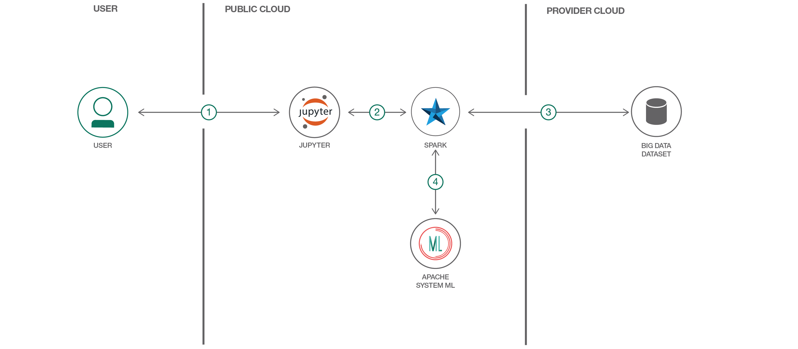

# 機械学習エクササイズを実行する

### IBM Data Science Experience (DSX) 上で Apache SystemML を使用して機械学習エクササイズを実行する

English version: https://developer.ibm.com/patterns/perform-a-machine-learning-exercise
  
ソースコード: https://github.com/IBM/SystemML_Usage

###### 最新の英語版コンテンツは上記URLを参照してください。
last_updated:  2019-03-28

 
## 概要

データ・サイエンスの力を利用して機械学習による問題を迅速、効率的に解決するには、Apache SystemML を使用してください。今回紹介するパターンでは、IBM Watson Studio 上で稼働する Jupyter Notebook を使用して機械学習エクササイズを実行します。

## 説明

今回紹介するパターンでは、IBM Watson Studio 上で稼働する Apache SystemML を使用して機械学習エクササイズを実行します。Watson Studio はクラウドをベースとしたインタラクティブなコラボレーション環境です。この環境では、データ・サイエンティスト、開発者、そしてデータ・サイエンスに興味を持つ誰もが、さまざまなツール (RStudio、Jupyter Notebook、Spark) を使用して共同で作業し、データを共有し、それらのデータから洞察を引き出すことができます。Apache SystemML は、大規模データ・セットに応じてスケーリングできるように最適化された、柔軟な機械学習システムです。

このコード・パターンをひと通り完了することで、以下を行う方法を把握できます。

* [Jupyter Notebook](http://jupyter.org/) を使用してデータをロード、視覚化、分析する
* Notebook を [IBM Watson Studio](https://www.ibm.com/cloud/watson-studio) 内で実行する
* [Apache SystemML](https://systemml.incubator.apache.org/) を機械学習ライブラリーとして使用する

このパターンで対象としているのは、データ・サイエンスの力を利用して機械学習による問題を迅速、効率的に解決するために、Apache SystemML という手段を使用することに関心を持つアプリケーション開発者とその他の利害関係者です。Apache SystemML には、そのまますぐに使用して試してみることのできる各種のアルゴリズムが提供されていますが、このパターンでは線形回帰の例を使用して、Apache SystemML の使いやすさと威力をデモンストレーションします。さらに、Apache SystemML では、R や Python のような構文を持つ Declarative Machine Language (DML) を使って独自のアルゴリズムを作成したり、パッケージに含まれている任意のアルゴリズムをカスタマイズしたりすることもできます。その他の機能サポート、資料、ロードマップについて詳しくは、このリンク先の [Apache SystemML](https://systemml.incubator.apache.org/) のサイトを参照してください。

## フロー

