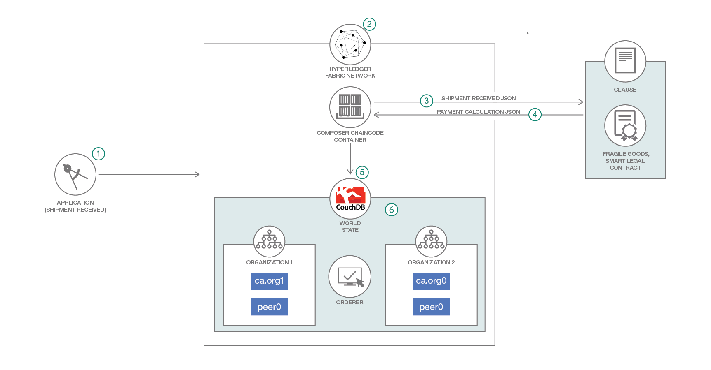

# 接続された契約: オフチェーンのスマート・コントラクトを使用してサプライ・チェーンを管理する

### Clause を呼び出してスマート・リーガル・コントラクトを履行する Hyperledger Composer ビジネス・ネットワークをデプロイする

English version: https://developer.ibm.com/patterns/perishable-goods
ソースコード: https://github.com/clauseHQ/demo-clause-ibm-perishable-goods

###### 最新の英語版コンテンツは上記URLを参照してください。
last_updated: 2018-10-02

 
## 概要

このコード・パターンでは、生鮮食品を追跡するために、Hyperledger ブロックチェーン上でスマート・リーガル・コントラクトを使用する方法を説明します。このスマート・リーガル・コントラクトは Clause 上で動作し、食品メーカー、輸入業者、配送業者の間での契約条項を収集して違約金を計算します。

## 説明

食品業界は、ブロックチェーン・テクノロジーを適用するのにまさに絶好の業界です。食料品店は傷んだ食品を廃棄することを忌み嫌うものなので、食品のサプライ・チェーンを追跡できるとなれば、そのチャンスに飛びつくはずです。ブロックチェーンは生産履歴管理を可能にし、食品の生産元と併せて食品の現在のステータスを追跡することで、食品の品質を保証します。ほとんどのものがデジタル化されている中、契約もその例外ではありません。ブロックチェーンによって、資産の交換方法は今や、分散型レジャーを使用するビジネス・ネットワークに基づくモデルに変わりつつあります。このようなモデルでは、デジタル資産交換の管理ルールを確立する必要があります。そこで生まれたのが、スマート・コントラクトという概念です。スマート・リーガル・コントラクトについては、[Accord Project](https://accordproject.org/) というオープンソース・ソフトウェア・イニシアチブによってその仕様、ツール、コードが作成されています。

[Clause プラットフォーム](https://clause.io/)は、Accord Project による[スマート・リーガル・コントラクト](https://medium.com/@Clause/really-smart-and-legal-contracts-a77fcd1d0d10)の[仕様](https://docs.accordproject.org/)に準拠したデジタル・リーガル・コントラクトを管理するためのプラットフォームです。

この開発者コード・パターンでは、出荷契約などの法的な取り決めを、IBM Blockchain Platform の信頼できるデータを使用して自動化する方法を説明します。このコード・パターンのシナリオにおいては、(Hyperledger Fabric v1 上で稼働する) Hyperledger Composer ビジネス・ネットワークが Clause プラットフォームを呼び出します。Accord Project の [Cicero エンジン](https://github.com/accordproject/cicero)が Clause プラットフォーム上の契約ロジックをオフチェーンで実行すると、その都度、Hyperledger Fabric が資産の状態をブロックチェーンに保管します。

このコード・パターンを完了すると、以下の方法がわかるようになります。

* IBM Blockchain スターター・プランにネットワークをデプロイする
* スマート・コントラクトを作成して実行できるように Clause プラットフォームを構成する
* Clause スマート・コントラクトを使用する Angular アプリケーションを実行する

## フロー

1. アプリケーションが出荷リクエストを受け取ります。
1. トランザクションが IBM Blockchain Platform に送信されます。
1. IBM Blockchain Platform 上で稼働する Hyperledger Composer ベースのビジネス・ネットワークが、資産の状態を更新します。
1. スマート・リーガル・コントラクトの実行をトリガーするために Clause が呼び出されます。
1. スマート・リーガル・コントラクトが実行されます。検証に合格にすると、続いて支払い額が計算されます。
1. ブロックチェーン上の資産が更新されます。つまり、ブロックがネットワークに書き込まれ、ワールド・ステートが更新されます。

## 手順

詳細な手順については、[README](https://github.com/clauseHQ/demo-clause-ibm-perishable-goods/blob/master/README.md) を参照してください。手順の概要は以下のとおりです。

1. IBM Cloud にビジネス・ネットワークをデプロイします。
1. スマート・リーガル・コントラクトをセットアップします。
1. クライアント・アプリケーションを実行します。
