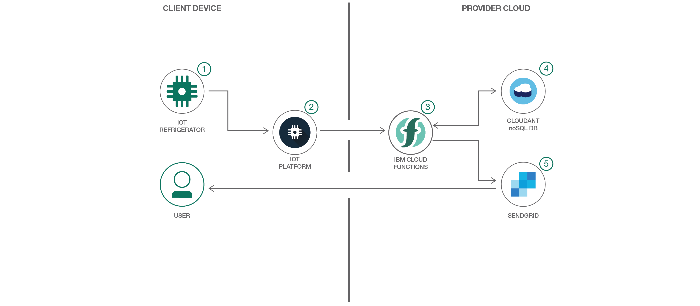

# 交換用パーツをリクエストする機能をスマート冷蔵庫に追加する

### ネットワークに接続されたスマート冷蔵庫が自身の修理サービスと交換用パーツをリクエストできるようにする

English version: https://developer.ibm.com/patterns/./power-smart-fridge
  ソースコード: https://github.com/IBM/ibm-cloud-functions-serverless-iot-openfridge?cm_sp=IBMCode-_-power-smart-fridge-_-Get-the-Code

###### 最新の英語版コンテンツは上記URLを参照してください。
last_updated: 2017-07-25

 
## 概要

家電製品のメーカーとその顧客は、モノのインターネット (IoT) を利用して家庭用アプライアンスを他のアプライアンス、診断サービス、サポートからなるネットワークに接続することで、アプライアンスの使用を効率化できます。さらに、搭載されているソフトウェアと併せて IoT 対応のアプライアンスやデバイスをクラウド内のアナリティクスと連動させれば、機能強化とメンテナンス・コストの削減を実現して、寿命の長い、よりシンプルで使いやすいアプライアンスにすることができます。

## 説明

この開発者コード・パターンでは、サーバーレスのイベント駆動型アーキテクチャーの力を紹介します。このアーキテクチャーを使用してクラウド内のアナリティクス・ワークフローをサポートすることで、ホーム・アプライアンスをよりスマートにして、より効率的なカスタマー・サービスを提供できるようになります。例として取り上げるのは、Watson IoT Platform、OpenWhisk、および IBM Cloud サービスを統合したエッジ・ツー・クラウドのシナリオです。現在、この新しいタイプのアプリケーション設計が標準となりつつあるため、IoT 対応アプライアンスのメリットを最大限に活かす方法を把握しておくことは重要です。

このシナリオでは、ネットワークに接続された冷蔵庫が、自身のパーツに関するステータス・メッセージを IBM Cloud 内の Watson IoT Platform サービスに送信します。これを受けて、Watson IoT Platform が OpenWhisk 内のアクションをトリガーします。このアクションは、メッセージの内容を分析して、パーツの交換が必要であるかどうかを判別するというアクションです。パーツの交換が必要な場合は、アプライアンスの保証ステータスがチェックされます。パーツが保証対象であれば、自動的に交換用パーツが注文されて、注文したことを通知する e-メールが送信されます。パーツが保証対象外の場合は、未決注文が作成され、支払いの承認を求めるリクエストが送信されます。

## フロー

1. 冷蔵庫から IBM Cloud 上のWatson IoT Platform サービスに、JSON ペイロードが含まれる MQTT メッセージが定期的に送信されます。
2. メッセージにより、action という名前のビジネス・ロジックがトリガーされます。JavaScript で作成されているこのロジックは、OpenWhisk プラットフォーム上で実行されます。
3. 最初のアクションでは、メッセージを分析して、例えばフィルターの寿命測定値が許容範囲内にあるかどうかを判別します。測定値が正常であれば、それ以上の処理は行われません。このように、非常に効率的で費用対効果の高いワークフローになっています。パーツの交換が必要な場合、このアクションによって Cloudant データベース内に修理サービス・レポートが作成されます。
4. 新しい修理サービス・レポートの作成によって、別のアクションがトリガーされます。このアクションで、ユーザーとアプライアンスの登録情報を調べて、アプライアンスが保証期間内であるかどうかを判別します。保証期間内であれば、このアクションによって自動的に交換用パーツが注文され、アプライアンスのステータスに関する e-メール通知がユーザーに送信されます。以降のユーザー入力は必要ありません。アプライアンスが保証対象外となっている場合、未決注文が作成され、支払いの承認を求めるリクエストがユーザーに送信されます。支払いが承認されると、未決注文が自動的に送信されて注文が完了します。
5. 最後のアクションは、アプライアンスのステータスに関する e-メールを送信して、ユーザーに注意を促すというものです。このアクションは、交換用パーツの注文が作成されるとトリガーされます。アプライアンスの保証期限の 30 日以内になると、夜間のバッチ・ジョブが e-メール通知をトリガーし、保証期間がもうすぐ切れることをユーザーに警告します。

## 手順

Find the detailed steps for this pattern in the [README](https://github.com/IBM/ibm-cloud-functions-serverless-iot-openfridge/blob/master/README.md).
