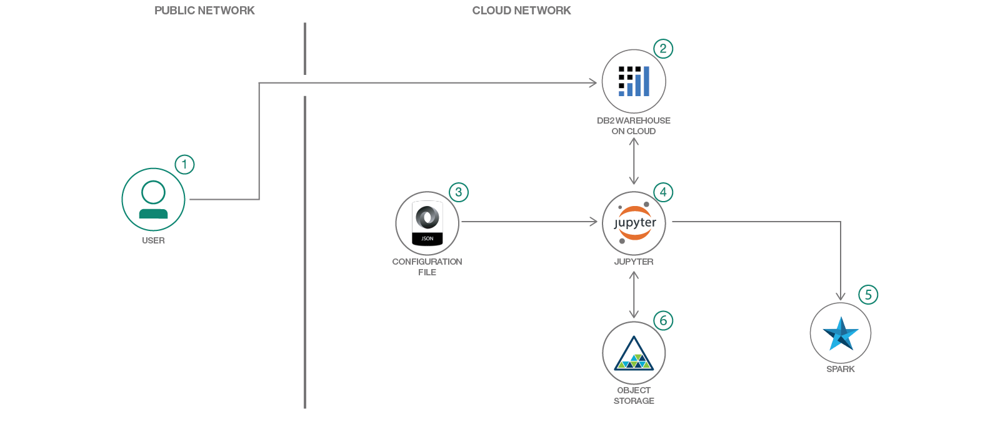

# IoT センサー・データを使用して機器故障を予測する

### 多変数 IoT データを使用してセンサーから値を収集し、アルゴリズムを実行する予測手法の紹介

English version: https://developer.ibm.com/patterns/./predict-equipment-failure-using-iot-sensor-data
  ソースコード: https://github.com/IBM/iot-predictive-analytics

###### 最新の英語版コンテンツは上記URLを参照してください。
last_updated: 2018-02-07

 
_**Note: This pattern is part of a composite pattern.** These are code patterns that can be stand-alone applications or might be a continuation of another code pattern. This composite pattern consists of:_

* [IoT センサー・データの予測アナリティクスに基づいてエッジで是正アクションをとる](https://github.com/IBM/japan-technology/blob/main/Code-Patterns/iot-edge-predictive-analytics-corrective-actions/)
* [IoT センサー・データから変化点を検出する](https://github.com/IBM/japan-technology/blob/main/Code-Patterns/detect-change-points-in-iot-sensor-data/)
* IoT センサー・データを使用して機器故障を予測する (このパターン)

## 概要

IoT 機器で発生しそうな故障を予測するには、センサー値を収集し、アルゴリズムを実行するという作業が伴います。機器故障システムのコアとなる基本的な要素は、機器故障の要因となるフィーチャーまたは因子を識別することです。これらを識別した上で、予測モデルを構成してモデルをトレーニングします。その後、テスト・データを採点して、予測モデルの信頼度を確認します。このコード・パターンでは、IBM Watson Studio クラウドにロードしたサンプル・データを Python 2.0 ソフトウェアで処理します。

## 説明

標準的な小売チェーンでは、それぞれに何百もの機器が置かれた何千もの店舗がさまざまな場所に散在しています。このようなシナリオで予防保守をスケジューリングするのは簡単なことではありません。しかも、ルール・ベースのシステムによってトリガーされたアラームが、実際の検査時にそれほど重大ではないことがわかったとなると (冷蔵庫のドアが開いていたなど)、保守のスケジューリングは尚更難しくなります。

先進的な予測手法をとれば、予防保守から予測保守に切り換えることが可能になります。この開発者向けパターンで対象としているのは、IoT デバイス、自動製造ロボット・アーム、プロセス監視制御設備に搭載されたセンサーを使用して継続的に収集して送信される IoT センサー・データを使用して、機器の故障を予測するための新しい手法の実験、学習、強化、実装を目指す開発者です。

最初のステップは、単一の IoT センサーによって生成される時系列データを使用して、システム・パフォーマンスにおける大幅な変化をすべて識別することです。このトピックに関する詳細なフローについては、開発者向けパターン「[IoT センサー・データから変化点を検出する](https://github.com/IBM/japan-technology/blob/main/Code-Patterns/detect-change-points-in-iot-sensor-data/)」を参照してください。

IoT 機器の主要な動作パラメーターにおける変化点を検出したら、当然のことながら、その最近の変化が機器の故障につながるかどうかを予測するテストを使用して変化を追跡します。このパターンは、多変数 IoT データを使用して機器故障を予測する手法の全容を解説するためのものです。この手法では、ロジスティック回帰を使用する 2 項式予測アルゴリズムを実装します。また、Python 2.0 の予測パッケージを使用し、サンプル・センサー・データを IBM Watson Studio クラウドにロードします。中間ステップはモジュール化されていて、すべてのコードはオープンソースとして使用できるようになっています。また、アプリケーションに応じてモジュールやサブモジュールに変更を加えることも可能です。

このコード・パターンをひと通り完了すると、以下の方法がわかるようになります。

* データベースに格納されている IoT センサー・データを読み取る
* 予測モデルのフィーチャーとターゲット変数を構成する
* トレーニング用データセットとテスト用データセットの比率を構成して、多変数データを 2 つに分割する
* ロジスティック回帰を使用してモデルをトレーニングする
* テスト・データを採点し、予測の正確度を測定する
* 混同行列を計算してモデルの予測パフォーマンスを評価する
* 構成パラメーターを変更して実験を再実行する

## フロー

1. ユーザーが IBM Watson Studio にサインアップします。
2. ユーザーがサンプル IoT センサーの時系列データをデータベースにロードします。
3. 構成ファイルには、IoT 時系列予測アルゴリズムを実行する際の主要なパラメーターが含まれます。
4. Python 2.0 Jupyter Notebook で作成された予測アルゴリズムでは、構成パラメーターと、データベース内のセンサー・データを使用します。
5. パフォーマンスとスケーラビリティーを確保するために、ノートブックは IBM Watson Studio 内の Spark 上で実行されます。
6. 予測アルゴリズムの出力がオブジェクト・ストレージに保存されて使用できるようになります。

## 手順

1. User signs up for IBM Data Science experience.
2. User loads the sample IoT sensor Time series data to database.
3. A configuration file holds all the key parameters for running the IoT Time series prediction algorithm.
4. The prediction algorithm written in Python 2.0 Jupyter notebook uses the Configuration parameters and Sensor data from DB.
5. Python Notebook runs on Spark in IBM Watson Studio to ensure performance and scalability.
6. The outputs of the prediction algorithm is saved in Object storage for consumption.
