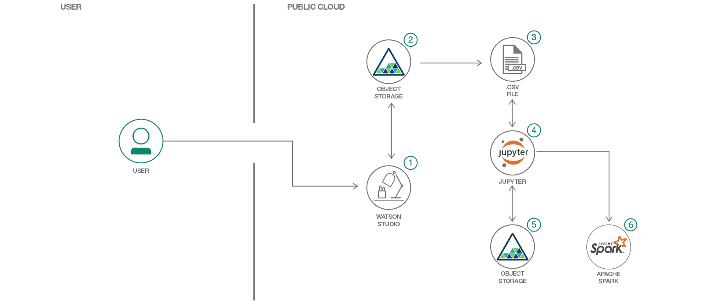

# データの偏差を手掛かりに不正行為を予測する

### 異なる複数の予測モデルを作成して評価し、予測モデルの精度に対するサンプリング手法の影響を確認する

English version: https://developer.ibm.com/patterns/./predicting-fraud-using-skewed-data
  ソースコード: https://github.com/IBM/xgboost-smote-detect-fraud

###### 最新の英語版コンテンツは上記URLを参照してください。
last_updated: 2018-06-28

 
## 概要

予測アナリティクスでは履歴データを使用して将来のイベントを予測します。通常は履歴データを使用して、重要な傾向を捕捉することを目的とした数学的モデルを作成します。作成した予測モデルを現在のデータに対して使用して、次に何が起こるのかを予測したり、最適な結果を得るために取るべきアクションを提案したりします。このコード・パターンでは、これと同じ手法に従って、クレジット・カード詐欺を検出するためのソリューションを作成します。予測モデルを使用すれば、不正行為の可能性があるアクティビティーを自動的に特定して優先順位を付けることができます。これにより、詐欺に対処する部署は、調査が必要になりそうなインシデントだけを調査できるようになります。このコード・パターンで、異なる複数のサンプリング手法によってデータの偏りに対処し、各種の統計アルゴリズムを使用して正確な予測を生成する方法を学んでください。

## 説明

クレジット・カード詐欺の件数は世界中で増加の一途を辿っています。その被害額は、毎年 10 億ドル単位で増加しているほどです。クレジット・カード詐欺とは、取引の際にクレジット・カードやデビット・カードなどの決済カードを不正な資金源として使用するなど、決済カードが関連する窃盗や不正行為を表す広義の言葉です。ACI Worldwide および金融業界のコンサルティング会社である Aite Group が公開した 2016 年のデータによると、過去 5 年の間に、世界中でほぼ 3 人に 1 人の消費者がカード詐欺の被害に遭っています。ベンチマーク調査の結果でも、17 か国のうち 14 か国での調査で、2014 年から 2016 年までの間にカード詐欺の件数が増加していることが明らかになったと報告しています。2016 年の iovation/Aite Group の調査による金融詐欺に関するレポートには、クレジット・カード詐欺による損失は、2020 年までに米国だけでも 100 億ドルに上ることになるという予測が反映されています。このような状況の中、この驚くほどの数値を減らすためにテクノロジーを駆使することが必要不可欠となっています。

不正な取引は被害額が大きいとは言え、あらゆる取引を調査して不正を見つけるのではあまりにも費用がかかり、非効率的です。あらゆる取引を調査できるとしても、調査対象の消費者が無実であれば、カスタマー・エクスペリエンスが損なわれることになり、顧客を失いかねません、予測モデルを使用すれば、詐欺行為の可能性があるアクティビティーを自動的に特定して優先順位を付けることができます。他の有効なソリューションと比べ、人間による誤りのない、効率的かつ正確なソリューションとなります。このソリューションで目標となるのは、不正と予測されたものの、実際には不正ではないインスタンス (誤検出) と、不正であっても予測されなかったインスタンス (検出漏れ) を最小限に減らすことです。

このコード・パターンをひととおり完了すると、以下の方法がわかるようになります。

* バギングとブースティングという統計手法のそれぞれを使用して予測モデルを作成する
* 異なる統計モデルを実行して、それぞれの結果を評価する
* 多数集団と少数集団との間のバランスがとれるようにデータをサンプリングし、データの偏りに対処する
* サンプリング手法によって予測モデルの精度が向上する仕組みを実証する

## フロー

1. Watson Studio にログインして、オブジェクト・ストレージを組み込んだインスタンスを作成します。
1. CSV ファイルをオブジェクト・ストレージにアップロードします。
1. URL から Jupyter Notebook をインポートします。
1.  ノートブック内で予測モデルとサンプリング手法を実行します。
1. 予測モデルの結果をオブジェクト・ストレージにエクスポートします。

## 手順

詳細な手順については、[README](https://github.com/IBM/xgboost-smote-detect-fraud/blob/master/README.md) を参照してください。手順の概要は以下のとおりです。

1. IBM Cloud でアカウントを作成します。
1. 新しい Watson Studio プロジェクトを作成します。
1. ノートブックを作成します。
1. データを追加します。
1. データフレームを挿入します。
1. ノートブックを実行します。
1. 結果を分析します。
