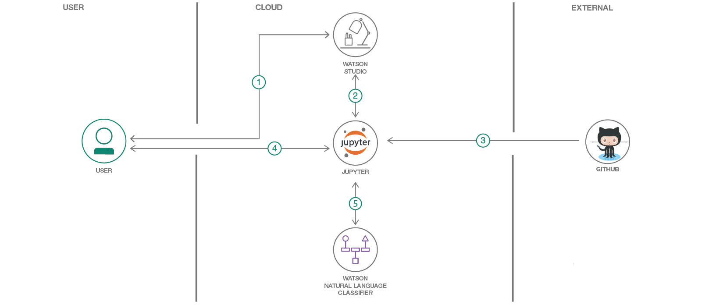

# プログラミング言語を分類する

### コードのテキストに基づいて、そのコードで使用しているプログラミング言語を予測するモデルを作成する

English version: https://developer.ibm.com/patterns/programming-language-classification-with-watson-and-github
  ソースコード: https://github.com/IBM/programming-language-classifier

###### 最新の英語版コンテンツは上記URLを参照してください。
last_updated: 2018-09-14

 ## 概要

この開発者コード・パターンでは、IBM Watson™ Studio 内で Jupyter Notebookを使用して、コードのテキストに基づいて使用されているプログラミング言語を予測するモデルを作成します。作成したモデルの評価は、IBM Watson Natural Language Classifier を利用して行います。

## 説明

IBM Watson Natural Language Classifier を使用すると、データ・サイエンティストは、複数のカテゴリーを使用して作成したモデルによってテキスト・ドキュメントを調べ、使用したカテゴリーに応じて分類できるようになっています。このコード・パターンでは、このツールを使用して GitHub のコンテンツを調べ、使用されているプログラミング言語に応じてコードを分類します。そのデータは、Watson Studio 上で稼働する Jupyter Notebook を使用してクリーンアップして処理します。Watson Natural Language Classifier 内でモデルを作成して使用するための API は、Watson Developer Cloud SDK for Python に用意されています。

このコード・パターンを完了すると、以下の方法がわかるようになります。

* ラベル付けしたデータ・セットを作成する
* Watson Natural Language Classifier を利用して予測モデルを作成する
* Jupyter Notebook 内で予測モデルを構築する
* Watson API を構成して使用する

## フロー

1. IBM Watson Studio ワークスペースを作成します。
2. Watson Studio を使用して、Jupyter Notebook と Watson Natural Language Classifier インスタンスを作成します。
3. Github から新しいデータ・セットを作成するか、このリポジトリー内にある既存のデータ・セットを使用します。
4. Jupyter Notebook とやり取りして単純ベイズ分類子を作成し、Watson Developer Cloud SDK を使用して Natural Language Classifier インスタンスを作成します。
5. Python コードで NLC API を使用して分類子を作成し、使用することもできます。

## 手順

詳細な手順については、[README](https://github.com/IBM/programming-language-classifier/blob/master/README.md) を参照してください。
