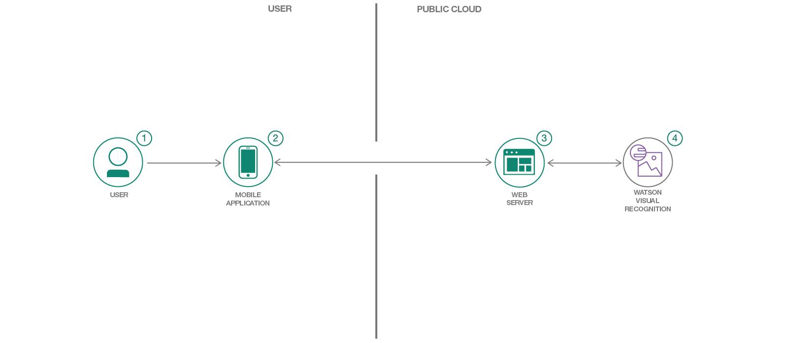

# Watson を利用してリサイクルする

### Watson Visual Recognition カスタム分類子を使用してゴミを分別する、iOS スマートフォン対応アプリケーションを作成する

English version: https://developer.ibm.com/patterns/recycle-with-watson
  
ソースコード: https://github.com/IBM/watson-waste-sorter

###### 最新の英語版コンテンツは上記URLを参照してください。
last_updated: 2018-04-05

 ## 概要

米国国内のリサイクル率は 35 パーセントに達していません。その主な原因の 1 つは、ゴミが適切に捨てられていないためです。そこで、このパターンでは Watson Visual Recognition カスタム分類子、API サーバー、iOS アプリを使用して、ゴミを 3 つのカテゴリー (埋め立て、リサイクル、堆肥) に分別するモバイル・アプリを作成する方法を説明します。このモバイル・アプリを基に、独自の Visual Recognition カスタム分類子を作成することもできます。

## 説明

世界中では現在、過剰なゴミが問題になってきています。埋め立て地に送られるゴミの量を減らして、その分をリサイクルしたり堆肥にしたりできれば、問題解決に役立ちます。そこで、このコード・パターンでは、ゴミを 3 つのカテゴリー (埋め立て、リサイクル、堆肥) に分類できるモバイル・アプリを構築する方法を説明します。

このアプリを構成する主なコンポーネントは、Watson Visual Recognition、API サーバー (この例では Flask をインストールした Python サーバー)、iOS アプリケーションの 3 つです。このモバイル・アプリでは、スマートフォンで写真を撮って、その画像をサーバー・アプリに送信することができます。サーバー・アプリはその画像を Watson Visual Recognition サービスに送信します。すると、Watson Visual Recognition サービスが画像を分類して、その結果をサーバーに返します。そして最後に、サーバー・アプリから分類結果がモバイル・アプリに返されます。サーバー・アプリケーションでは一般的なゴミの写真を使って、廃棄物のさまざまなカテゴリーを識別できるように Watson Visual Recognition をトレーニングします。

このコード・パターンをひと通り完了すると、以下の方法がわかるようになります。

* Python を使用して、画像分類に Watson Visual Recognition サービスを利用する Node.js サーバーを作成する
* Web UI またはコマンド・ラインを使用して Visual Recognition カスタム分類子を作成する
* Visual Recognition で分類するために写真を送信できるモバイル・アプリケーションを作成する

## フロー

1. モバイル・アプリを使って画像をキャプチャーします。
1. アプリから、クラウド内で稼働中のサーバー・アプリケーションに画像を渡します。
1. サーバーが画像を Watson Visual Recognition サービスに送信し、Watson Visual Recognition サービスから返された分類結果をモバイル・アプリに送信します。
1. Visual Recognition サービスは画像を分類し、その情報をサーバーに返します。

## 手順

このパターンの詳細な手順については、[README](https://github.com/IBM/watson-waste-sorter/blob/master/README.md) を参照してください。手順の概要は以下のとおりです。

1. カスタム視覚認識モデルを作成します。
1. サーバー・アプリケーションをデプロイします。
1. モバイル・アプリケーションを作成してサーバーに接続します。
1. Waste Sorter モバイル・アプリケーションを使用します。
