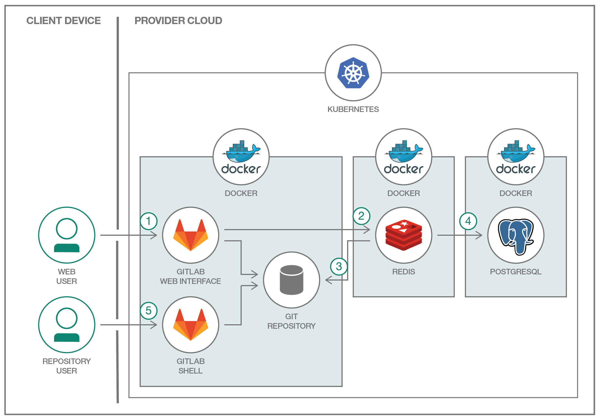

# GitLab を Kubernetes 上で実行する

### Kubernetes と Docker を利用して分散型 GitLab をデプロイする

English version: https://developer.ibm.com/patterns/run-gitlab-kubernetes
  ソースコード: https://github.com/IBM/kubernetes-container-service-gitlab-sample

###### 最新の英語版コンテンツは上記URLを参照してください。
last_updated: 2017-03-24

 
## 概要

パブリック・クラウドでもプライベート・クラウドでも、アプリケーションをデプロイするにはコンテナーを使用するという方法が主流になってきています。最近このようにコンテナーの導入が広まっているわけは、コンテナーをもっと簡単に使えるようにすることを目的とした Docker イメージ・フォーマットや分散モデルなどの標準が開発されたことにあります。コンテナーの主要な使用ケースの 1 つとしては、レガシー・アプリケーションを Kubernetes のようなコンテナー・オーケストレーション・プラットフォームに移行して、分散、スケーリング、保守を容易にすることが挙げられます。

## 説明

このアプリケーションは、コンテナーの力を最大限に発揮させて、既存のアプリケーションをシームレスにクラウドに移行する方法を説明するためのものです。開発者がアプリをクラウドに移行し、コンテナーを使用してクラウド・ネイティブのパッケージ化を利用できるよう、このコード・サンプルで完全なロードマップを提供します。例として、一般的なマルチコンポーネント・アプリケーションを、Kubernetes を利用して IBM Cloud Kubernetes Service 上にデプロイする方法を説明します。

GitLab は典型的な多層アプリを象徴し、コンポーネントごとに固有のコンテナーがあります。Web 層にはマイクロサービス・コンテナーを使用します。状態/ジョブ・データベースは Redis で作成し、データベースとして PostgreSQL を使用します。

## フロー

1. ユーザーは Web インターフェースを介して GitLab を操作するか、コードを GitHub リポジトリーにプッシュして GitLab を操作します。GitLab コンテナーは NGINX と gitlab-workhorse の背後にあるメインの Ruby on Rails アプリケーションを実行します。gitlab-workhorse は、ファイルのダウンロードや GitHub のプッシュ/プルといった大量の HTTP リクエストに対応するリバース・プロキシーです。GitLab は HTTP/HTTPS を介してリポジトリーに対応する一方で、GitLab API を利用して認証とアクセス権を決定し、Git オブジェクトを提供します。
2. 認証と許可が完了した後は、GitLab Rails アプリケーションは非永続データベースとして機能する Redis ジョブ・キューに、着信ジョブ、ジョブ情報、メタデータを入れます。
3. リポジトリーはローカル・ファイル・システム内に作成されています。
4. ユーザーが、ユーザー、ロール、マージ・リクエスト、グループなどを作成すると、いずれも PostgreSQL 内に保管されます。
5. ユーザーは Git シェルを使用してリポジトリーにアクセスします。

## 手順

このコード・パターンに取り組む準備はできましたか？アプリケーションを起動して使用する方法について詳しくは、[README](https://github.com/IBM/Kubernetes-container-service-GitLab-sample/blob/master/README.md) を参照してください。
