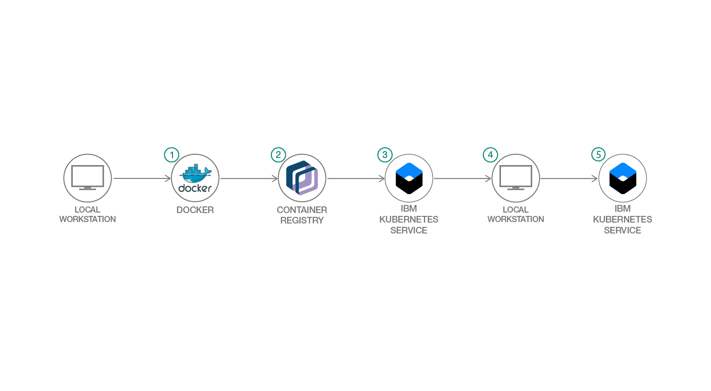

# Kubernetes 上で COBOL プログラムを実行する

### レガシー Hello World アプリケーションを使用して Docker コンテナーを作成する

English version: https://developer.ibm.com/patterns/running-cobol-in-a-cloud-native-way
  
ソースコード: https://github.com/IBM/kubernetes-cobol

###### 最新の英語版コンテンツは上記URLを参照してください。
last_updated: 2019-05-14

 
## 概要

このコード・パターンでは、Kubernetes にシンプルなアプリケーションをデプロイできる 1 つのシナリオとして、企業や組織が Kubernetes を利用してレガシー・アプリケーションを 近代化する方法を、COBOL (Common Business-Oriented Language) を使って説明します。

## 説明

会社や組織でレガシー・アプリケーションを使用していて、クラウド・ネイティブの開発プロセスを探りたいと思っているとしたら、このコード・パターンはまさにそのためのものです。Kubernetes とクラウドを利用すれば、組織を近代化してシステムとデータのセキュリティーを強化できると同時に、顧客対応のフロントエンドを後回しにすることなく業務を効率化できます。

このコード・パターンでは、COBOL と Kubernetes の組み合わせを例に、少々のエンジニアリング作業によってメインフレーム上での場合とまったく同じようにアプリケーションをコンパイルできることを明らかにします。このコード・パターンに従えば、レガシー COBOL アプリケーションをバッチ・ジョブとしてビルドして IBM Cloud Kubernetes Service にデプロイするのがいかに簡単なことであるかがわかるはずです。

このコード・パターンを完了すると、以下の方法がわかるようになります。

* Docker コンテナーをローカルで作成する
* 基本的な Docker コンテナーをテストする
* Docker コンテナーをリモート・レジストリーにプッシュする
* リモート・レジストリーから COBOL Hello World アプリケーションをプルして実行するように Kubernetes を構成する

## フロー

1. ローカルのワークステーションに Docker CE をインストールします。
1. IBM Cloud Container Registry 内に `namespace` を作成します。
1. IBM Cloud 上でのバインディングが完了したら、IBM Cloud Kubernetes クラスターをリクエストします。
1. ローカル・ワークステーション上でテストを完了します。
1. Kubernetes Service 上でジョブを実行します。

## 手順

このパターンに取り組む準備はできましたか？詳しい手順については、[README](https://github.com/IBM/kubernetes-cobol/blob/master/README.md) ファイルを参照してください。
