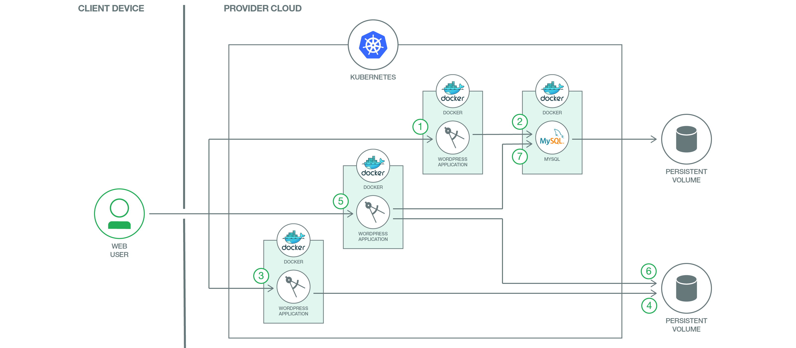

# スケーラブルな WordPress 実装を Kubernetes 上にデプロイする

### Kubernetes の能力を最大限に活用して、IBM Cloud Kubernetes Service から WordPress をホストする

English version: https://developer.ibm.com/patterns/scalable-wordpress-on-kubernetes
  ソースコード: https://github.com/IBM/scalable-wordpress-deployment-on-kubernetes?cm_sp=IBMCode-_-scalable-wordpress-on-kubernetes-_-Get-the-Code

###### 最新の英語版コンテンツは上記URLを参照してください。
last_updated: 2020-07-09

 
## 概要

6000 万を超える Web サイトをサポートしている WordPress は、世界で最もよく使われている Web サイト管理およびブログ・システムです。WordPress は根本的に、最もよく使われている Web プログラミング言語の 1 つに数えられる PHP をベースに作成されていて、バックエンド・データベースとして MySQL を使用します。Kubernetes はオープンソースのコンテナー管理システムです。コードを貢献している個々の開発者の数に基づく GitHub プロジェクトのランキングでは、Kubernetes がトップ 10 にランキングされています。WordPress と Kubernetes という 2 つの大規模オープンソース・プロジェクトを統合して最大のメリットをもたらすことは、開発者にとって難しいけれどもやりがいのある課題です。

## 説明

開発者は、最も優れたアプリケーションを作成することを目指すものです。この目標を達成するためには、優れたツールとプラットフォームを使用することが重要となります。このコード・パターンでは、Kubernetes クラスターの能力を最大限に活用する方法を説明し、世界で最もよく使われている Web サイト・フレームワークを、世界で最もよく使われているコンテナー・オーケストレーション・プラットフォーム上にデプロイするのがいかに簡単なことであるかを実証します。

このコード・パターンでは、WordPress を IBM Cloud Kubernetes Service の Kubernetes クラスター上でホストする際の完全なロードマップを含め、段階ごとに手順を進めていきます。各コンポーネントは、個々のコンテナー内、またはコンテナーのグループ内で稼動します。

WordPress は典型的な多層アプリを象徴し、コンポーネントごとに固有のコンテナーを割り当てます。これらのコンテナーが WordPress のフロントエンド層を形成し、MySQL コンテナーが WordPress のデータベース/バックエンド層となります。WordPress のフロントエンド層では、IBM Cloud のサービスとしての MySQL を利用できます。

## フロー

1. ユーザーが Web インターフェースを使用して WordPress を操作します。WordPress の各コンテナーはユーザーに対し、HTTP/HTTPS を使用して応答します。
2. ユーザーがいずれかの WordPress コンテナーに POST リクエストを送信すると、通常は、WordPress がその変更リクエストを MySQL データベースに送信します。MySQL データベースはセキュリティーを確保するために、POST リクエストのデータを永続ディスクに保管します。MySQL コンテナーに加え、IBM Cloud の Compose MySQL サービスを利用することもできます。認証と認可が完了すると、パスワード (MD5 で暗号化) や e-メール・アドレスなどの WordPress ユーザー情報が作成されて MySQL 内に保管されます。Web サイト、ブログ、タグ、カテゴリーやその他のデータも MySQL 内に保管されます。
3. ユーザーはテーマ、プラグイン、画像、ドキュメントをアップロードすることもできます。テキスト以外のデータ (PDF、動画、MP3 など) もアップロードできます。
4. テーマ、プラグイン、PDF、動画、MP3 などは、WordPress ポッドに接続された永続ボリューム内に保管されます。
5. ユーザーが WordPress の Web サイトまたはブログにアクセスします。WordPress コア (つまり、WordPress の「ブレイン」) は、まず index.php を呼び出し、その後に他の必要な PHP スクリプトを呼び出します。
6. WordPress が MySQL データベースにアクセスして Web サイト、ブログ、タグ、カテゴリーなどを取得します。
7. WordPress コアが永続ボリュームからテーマ、ドキュメント、画像などを取得し、これらの要素をデータベースから取得したデータに結合した上で、結果のページをユーザーに表示します。

## 手順

このコード・パターンに取り組む準備はできましたか？アプリケーションを起動して使用する方法について詳しくは、[README](https://github.com/IBM/Scalable-WordPress-deployment-on-Kubernetes/blob/master/README.md) を参照してください。
