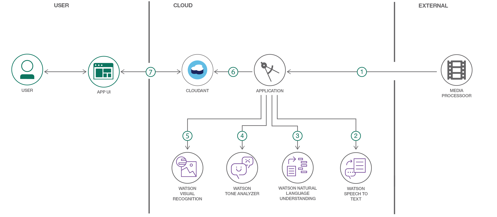

# 複数のサービスを利用してマルチメディア・ファイルをエンリッチする

### IBM Watson の複数のサービスを利用して、音声と画像のファイルをエンリッチするアプリを構築する

English version: https://developer.ibm.com/patterns/score-streaming-data-with-a-machine-learning-model/enrich-multi-media-files-using-ibm-watson
  ソースコード: https://github.com/IBM/watson-multimedia-analyzer

###### 最新の英語版コンテンツは上記URLを参照してください。
last_updated: 2018-06-20

 ## 概要

マーケティング、教育、娯楽のどの分野であるかを問わず、あらゆるタイプの Web 通信にとって、マルチメディア・ファイルは不可欠な存在となってきています。このコード・パターンでは、IBM Watson&reg; Node.js SDK を使用してマルチメディア・ファイルをエンリッチする Web UI アプリを作成する方法を説明します。このアプリは、マルチメディア・ファイルに音声テキスト変換、トーン分析、自然言語認識、および視覚認識処理を適用して、マルチメディア・ファイルをエンリッチします。

## 説明

Web を使っているとしたらご存知だと思いますが (つまり、誰もが知っているように)、サイトの読者を増やすには、今ではマルチメディア・ファイルが不可欠の存在となっています。関わっている分野が小売りであろうと、マーケティング、教育、娯楽のどれであろうと、フラットな Web ページはもはや選択肢ではありません。音声と動画は必須です。

ほとんどの開発者は、開発するアプリにマルチメディア・コンテンツを組み込む方法を把握しています。けれども、大量の動画コンテンツを扱っている開発者であれば誰でも知っているように、絞り込んだ検索によって、これらの動画ファイルからデータを取り出すのは至難の業です。特定の動画で取り上げられている本質的な情報を特定できますか？関連する動画をどのように見つけますか？ユーザーに他のおすすめの動画をすぐに提示できますか？こうした課題に対処し、迅速に動画のコンテンツを検索して必要な情報を引き出す方法を把握している開発者は、突出した存在になるはずです。

このコード・パターンでは、開発者がマルチメディアをもっと利用できるよう支援するために、IBM Watson Node.js SDK を使用してマルチメディア・ファイルをエンリッチする Web UI アプリを作成する方法を説明します。このアプリは、マルチメディア・ファイルに音声テキスト変換、トーン分析、自然言語認識、および視覚認識処理を適用して、マルチメディア・ファイルをエンリッチします。視覚認識をなぜ適用するのかというと、この処理を数秒間隔で行うことで、動画に含まれる情報をより迅速に検出し、任意の目的ですぐに使用できるよう準備できるためです。

このコード・パターンでは 2 つの Node.js アプリを作成します。1 つは、IBM Watson Speech-to-Text、Tone Analyzer、Natural Language Understanding、Visual Recognition の各サービスを利用してマルチメディア・ファイルを処理し、Cloudant NoSQL データベースを使用してデータを保管するアプリです。マルチメディア・プロセッサーによってメディア・ファイルからエンリッチされたデータを抽出し、その結果を NoSQL DB に保管します。もう一方のアプリは、エンリッチされたデータを表示する Web UI アプリです。このアプリで、一連の時間間隔でメディア・ファイルを再生して、検索結果をユーザーがリアルタイムで確認できるようにします。

このコード・パターンをひととおり完了すると、以下の方法がわかるようになります。

* さまざまな Watson サービスを利用して、マルチメディア・ファイルからエンリッチされたデータを抽出して表示する Node.js アプリを作成する
* Watson Speech-to-Text を利用して、動画ファイルからテキストを抽出する
* Watson Tone Analyzer を利用して、会話から感情を検出する
* Watson Natural Language Understanding を利用して、エンティティーを検出する
* Watson Visual Recognition を利用して、動画ファイルから認識した分類、語句を抽出する
* エンリッチされたデータを Cloudant NoSQL DB 内に保管する

動的なマルチメディア・コンテンツに取り組んで、開発者たちの間で突出した存在なることを目指しているとしたら、このコード・パターンはうってつけです。

## フロー

1. マルチメディア・プロセッサーのプロセスにマルチメディア・ファイルが渡されます。
1. Watson Speech to Text サービスが音声をテキストに変換します。変換されたテキストは、タイマー、話者の変更、または音声の顕著な中断に基づいて、複数のシーンに分割されます。
1. Watson Natural Language Understanding サービスが、各シーンのキーワード、エンティティー、概念、分類を特定して取り出します。
1. Watson Tone Analyzer サービスが、各シーンの主要な感情と社会的および文体のトーンを抽出します。
1. Watson Visual Recognition サービスが、10 秒間隔で画面をキャプチャーし、「モーメント」を作成します。各スクリーンショットから、分類、語句が抽出されます。
1. シーンとモーメントのすべてが Watson Cloudant NoSQL データベース内に保管されます。
1. データベース内に保管されたシーンとモーメントがアプリの UI に表示されます。

## 手順

Ready to put this code pattern to use? Complete details on how to get started running and using this application are in the [README](https://github.com/IBM/watson-multimedia-analyzer/blob/master/README.md).
