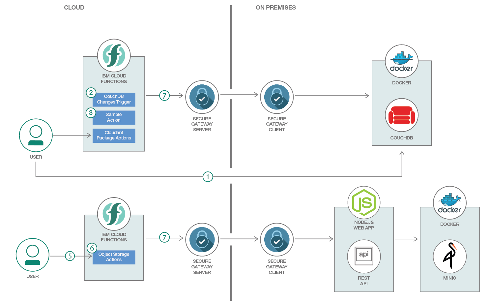

# オンプレミス・リソースにサーバーレス関数を安全に統合する

### サーバーレス関数とオンプレミス・リソース間のやりとりを可能にする Secure Gateway トンネルを作成する

English version: https://developer.ibm.com/patterns/securely-integrate-serverless-functions-with-on-premises-resources
ソースコード: https://github.com/IBM/ibm-cloud-functions-with-on-prem-resources

###### 最新の英語版コンテンツは上記URLを参照してください。
last_updated: 2018-12-26

 
## 概要

ハイブリッド・クラウド環境内ではプライベート・クラウドとパブリック・クラウドの両方を使用します。例えば、機密データを保管するにはオンプレミスのデータベースとストレージを使用する一方で、アーキテクチャーの他の部分 (Web アプリケーション、静的ファイルなど) にはパブリック・クラウド・プラットフォームを使用することもできます。その場合に 1 つの課題となるのは、パブリック・クラウドからオンプレミスのリソースを利用できるようにすることです。開発者はパブリック・クラウドのリソースとしてサーバーレス・コンピューティングを使用できます。けれどもサーバーレス関数がオンプレミスのリソースとやりとりできるようにするためには、オンプレミスとパブリック・クラウドとの間のトンネルが必要になります。

パブリック・クラウドを使用するという手法は普及しつつあるとは言え、一部のソリューションではオンプレミスあるいはプライベート・クラウド環境を使用して機密データやワークロードを処理する必要があります。Secure Gateway サービスのような手法を用いれば、パブリック・クラウド環境とプライベート・クラウド環境の間での通信を簡単にセットアップし、両方のクラウドを接続することができます。このコード・パターンでは、CouchDB と Minio のローカル・デプロイメントをオンプレミスのリソースとして使用し、Docker を使ってこれらのリソースを簡単にクラウド内にデプロイします。

このコード・パターンに取り組んで、サーバーレス関数と既存のオンプレミス・リソースの統合がどのように機能するのかを確認してください。それを基に、独自の統合を実装する方法を検討することができます。

## 説明

このコード・パターンでは、サーバーレス・コンピューティングを使用してオンプレミス・リソースを処理する例を説明します。Secure Gateway トンネルを使用すれば、データベースや Web アプリケーションなどのオンプレミスのリソースにサーバーレス関数で安全にアクセスすることができます。サーバーレス関数をトリガーするには、イベントまたは REST API を使用できます。

このコード・パターンで使用するサンプル・アプリケーションは、IBM Cloud Functions (Apache OpenWhisk ベース) で Secure Gateway サービスを利用してオンプレミスのリソースとやりとりする方法を説明するものです。このコード・パターンでは、Cloud Functions がオンプレミス・リソース (データベース、Web アプリケーションなど) にアクセスできるようにする方法を説明する使用ケースを取り上げます。このコード・パターンではローカルの CouchDB デプロイメントにサーバーレス関数でアクセスします。また、ローカルの Minio オープンソース・オブジェクト・ストレージ・サーバーに、ロ―カルの Node.js Web アプリケーションからアクセスします。これらのローカル・リソースは、Secure Gateway トンネルを介して公開されます。

CouchDB を対象としたサーバーレス関数では、既存の OpenWhisk Cloudant パッケージを使用します。このパッケージを使用できるわけは、Cloudant は CouchDB をベースとしていて、同様の API を備えているためです。データベース内で変更が行われると、アクションがトリガーされます。このサンプルの場合、アクションの出力はドキュメント ID です。`wsk` コマンドを使用して、ドキュメントの作成や読み取りなどの他のアクションを呼び出すこともできます。別のシナリオとしては、REST API を使用してアクションを実行します。

これらのアクションは、オブジェクト・ストレージを使用するローカルの Node.js Web アプリケーションとやりとりします。アクションによって、URL に基づくバケットとオブジェクトが作成されます。すべてのアクションでは、Secure Gateway トンネルが使用されます。

このコード・パターンで使用するコンポーネントは以下のとおりです。

* [IBM Cloud](https://cloud.ibm.com/?cm_sp=ibmdev-_-developer-patterns-_-cloudreg)
* [Docker](https://www.docker.com)
* [IBM Cloud Functions](https://cloud.ibm.com/openwhisk?cm_sp=ibmdev-_-developer-patterns-_-cloudreg) (Apache OpenWhisk ベース)
* [IBM Secure Gateway](https://cloud.ibm.com/catalog/services/secure-gateway?cm_sp=ibmdev-_-developer-patterns-_-cloudreg)

このコード・パターンに従うと、以下のスキルを身に着けることができます。

* Cloud Functions がオンプレミスのリソースにアクセスできるようにする
* サーバーレス関数で使用する Secure Gateway トンネルを作成する

## フロー

1. アプリケーションのユーザーがオンプレミス・データベースにドキュメントを追加します。
1. ドキュメントがデータベースに追加されると、トリガーが起動されます。
1. トリガーに関連付けられたアクションが呼び出されます。アクションにより、追加されたドキュメントのドキュメント ID が出力されます。
1. ユーザーは、Cloudant パッケージ内に用意されているアクションを使用して、オンプレミス・データベースを操作することもできます。
1. ユーザーは REST API を使用してサーバーレス関数とやりとりすることもできます。それには、Cloud Functions に統合されている API Gateway を使用します。
1. アクションにより、Secure Gateway サービスで公開されている使用可能なクラウド・ホストに HTTP リクエストが送信されます。
1. オンプレミス・データベースとのすべてのやりとりは、Secure Gateway サービスを利用したトンネルを経由します。Secure Gateway サービスも同じくオンプレミス環境にインストールされています。

## 手順

このコード・パターンの詳しい手順については、GitHub リポジトリー内の [README.md](https://github.com/IBM/ibm-cloud-functions-with-on-prem-resources/blob/master/README.md) ファイルを参照してください。手順の概要は以下のとおりです。

1. リポジトリーのクローンを作成します。
1. IBM Cloud で Secure Gateway サービス・インスタンスを作成します。
1. Docker を使用して CouchDB と Minio を実行します。
1. Cloud Functions をデプロイします。
1. データベース・イベントを使用してテストします。
1. REST API でオンプレミス Web アプリへのアクセスをテストします。
