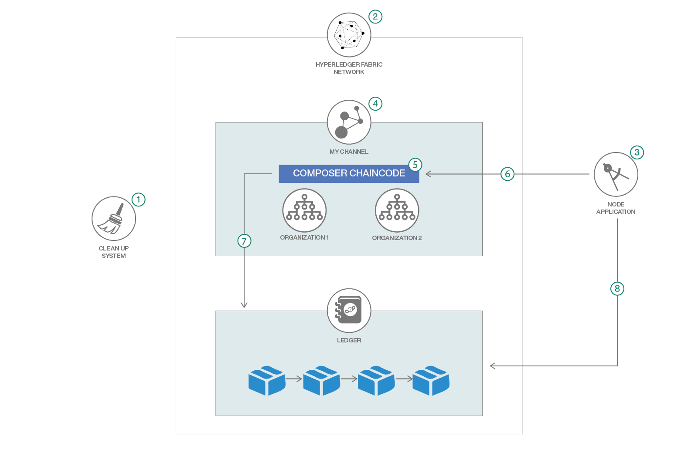

# ブロックチェーン・デジタル証明書を使用して美術品のセキュリティーを確保する

### Node.js ベースのオークション・アプリケーションで美術市場の民主化を促進する

English version: https://developer.ibm.com/patterns/securing-art-using-blockchain-digital-certificates

ソースコード: https://github.com/IBM/SecuringArt-using-Blockchain-DigitalCertificates

###### 最新の英語版コンテンツは上記URLを参照してください。
last_updated: 2018-09-12

 
*__注:__ このコード・パターンの作成者は [Chainyard](https://chainyard.com/) に勤めています。*

## 概要

最近、[アンディー・ウォーホールによる数百万ドルの絵画](https://www.ccn.com/andy-warhols-multi-million-dollar-painting-tokenized-and-sold-on-blockchain/)がブロックチェーン上でトークン化されて売却されました。これに類するトランザクションとしては、これが初めてのことです。こうしたタイプのトランザクションが可能になったことはあきらかです。ついに、美術市場が民主化されたのです！ブロックチェーンという手法により、従来とは異なる美術品収集家が生まれ、世界規模の新しい市場に美術品の売り手が参入できるようになります。このコード・パターンでは、ローカル・ブロックチェーン・ネットワークを初期化して美術品の画像をデジタル形式でレジャーに保管するアプリを取り上げます。

## 説明

このコード・パターンは、Base64 でエンコードして Base64 で暗号化した画像を Hyperledger Blockchain レジャー上で保管し、レジャーから画像を取得する方法を説明する、Node.js ベースのサンプル・アプリケーションです。このアプリケーションは Hyperledger Fabric ネットワークを起動した後、Node SDK API をベースに作成された REST API サーバーとしてのアプリケーションを起動します。このアプリケーションの第一の目標は、ブロックチェーン上でエンコードと暗号化を使用する方法をデモンストレーションすることです。この使用ケースで説明するのは、オークションに出品するために美術品の画像をブロックチェーン上に保管する方法ですが、このモデルは書類や動画など、他のタイプの資産にも適用できます。画像を保管するには、次の方法があります。

1. IPFS (有償版) または STORJ を使用する。
2. 画像のハッシュを作成して、その画像ファイルを s3 に保管する (ファイルが不正に改ざんされないようにするには、この手法を使用します)
3. 画像を Base64 文字列に変換して、その文字列をコンポーザー・モデル形式で保管する

このパターンでは、3番目の方法を使用します。Base64 コマンドは、コマンド・ライン上で実行することも、スクリプトの一部として実行することもできます。OS X 内ではデフォルトで、このコマンドをこのコマンドを使用できるようになっています。構文は次のとおりです。

`$ base64 –i -o`

`cat` を使用して、ファイルから入力を読み取ることもできます。

ブロックチェーンでは、デフォルトで暗号化、セキュリティー、普遍性をサポートします。これらの特性は、美術品オークションという使用ケースの基礎となります。

このコード・パターンを完了すると、以下の方法がわかるようになります。

* ブロックチェーン・ネットワークをセットアップする
* Base64 で暗号化された画像を生成し、その画像を暗号化してブロックチェーン・レジャー上で保管する
* チェーンコードをクエリーして画像を取得し、パブリック・フォルダー内に保管する

このコード・パターンを他のタイプの資産にも適用してみてください！

## フロー

1. 既存のすべてのネットワークを破棄して、散らばっているコンテナーや画像のすべてを削除します。
1. Hyperledger Fabric ネットワークを起動します。
1. Node.js アプリケーション (Node SDK API ベースの REST サーバー・ラッパー) を起動します。
1. 「myChannel」というチャネルを作成します。
1. オークション・チェーンコードをインストールしてインスタンス化します。
1. Node.js アプリによって Base64 で暗号化された画像を文字列形式に変換するトランザクションを呼び出します。
1. 暗号化された画像をブロックチェーン・レジャー上で保管します。
1. レジャーをクエリーして、imageID を基準に画像を取得し、その画像をサムネイルとしてパブリック・フォルダー内に保存します。

## 手順

詳細な手順については、[README](https://github.com/IBM/SecuringArt-using-Blockchain-DigitalCertificates/blob/master/README.md) を参照してください。手順の概要は以下のとおりです。

1. リポジトリーを複製します。
2. Hyperledger Fabric Network を起動し、次に Node.js アプリを起動します。
3. ネットワーク・チャネルを作成し、トランザクションを呼び出します。
