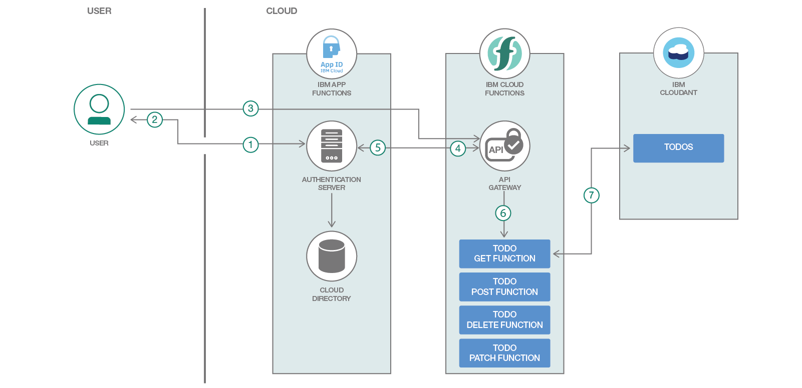

# サーバーレスのイベント駆動型アーキテクチャーを使用して、自動的にスケーリングするコードを実行する

### API ゲートウェイを Cloud Functions に接続する

English version: https://developer.ibm.com/patterns/./serverless-microservices-api-gateway
ソースコード: https://github.com/IBM/ibm-cloud-functions-refarch-serverless-apis/

###### 最新の英語版コンテンツは上記URLを参照してください。
last_updated: 2018-12-12

 
## 概要

クラウド・リソースを効率的に使用して、より迅速にアプリケーションを構築し、デプロイする方法をお探しですか？

サーバーレスのイベント駆動型アーキテクチャーであれば、REST API からの需要に応じて自動的にスケーリングするコードを実行できます。関数に関連付けられているエンドポイントへの API 呼び出しを API ゲートウェイで受信するまでは、コードは一切実行されません。

API 呼び出しを受信した時点で、各 API リクエストを処理するために必要な数だけ、アプリケーション・インスタンスが起動されます。

## 説明

このコード・パターンのリポジトリー内に含まれるコードは、IBM Cloud Functions を使用してサーバーレス REST API を実装しています。この REST API は [Todo-Backend API](https://www.todobackend.com/) に完全に準拠した実装です。

[IBM Cloud Functions デプロイ・スクリプト](https://github.com/IBM/ibm-cloud-functions-refarch-serverless-apis/blob/master/README.md#deploy-through-the-deployment-script)を使用して、ご使用のシステム上にこの REST API をそのままデプロイすることができます。

IBM Cloud アカウントをまだ登録していない場合は、アカウントを登録して [Cloud Functions ダッシュボード](https://cloud.ibm.com/openwhisk?cm_sp=ibmdev-_-developer-patterns-_-cloudreg)にアクセスしてください。ここでは、さまざまな[リファレンス・アーキテクチャー・テンプレート](https://github.com/topics/ibm-cloud-functions-refarch)を調べたり、必要に応じてコマンド・ライン・ツールをダウンロードしたりできます。

このコード・パターンでは、次のコンポーネントを使用しています。

* [IBM Cloud Functions](https://cloud.ibm.com/openwhisk?cm_sp=ibmdev-_-developer-patterns-_-cloudreg) (Apache OpenWhisk ベース): 極めてスケーラブルなサーバーレス環境内で、オンデマンドでコードを実行できます。
* [Cloud Functions API](https://cloud.ibm.com/openwhisk/apimanagement?cm_sp=ibmdev-_-developer-patterns-_-cloudreg) (Apache OpenWhisk ベース): 一連の OpenWhisk アクションをラップする API を定義できます。
* [Cloudant サービス](https://cloud.ibm.com/catalog/services/cloudant?cm_sp=ibmdev-_-developer-patterns-_-cloudreg): 柔軟な JSON スキーマを使用した最新式の Web およびモバイル・アプリケーションを対象に設計された、(CouchDB をベースにした) フルマネージドのデータ層を利用できます。
* [App ID サービス](https://cloud.ibm.com/catalog/services/appid?cm_sp=ibmdev-_-developer-patterns-_-cloudreg): モバイル・アプリや Web アプリに認証を追加して、バックエンドと API を保護するとともに、ユーザー固有のデータを管理します。

このアプリケーションは、[Todo-Backend API](https://www.todobackend.com/) に完全に準拠した実装に、認証サポートを追加したものです。

このコード・パターンでは、(Apache OpenWhisk ベースの) IBM Cloud Functions を利用して REST API を作成する方法を紹介します。使用ケースの例で、アクションがデータ・サービスと連動し、API リクエストに応じてレスポンス内でロジックを実行する仕組みを説明します。また、IBM App ID サービスを利用して、認証トークンがなければ API にアクセスできないようにして、API の背後にあるコンテンツを保護する方法も説明します。

認証は API ゲートウェイによって完了されるため、関数で認証について考慮する必要はありません。関数では API ゲートウェイから渡される JWS トークン情報を使用して、コンテンツ許可ルールを追加できます。このパターンでは、認証されたユーザーのそれぞれが専用の Cloudant データベースに接続されます。したがって、各ユーザーの「To-Do」リストはそのユーザーだけのものであり、セッションを繰り返しても存続します。

このコード・パターンを完了すると、以下のスキルを身に付けることができます。

* Cloudant でサポートされた単純な「To-Do」リスト・アプリケーションの API として機能するサーバーレス関数を使用する
* IBM Cloud 上の App ID サービスを利用して、認証を簡単に API に追加する

## フロー

1. アプリのユーザーがログインして、IBM App ID 認証サーバーからトークンを取得します。App ID サービスにより、ユーザーの資格情報がクラウド・ディレクトリーに照合されます。App ID サービスで他の[認証プロバイダー](https://cloud.ibm.com/docs/services/appid/manageidp.html#managing)を使用するように構成することもできます。
1. App ID 認証サービスからユーザーに JWS トークンが返されます。
1. ユーザーからの API リクエスト (HTTP GET) が Cloud Functions API ゲートウェイに対して発行されます。リクエストには、保護されたリソースにアクセスするための JWS トークンが組み込まれます。
1. Cloud Functions API ゲートウェイにより、App ID サービスを介したトークンの検証が行われます。
1. App ID サービスがトークンを検証します。
1. Cloud Functions API ゲートウェイにより、API エンドポイントと HTTP メソッドに関連付けられている関数 `todo_get` が呼び出されます。
1. 関数が JWS トークンを使用して、リソースをリクエストしているユーザーの情報を取得し、そのユーザーにアクセスが許可されている Cloudant データベース内のコンテンツを選択します。この関数はまた、HTTP レスポンスとその JSON 本文を作成し、リクエストされた「To-Do」項目を JSON 本文に格納します。

## 手順

このコード・パターンの詳細な手順については、GitHub リポジトリー内に置かれている [README.md](https://github.com/IBM/ibm-cloud-functions-refarch-serverless-apis/blob/master/README.md) ファイルを参照してください。手順の概要は以下のとおりです。

1. アカウントと資格情報をセットアップします。
1. デプロイ・スクリプトを使用してアプリをデプロイします。
1. デプロイ・スクリプトを使用してアプリを検証するか、手作業で検証します。
