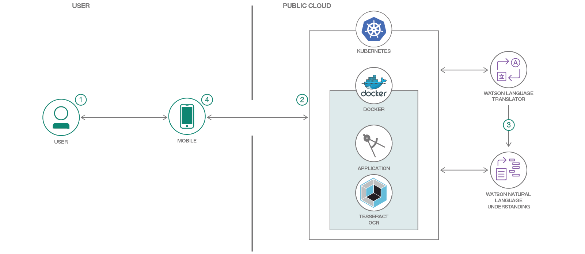

# 画像を取り込み、そこから抽出したテキストを翻訳する

### Tesseract OCR で画像を取り込んでテキストを抽出し、Watson Language Translator を利用して翻訳する

English version: https://developer.ibm.com/patterns/snap-translate-using-tesseract-ocr-watson-language-translator
  ソースコード: https://github.com/IBM/snap-and-translate

###### 最新の英語版コンテンツは上記URLを参照してください。
last_updated: 2018-09-17

 
## 概要

このコード・パターンでは画像からテキストを認識して翻訳しようと試みている開発者を対象に、Tesseract OCR を使用して取り込んだ画像からテキストを抽出する方法、そして Watson Language Translator を利用して抽出したテキストを翻訳する方法を紹介します。

## 説明

ビジュアル・コンテンツは、プレーン・テキストよりも遥かに人の興味を引き付けます。インフォグラフィックを作成する際、広告を出す際、あるいは面白いと思ったミームを共有する際に、興味深いテキストと魅力的なタイポグラフィーを画像に追加するのは極めて効果的な方法です。テキストを画像に追加すれば、伝えたいメッセージをさらに効果的に広めることができます。けれども、それぞれに異なる言語を使用する複数の地域にわたってメッセージを共有したい場合はどうなるでしょうか？

このコード・パターンでは、Apache Cordova 開発環境と、IBM Cloud Kubernetes サービス上で稼働する Node.js サーバーを使用して、ハイブリッド・モバイル・アプリを作成する方法を説明します。このアプリは Tesseract OCR を使用して画像内のテキストを認識し、そのテキストを Watson Language Translator で翻訳するとともに、Watson Natural Language Understanding でテキストから感情とセンチメントを抽出します。このモバイル・アプリが翻訳するテキストは、取り込んだ画像、またはフォト・アルバムからアップロードされた画像から認識されたテキストです。

このコード・パターンを完了すると、以下の方法がわかるようになります。

* Cordova モバイル・フレームワークを使用して、モバイル・アプリを作成し、デプロイする
* 画像を取り込んで画像内のテキストを認識し、Watson サービスを利用してテキストを翻訳する Node.js アプリを作成する
* テキストを認識する Tesseract OCR を IBM Cloud Kubernetes サービス上にデプロイし、Watson サービスを Kubernetes クラスターにバインドする
* 認識されたテキストを、Watson Language Translator を利用して翻訳する
* Watson Natural Language Understanding を利用してテキストからセンチメントと感情を抽出する

## フロー

1. ユーザーがモバイル・アプリを操作して、画像を取り込むか、フォト・アルバムから画像を選択します。
1. IBM Cloud Kubernetes サービス上で稼働する Node.js サーバー・アプリケーションに画像が渡されると、このアプリが Tesseract OCR を使用して画像内のテキストを認識します。
1. Node.js アプリが Watson Language Translator サービスを利用して、認識されたテキストを翻訳します。また、Watson Natural Language Understanding を利用して、翻訳されたテキストからセンチメントと感情を抽出します。
1. 認識されたテキスト、翻訳された言語、そして抽出されたセンチメントと感情が結果としてモバイル・アプリに返されて表示されます。

## 手順

このパターンの詳細な手順については、[README](https://github.com/IBM/snap-and-translate/blob/master/README.md) を参照してください。手順の概要は以下のとおりです。

1. GitHub リポジトリーを複製します。
1. IBM Cloud を使用して Language Translator サービスと Natural Language Understanding サービスのインスタンスを作成します。
1. IBM Cloud 上で Kubernetes を使用して、コンテナー内でサーバー・アプリケーションを実行します。
1. Docker を使用してローカルでサーバー・アプリケーションを実行します。
1. モバイル・アプリケーションを実行します。
