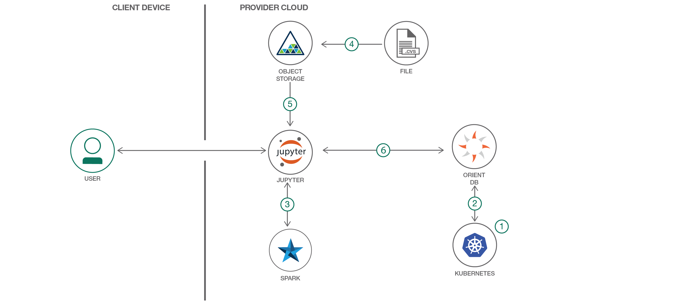

# 相互に関連するデータを保管し、グラフを生成して洞察を引き出す

### OrientDB と IBM Watson Studio を利用して、相互に関連するデータを保管し、グラフを作成して分析する

English version: https://developer.ibm.com/patterns/./store-graph-and-derive-insights-from-interconnected-data
  ソースコード: https://github.com/IBM/graph-db-insights

###### 最新の英語版コンテンツは上記URLを参照してください。
last_updated: 2017-11-23

 
## 概要

デジタル・ユーザーは、ソーシャル・メディアやオンライン・ポータル、そして社内ビジネス・プロセスやその他のソースから、相互に関連する膨大な量の非構造化データを日々生成しています。このような非構造化データ間の相関関係を保管して、そこから洞察を引き出すには、グラフ・データベースが最適です。このコード・パターンでは、IBM Watson Studio を使用して相互に関連するデータを保管し、OrientDB データベースを使用してクエリーを実行することで、洞察を引き出す方法を説明します。データ・セットをクレンジングして、エンティティーと関係を抽出し、OrientDB データベースにそれらのデータを取り込んで、データをクエリーする方法を学んでください。

## 説明

最近のデジタル世界は、かつてないほど相互関係が強くなっていて、このような相互関係に豊富なデータが潜んでいます。組織がユーザーと市場をより深く理解するとともに、組織自体を拡大するチャンスを把握するには、これらの相互に関連するデータの価値を解き放たなければなりません。さらに、オンライン調査、製品レコメンデーション・エンジン、不正の検出などから洞察を引き出す必要もあります。

最もよく知られている相互関係の例は、ソーシャル・メディアです。ソーシャル・メディアは事実上、世界中の誰とでもつながることを可能にします。現代的なこのような接点のそれぞれが、地理的な境界線を越えてビジネスを展開する可能性を広げている一方で、組織がユーザー、市場、自信の拡大可能性をより深く理解するためにデータの価値を解き放つ必要性をますます大きくしています。

相互に関連するデータから価値を解き放つには、グラフ・データベースがとりわけ適しています。グラフ・データベースを使用すると、相互関係を保管してクエリーを実行できるため、さまざまな関係と相互作用に関する洞察を収集することが可能になります。グラフ・データベース・エンジンを備えた OrientDB は、レコード間の直接的なつながりを使用して関係を管理する、マルチモデル NoSQL データベースです。OrientDB のようなグラフ・データベースは、複雑な関係と動的なスキーマを伴う諸領域のビジネス・データを処理する際にも役立ちます。その一例として、小売関係のポータルに表示される「この商品を購入したお客様は、これらの商品も閲覧しました…」といったお勧めがあります。グラフ・データベースには柔軟性があり、対象者に理解しやすい方法でデータを表示できると同時に、そのデータに内在する複雑なやりとりを追跡することもできます。

このパターンでは、データを操作して OrientDB から洞察を収集するために、PyOrient モジュールという Python 用 OrientDB ドライバーを使用します。また、Jupyter Notebook を使用してデータを分析するために、IBM Watson Studio を利用します。フロー全体を理解できるよう、データ・セットをダウンロードしてクリーニングするところから、エンティティーと関係を抽出し、新しい OrientDB データベースを作成し、そのデータベースにノード・クラス、エッジ・クラス、頂点、関係を取り込んでからクエリーを実行して洞察を収集するまでの完全な手順を説明します。

このパターンをひととおり完了すると、以下の方法がわかるようになります。

* Watson Studio 上に IPython ノートブックをセットアップし、PyOrient を使用して OrientDB に接続する
* CRUD 処理を実行して、OrientDB データベースから洞察を抽出する

ソーシャル・メディアとその他の複雑な相互関係には、マイニングおよび分析して利用できる、事実上無限のデータが潜んでいます。膨大な量のソーシャルおよび相互作用データの価値と可能性を解き放てるよう組織をサポートする必要に迫られている開発者にとって、このパターンが目標達成への道のりの出発点になります。

## フロー

1. ユーザーが IBM Cloud 上の Kubernetes サービスを利用して Kubernetes クラスターをセットアップします。
1. ユーザーがステップ 1 で作成した Kubernetes クラスターに、永続ボリュームと併せて OrientDB インスタンスをデプロイし、IBM Cloud 上の OrientDB が使用するポート (2424、2480) を公開します。
1. ユーザーが Spark を備えた IBM Watson Studio 上で、Jupyter ノートブックを作成します。ノートブックで使用するデータを保管するために、Object Storage インスタンスをノートブックに接続します。
1. 開発者が Object Storage に構成ファイル (config.json) とデータベース (graph-insights.csv) をアップロードします。
1. ノートブック内の Object Storage 資格情報が更新され、Object Storage からファイルがロードされて、OrientDB 内でグラフが作成されます。
1.  ノートブックが PyOrient ドライバーを介して OrientDB と通信します。Jupyter ノートブック内に作成された関数を使用して、OrientDB に対する各種の処理が実行されます。

## 手順

Ready to put this code pattern to use? Complete details on how to get started running and using this application are in the [README](https://github.com/IBM/graph-db-insights/blob/master/README.md).
